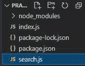
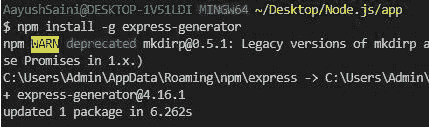
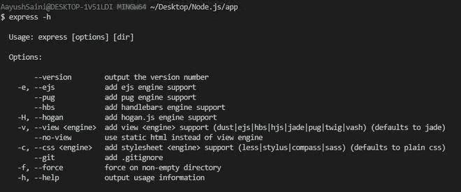
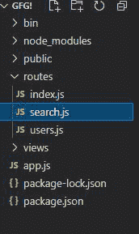
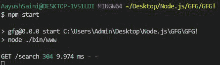

# 使用 Express.js

创建以“搜索 url”为参数的路线

> 原文:[https://www . geesforgeks . org/create-a-route-with-search-URL-as-parameter-use-express-js/](https://www.geeksforgeeks.org/create-a-route-with-search-url-as-parameter-using-express-js/)

Express.js 是[节点最强大的框架. js](https://www.geeksforgeeks.org/working-of-express-js-middleware-and-its-benefits/) 。 **Express.js** 是一个路由和中间件框架，用于处理网页的不同路由，它在请求和响应周期之间工作。Express.js 使用不同种类的中间件功能到完成客户端发出的不同请求，例如客户端可以发出 get、 put、 post 、和 delete 请求这些请求可以通过这些中间件功能轻松处理请参考 [](https://www.geeksforgeeks.org/working-of-express-js-middleware-and-its-benefits/)至 [这篇](https://www.geeksforgeeks.org/working-of-express-js-middleware-and-its-benefits/) 文章，了解express . js 框架是如何工作的。**在本文中******我们将讨论什么是路由以及如何使用两种方法创建路由。****

****路由**:路由网内  是指从计算机网络或服务器中的大量可用路径中过滤出所需路径。我们可以在 express.js 中间件的帮助下创建自己的路线，该中间件将我们的路径路由到所需的位置。**

****工作路由:**来自客户端的所有传入请求都与项目目录中的所有可用路由相匹配。匹配成功后，特定路由会做出响应。**

****

****有两种方法可以为特定的 URL 创建路由。****

1.  ****不使用 express-generator:** 在这个方法中，我们简单地使用 express.js 模块来实现搜索 URL 路由。Express.js 可以在同一条路由上处理多个不同的请求。**
2.  ****使用快速生成器:**快速生成器是生成制作 Node.js **所需的所有必要文件的最快方法。Express-generator 生成默认路由以及默认配置的 app.js 文件。****

****下面是两种方法的实现:****

****1 无快递生成器:**使用简单的[快递模块](https://www.geeksforgeeks.org/working-of-express-js-middleware-and-its-benefits/)处理来自客户端的所有请求，并检查传入的请求。**

****安装模块:****

```js
npm install express
```

****项目结构:****

****

## **index.js**

```js
//Importing require module
const express=require("express")
const server_route=require("./search")
const app=express()

// Creating First route
app.use("/",server_route);

// Listening the server
app.listen(3000,()=>{
  console.log("Server is Running on the port 3000")  
})
```

## **search.js**

```js
//Importing libraries
var express = require('express');
var router = express.Router();

// Handling first request
router.get('/search', function(req, res, next) {
  res.send('Respond from server');
  res.end()
});
// Handling second request of different route
router.get("/search/login",(req,res,next)=>{
    res.send("This is the login page")
    res.end()
})
// Exporting router 
module.exports = router;
```

**使用以下命令运行 **index.js** 文件:**

```js
node index.js
```

****输出:**访问 http://localhost:3000/它会重定向到你的 http://localhost:3000/搜索/登录。**

****

****2 使用快速生成器:**快速生成器是生成制作网络应用程序所需的所有必要文件的最快方法。这种方法的优点是**快速生成器生成默认路由以及默认配置的 app.js 文件。****

****安装快速发电机**:**

```js
npm install -g express-generator
```

****

****基本快速生成器命令:****

****

****项目结构中的生成器文件:**安装快速生成器后。我们必须在 express-generator 文件夹的 routes 文件夹中创建新的文件 search.js。**

****

## **app.js**

```js
//Default Imported libraries
var createError = require('http-errors');
var express = require('express');
var path = require('path');
var cookieParser = require('cookie-parser');
var logger = require('morgan');

var indexRouter = require('./routes/index');
var usersRouter = require('./routes/users');

// creating instance of the search.js route
var searchRouter=require("./routes/search")

var app = express();

// view engine setup
app.set('views', path.join(__dirname, 'views'));

app.use(logger('dev'));
app.use(express.json());
app.use(express.urlencoded({ extended: false }));
app.use(cookieParser());
app.use(express.static(path.join(__dirname, 'public')));

app.use('/', indexRouter);
app.use('/users', usersRouter);

// Handling request for the searchRouter
app.use('/',searchRouter)

// catch 404 and forward to error handler
app.use(function(req, res, next) {
  next(createError(404));
});

// error handler
app.use(function(err, req, res, next) {
  // set locals, only providing error in development
  res.locals.message = err.message;
  res.locals.error = req.app.get('env') === 'development' ? err : {};

  // render the error page
  res.status(err.status || 500);
  res.render('error');
});

module.exports = app;
```

**使用以下命令运行 **app.js** 文件:**

```js
node app.js
```

## **search.js**

```js
var express = require('express');
var router = express.Router();

/* GET users listing. */
router.get('/search', function(req, res, next) {
  res.send('Respond from server');
  res.end()
});
router.get("/search/page",(req,res,next)=>{
    res.send("Respond to the search page")
    res.end()
})

module.exports = router;
```

****控制台输出:****

****

****处理响应:****

****