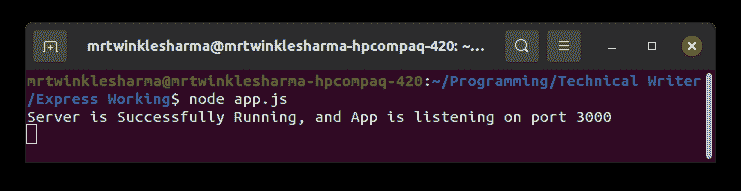
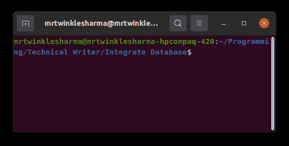
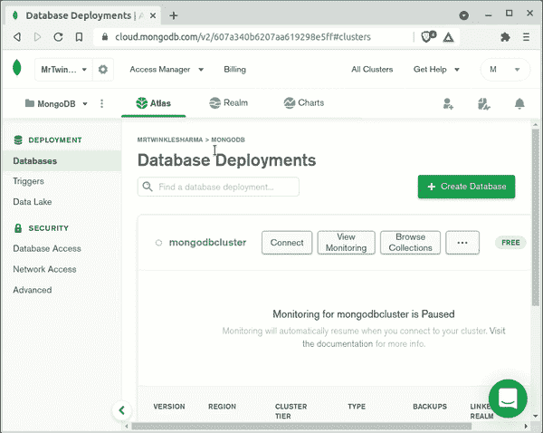
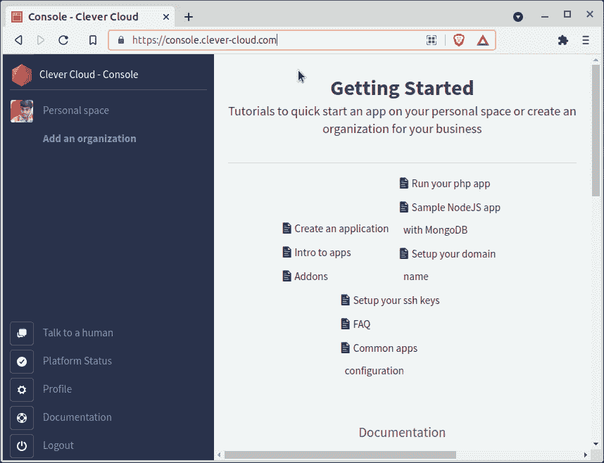

# express . js 中的数据库集成

> 原文:[https://www . geesforgeks . org/database-integration-in-express-js/](https://www.geeksforgeeks.org/database-integration-in-express-js/)

[Express](https://www.geeksforgeeks.org/working-of-express-js-middleware-and-its-benefits/) 是一个与 Node.js 一起工作的极简框架，提供了运行后端服务器等的显著特性。众所周知，数据库在一个完整的应用程序中扮演着重要的角色来保存数据。在本文中，我们将讨论如何在使用 Express.js 框架的服务器中集成数据库。

#### 步骤 1:创建快速应用程序

这里我们将创建一个 express 应用程序，因为我们的所有工作都将在 express 内部执行。如果你对这些东西感到满意，你可以跳过这一步。

在您的终端中编写这些命令来启动一个节点应用程序，然后安装 express。请确保您已成功安装 npm。 **npm init** 会问你一些关于你的项目的配置，这非常容易提供。

```js
npm init
npm install express
```

现在创建一个空的。js 文件(我们命名为 *app.js* )，这将是我们的文件夹结构，


因此，我们准备开始在 app.js 文件中编写快速代码

## java 描述语言

```js
//Importing express module
const express = require('express');

const app = express();
const PORT = 3000;

app.listen(PORT, (error) =>{
    if(!error)
        console.log("Server is Successfully Running, "
            + "and App is listening on port "+ PORT)
    else
        console.log("Error occurred, server can't start", error);
    }
);
```

注意:如果您想了解更多关于快速应用程序初始化的信息，请查看此[链接](https://www.geeksforgeeks.org/steps-to-create-an-express-js-application/)。

#### 步骤 2:运行服务器

在这一步中，我们将确认我们的服务器是否工作，在您的终端中编写这个命令来启动 express 服务器。服务器的成功启动表示我们的 express app 已准备好侦听指定路径上的连接(在我们的示例中为 *localhost:3000* )。

```js
node app.js
```

像这样的东西会在终端给你看。



#### 步骤 3:集成数据库

下面是您正在搜索的最有趣的部分，现在我们将数据库与 express 集成。但在此之前，我们必须选择其中一个数据库选项，即 MongoDB、MySQL、PostgreSQL、Redis、SQLite 和 Cassandra 等。
[【MongoDB】](https://www.geeksforgeeks.org/mongodb-an-introduction/)[MySQL](https://www.geeksforgeeks.org/mysql-common-mysql-queries/)最受欢迎，被众多开发者使用，所以我们只讨论这两个。此外，它们完全不同，所以您将有机会探索更多，一个是面向文档的 NoSQL 数据库，另一个是关系模型数据库。

*注意:-要用云数据库服务还是本地主机由你决定，只存在细微差别。知道如何访问云数据库是一件好事，所以在这里我们也将讨论一个云服务的例子。*

### ***【蒙戈布】***

*   安装 mongoose，这是一个基于“mongodb”本地驱动程序构建的包，用于与 MongoDB 实例进行交互，并对来自 express/node 应用程序的数据进行建模。

```js
npm install mongoose
```

*   安装 MongoDB

无论您是 Linux、Windows 还是 Mac 用户，官方文档都提供了一个在本地机器上安装 MongoDB 的简单过程。
点击此处安装:-[Windows](https://docs.mongodb.com/manual/tutorial/install-mongodb-on-windows/)|[Ubuntu](https://docs.mongodb.com/manual/tutorial/install-mongodb-on-ubuntu/)|[T6](https://docs.mongodb.com/manual/tutorial/install-mongodb-on-ubuntu/)[macOS](https://docs.mongodb.com/manual/tutorial/install-mongodb-on-os-x/)|[其他](https://docs.mongodb.com/manual/installation/)

安装后，您将能够在您的终端使用 MongoDB，也可以安装 mongo compass 一个图形用户界面应用程序来与数据库交互。

*   与快速应用程序集成

**解释:-** 首先我们将导入**猫鼬**模块，然后我们稍后调用 [connect](https://mongoosejs.com/docs/connections.html) 方法，它接受一个连接字符串，以及带有一些配置的对象，连接字符串里面写的“ExpressIntegration”是数据库的随机名称，其余所有东西都在语法下面。这种方法提供了一个承诺作为回报，这就是为什么我们使用然后捕捉块。在与数据库成功连接时，它将使用 app 对象调用 listen to 方法来启动 express 服务器，否则将执行控制台登录失败。

**文件名:app.js**

## java 描述语言

```js
//Importing modules
const express = require('express');
const mongoose = require('mongoose');

const app = express();
const PORT = 3000;
//Connection to the mongodb database
mongoose.connect('mongodb://localhost:27017/ExpressIntegration')
.then(()=>{
    app.listen(PORT, ()=>{
        console.log("Database connection is Ready "
        + "and Server is Listening on Port ", PORT);
    })
})
.catch((err)=>{
    console.log("A error has been occurred while"
        + " connecting to database.");   
})
```

**输出:**用`**节点 app.js** 命令启动服务器，这将在终端输出，这意味着我们能够成功集成 MongoDB 数据库。



**访问云服务**
前往[mongodb.com](https://www.mongodb.com/)自行注册/登录，查看 mongodb 云，之后会看到类似这样的内容，



在这里点击连接，然后它会询问一些配置，比如你是想为 mongo shell、应用程序还是 Mongo Compass(图形用户界面)使用云数据库。我们会选择 ***连接你的应用。*** 以后它会问你驱动和版本，选择 node.js 和最新版本。
最后，它将提供一个字符串，用于将该数据库集成到一个快速服务器中。它还提供了一个网络用户界面来监控和配置数据库。
现在只需用这个字符串替换早期的 localhost 字符串。有了这些，您的云数据库就可以使用了。

### *MySQL* 的实现

*   为 express/node 应用程序安装 mysql 驱动程序。

```js
npm install mysql
```

*   安装 MySQL

在使用本地数据库之前，您应该在您的本地系统中安装 mysql，继续下面给出的 MySQL 官方链接，它们提供了一个简单的安装过程。
点击此处安装:-[Windows](https://dev.mysql.com/doc/mysql-installation-excerpt/8.0/en/windows-installation.html)|[Linux](https://dev.mysql.com/doc/mysql-installation-excerpt/8.0/en/linux-installation.html)|[MacOS](https://dev.mysql.com/doc/mysql-installation-excerpt/8.0/en/macos-installation.html)

安装后，您将能够在您的终端上使用 MySQL 数据库，也可以使用任何图形用户界面，如 PHPMyAdmin 和 MySQL 工作台等与数据库交互。

*   与快速应用程序集成

**说明:-** 首先我们导入 **mysql** 模块，然后 [createConnection](https://github.com/mysqljs/mysql/blob/master/Readme.md#establishing-connections) 方法取一些关于数据库的配置，作为回报提供给我们一个连接对象。此连接对象将用于调用 connect 方法，该方法将应用程序与数据库连接起来，并在失败时提供错误对象，在成功连接时提供 threadID。当程序完成执行或连接调用 end 方法时，即 ***connection.end()*** ，该连接将被终止。
连接成功后，我们正在调用启动服务器的 express app 的监听方法。

**文件名:app.js**

## java 描述语言

```js
//Importing modules
const express = require('express');
const mysql = require('mysql');

const app = express();
const PORT = 3000;

// Create a connection to the database
const connection = mysql.createConnection({
  host: 'localhost',
  user: 'root',
  password: 'yourpassword',
  database: "ExpressIntegration"       
});

// open the MySQL connection
connection.connect(error => {
    if (error){
        console.log("A error has been occurred "
            + "while connecting to database.");       
        throw error;
    }

    //If Everything goes correct, Then start Express Server
    app.listen(PORT, ()=>{
        console.log("Database connection is Ready and "
             + "Server is Listening on Port ", PORT);
    })
});
```

**输出:**用`**节点 app.js** 命令启动服务器，这将在终端输出，这意味着我们能够成功集成 MySQL 数据库。


**接入云服务**
有很多可以合作的服务商，这里我就用简单的一个巧妙的——云 MySQL 托管。[点击此处](https://www.clever-cloud.com/en/mysql-hosting)进入网站，自行注册/登录，然后查看网站的[控制台](https://console.clever-cloud.com/)。你会看到这样的东西，



*   点击个人空间，然后点击创建。现在，选择一个插件，然后从插件列表中选择 MySQL。它将提示输入数据库的名称，提供您想要的任何内容，然后选择区域。
*   最后，单击下一步，现在它将提供数据库凭据，在您的快速应用程序中使用这些凭据来访问该数据库，您还可以导出环境变量来避免进行这种复制粘贴操作。Clever-Cloud 还提供了一个带有 PHPMyAdmin 的网络用户界面，因此您可以轻松地配置和管理您的数据库。
*   现在，只需用聪明云提供的数据和凭证替换被传递给 createConnection 方法的对象中写入的数据，您就可以访问这个数据库了。

**注意:**你可能注意到了，我们是在数据库连接成功后才连接到*快递服务器的，这只是一个约定，因为应用只有在每台服务器都在运行的情况下才能正常工作。虽然没有人在* *数据库连接之后或之前阻止你启动服务器。*

**结论:**现在我们已经成功地将数据库与快递应用集成在一起。您可以对数据库执行任何可允许的操作，以实现您的快速应用程序的目的。如果你在任何一步被卡住了，查看官方文档并搜索你的查询以获得支持。本文中使用的所有技术都有很好的社区支持，因此可能有人已经回答了您当前看到的问题。
以下是本文下一步应该访问的链接，分别是 MongoDB 中的 [CRUD 和 MYSQL](https://www.geeksforgeeks.org/nodejs-crud-operations-using-mongoose-and-mongodb-atlas/) 中的[基本查询。](https://www.geeksforgeeks.org/linking-of-mysql-database-in-node-js-backend-side/)