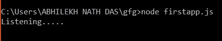
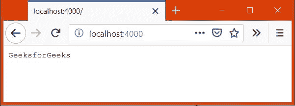

# 使用 Express

设计首次应用

> 原文:[https://www . geesforgeks . org/design-first-application-use-express/](https://www.geeksforgeeks.org/design-first-application-using-express/)

Express 是一个用于 node.js 的轻量级 web 应用程序框架，用于相对快速和轻松地构建 web 应用程序的后端。
这里我们将编写一个简单的 web 应用程序，它将在浏览器上显示一条消息。

**设置:**

*   **安装节点:**如果您没有安装节点，请按照[此](https://www.geeksforgeeks.org/introduction-to-nodejs/)页面上的说明进行操作。
*   通过在命令提示符或终端中键入以下两个命令，检查是否安装了节点和 npm。

    ```
    node --version
    npm --version

    ```

*   **安装快递:**前往[本](https://www.geeksforgeeks.org/introduction-to-express/)页面安装快递。别忘了为那里提到的项目制作工作目录。

**我们开始吧:**

*   创建一个文件“firstapp.js”，并编写如下所示的代码。

    ```
    var express = require('express');

    app = express();

    app.get('/', function(req, res) {
        res.type('text/plain');
        res.status(200);
        res.send('GeeksforGeeks');
    });

    app.listen(4000, function() {
        console.log('Listening.....');
    });
    ```

*   输入以下命令启动 app:

    ```
    node filename.js

    ```

    你会看到这样的东西

    
    这意味着服务器正在等待一个请求到来

*   打开任意选择的浏览器，进入“localhost:4000/”会看到消息“GeeksforGeeks”。
    

### 解释:

*   ```
    var express = require('express');
    ```

    require()是一个 node.js 函数，用于加载外部模块。这里“express”是外部模块。

*   ```
    app = express();
    ```

    这里创建了一个 express 模块的对象，在该对象上将应用不同的方法，如 get、set、post、use 等。

*   ```
    app.get('/', function(req, res){
    res.type('text/plain');
    res.status(200);
    res.send('GeeksforGeeks');
    });

    ```

    get()是一个函数，我们通过它添加 route 和一个函数，当任何请求到来时，这个函数将被调用。
    我们传递给 get()的函数通过将状态代码更新为 200、mime 类型更新为“text/plain”来设置响应头的属性，最后将消息“GeeksforGeeks”发送给浏览器。

*   ```
    app.listen(4000);

    ```

    这用于建立一个在端口 4000 监听任何请求的服务器。