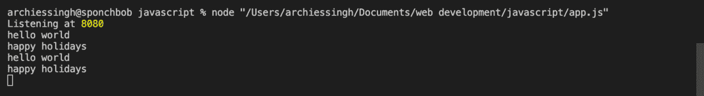

# express . js 中 app.use()和 app.get()的区别

> 原文:[https://www . geesforgeks . org/app-use-and-app-get-in-express-js/](https://www.geeksforgeeks.org/difference-between-app-use-and-app-get-in-express-js/)之间的区别

[Express](https://www.geeksforgeeks.org/introduction-to-express/) 是一个小框架，位于 Node.js 的 web 服务器功能之上，用于简化其 API 并添加有用的新功能

**附加条件:**按照以下步骤进行项目设置和模块安装。

**步骤 1:** 使用下面给出的命令创建一个目录。创建目录后，在终端中添加所创建目录的位置。

```js
 mkdir <folder_name>
```

**步骤 2:** 现在使用下面给出的命令初始化 npm(节点包管理器)。

```js
npm init
```

**步骤 3:** 现在在当前目录中安装 Express，并将其保存在依赖项列表中。

```js
npm install express --save 
```

### **代码实现:**

**1。app . use():**app . use()函数用于在指定的路径挂载指定的中间件函数*(是可以访问请求对象和响应对象的函数，或者我们可以称之为响应-请求循环)*。当请求路径的基础与路径匹配时，执行中间件功能。

**语法:**

```js
app.use([path,],callback[,callback...])
```

## index.js

```js
// Requiring module
const express = require('express')
const app = express()

app.use(function(req, res, next) {
  console.log('hello world')
  next()
})

app.use(function(req, res, next) {
  console.log('happy holidays')
  next()
})

// Server setup
var server = app.listen(8080, function () {
    var port = server.address().port
    console.log("Listening at", port)
 })
```

使用以下命令运行 **index.js** 文件:

```js
node index.js
```

**输出:**



**2。app.get():** 这个函数告诉服务器在给定的路由上获取请求时要做什么。

## index.js

```js
// Requiring module
var express = require('express');
var app = express();

app.get('/', function (req, res) {
   res.send('Hello Geek');
})

// Server setup
var server = app.listen(8080, function () {
   var host = server.address().address
   var port = server.address().port
   console.log(" Listening : ", port)
})
```

使用以下命令运行 **index.js** 文件:

```js
node index.js
```

**输出:**


**app . use()和 app.get()方法的区别:**

<figure class="table">

| **app . use()方法** | **app . get()方法** |
| It can be used to modularize routes (just like exposing a set of routes from npm modules that can be used by other web applications). | This method is used to expose the GET method. |
| It is designed to bind middleware to your application. This path is a *mount* path, and the middleware is restricted to only apply any path starting with it. | Used to match and process specific routes when getting http requests. |
| When the base of the request path matches the path, the middleware function is executed. | Routes the HTTP GET request to the specified path with the specified callback function. |
| It will allow all http requests that match this route. | Only http GET requests are allowed to reach this particular route. |
| **Syntax:** app.use ([path,], callback [,callback ...]) | **Syntax:** app.get (path, callback) |

</figure>

**参考:**

*   [https://www.geeksforgeeks.org/express-js-app-use-function/](https://www.geeksforgeeks.org/express-js-app-use-function/)
*   [https://www.geeksforgeeks.org/express-js-app-get-function/](https://www.geeksforgeeks.org/express-js-app-get-function/)