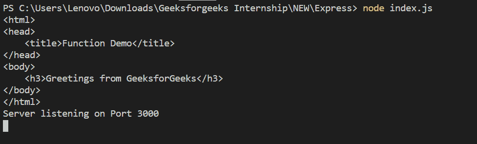

# Express.js | app.render()函数

> 原文:[https://www . geesforgeks . org/express-js-app-render-function/](https://www.geeksforgeeks.org/express-js-app-render-function/)

**app.render()** 函数用于通过回调函数渲染视图的 HTML。这个函数返回回调函数中的 html。

**语法:**

```
app.render(view, [locals], callback)
```

**参数:**

1.  **视图:**是要渲染的 HTML 页面的名称。
2.  **局部变量:**这是一个可选参数，它是一个包含所传递视图参数的局部变量的对象。
3.  **回调:**是作为参数传递的函数。

**快递模块安装:**

1.  您可以访问[安装快速模块](https://www.npmjs.com/package/express)的链接。您可以使用此命令安装此软件包。

    ```
    npm install express
    ```

2.  安装 express 模块后，您可以使用命令在命令提示符下检查您的 express 版本。

    ```
    npm version express
    ```

3.  Create a email.ejs file in views folder with the following code:
    **Filename: email.ejs**

    ```
    <html>
    <head>
        <title>Function Demo</title>
    </head>
    <body>
        <h3>Greetings from GeeksforGeeks</h3>
    </body>
    </html>
    ```

    **注意:**你可以使用任何视图引擎，就像在这种情况下，我们使用了 **ejs** 。

4.  After that, you can just create a folder and add a file for example, index.js. To run this file you need to run the following command.

    ```
    node index.js
    ```

    **文件名:index.js**

    ```
    var express = require('express');
    var app = express();
    var PORT = 3000;

    // View engine setup
    app.set('view engine', 'ejs');

    app.render('email', function (err, html) {
        if (err) console.log(err);
        console.log(html);
    });

    app.listen(PORT, function(err){
        if (err) console.log("Error in server setup");
        console.log("Server listening on Port", PORT);
    });
    ```

**运行程序的步骤:**

1.  使用以下命令确保您已经安装了 **express** 和 **ejs** 模块:

    ```
    npm install express
    npm install ejs
    ```

2.  Run index.js file using below command:

    ```
    node index.js
    ```

    **输出:**
    