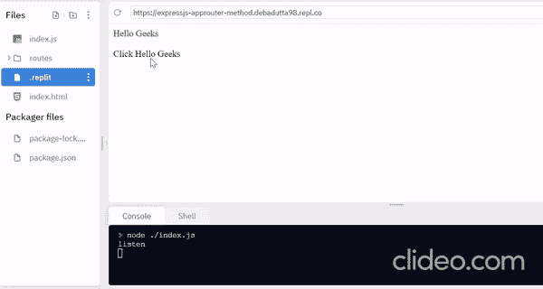

# Express.js app.router()方法

> 原文:[https://www.geeksforgeeks.org/express-js-app-router-method/](https://www.geeksforgeeks.org/express-js-app-router-method/)

Express.js 是一个 Node.js web 灵活框架，为移动和 web 应用程序提供了一组特性。Express 有许多开发人员提供的各种方法，express 中的方法之一是 Router，它用于根据请求将用户转移到网站的不同页面。

**语法:**

```
express.Router([options]);
```

**参数:**该功能接受以下参数:

*   **区分大小写:**启用区分大小写表示如果路由是“/contact”，则不表示与“/contact”、“/Contact”等相同默认情况下忽略区分大小写。
*   **合并参数:**此功能在 4.5.0 及更高版本的 express 上可用。如果要通过子路由从父路由访问参数，则需要将合并参数作为 true 传递。
*   **strict:** 启用严格 Routing 表示如果路由为“/about”，则不表示与“/about/”相同，默认情况下则相反。

**项目设置和模块安装:**

**第一步:**可以访问[安装快递模块](https://www.npmjs.com/package/express)的链接。您可以使用此命令安装此软件包。

```
npm install express
```

**第二步:**安装完快递模块后，可以使用命令在命令提示符下查看自己的快递版本。

```
npm version express
```

**第三步:**之后，您可以创建一个文件夹并添加一个文件，例如 index.js。要运行这个文件，您需要运行以下命令。

```
node index.js
```

**项目结构:**如下图。


项目结构

**文件名- index.js:**

## java 描述语言

```
// Requiring module
const express = require('express');
const app = express();

// Port number
const port = process.env.PORT || 4000;

// import router which is exported
// in app.js file
const route = require('./routes/app.js');

// When a request comes from /result
// route.It divert to app.js
app.use('/result', route);

var visit_link = "<a" + " href=" + "/result"
    + 'style="color:green;"'
    + '"text-decoration:none;"'
    + '"text-size:20px" + ">"'
    + "Hello Geeks" + "</a>"
    + "<br> <br> Click Hello Geeks";

// Handling GET Request '/'
app.get('/', function(req, res) {

    // Sending the html code as a string
    res.send(visit_link);
});

// Server setup
app.listen(port, function(req, res) {
    console.log("listen");
});
```

**Express 中的 Router()方法:**当你的 web 或移动应用程序有多条路由时，开发人员无法通过将所有路由维护在一个文件中来维护代码的可读性、整洁性、一致性和正确性。所以 express developer 想出了一个更好的主意，并引入了一种叫做 Router 的方法来帮助开发人员维护所有的需求。

在这个示例项目中，当用户点击 *Hello Geeks，*时，它被重定向到***http://localhost:4000/result。*** 当请求包含“/结果”路由时，服务器运行位于路由文件夹中的 **app.js** 文件。

**文件名 app.js**

## java 描述语言

```
// Requiring module
const app = require('express')

// Initiate router
const router = app.Router();

// Path Module
const path = require('path');

// Handling GET Request
router.get('/',function(req,res) {
  res.sendFile(path.dirname(__dirname)
  + "/index.html")
})

// Exporting router variable
module.exports = router;
```

**文件名-索引. html:**

在完成 app.js 文件的执行后，它会将一个 HTML 文件发送到特定的路线，并在浏览器上显示它。

## 超文本标记语言

```
<!DOCTYPE html>
<html>

<body>
    
</body>

</html>
```

**运行应用程序的步骤:**使用以下命令运行**索引. js** 文件:

```
node index.js
```

**输出:**现在打开浏览器转到***http://localhost:4000/*****你会得到如下输出。**

**

该项目的工作模式** 

****参考:**[https://expressjs . com/en/5x/API . html # express . router](https://expressjs.com/en/5x/api.html#express.router)**