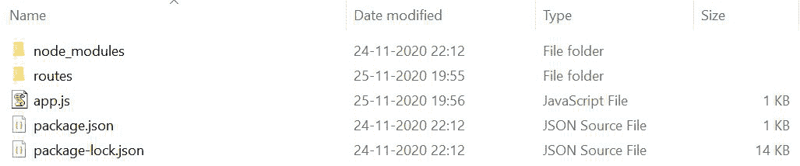
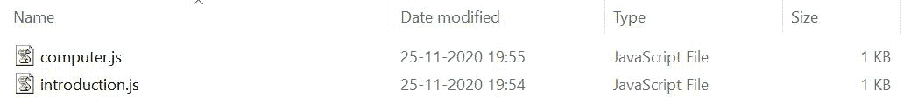

# Express.js app.router 属性

> 原文:[https://www . geesforgeks . org/express-js-app-router-property/](https://www.geeksforgeeks.org/express-js-app-router-property/)

在 Express 4 中引入了 **Express.js app.router** 属性。它帮助我们创建模块化、可安装的路由处理器。它为我们提供了许多功能，例如它扩展了这个路由来处理验证、处理 404 或其他错误等。它帮助我们为服务器端编程组织文件结构。

**有什么需要用快递的。路由器？**

它帮助我们管理服务器端项目中创建的数百条路由，方法是将它们分成单独的文件。它有助于基本的中间件路由和处理 404 错误。使用快递。路由器，包含所有依赖项、文件、路由等的整个文件夹结构良好，任何人都很容易理解。

**快速模块的安装**

运行 **npm init** 并创建一个 package.json 文件后，是时候安装我们的依赖项即 Express 了。

1.您可以访问此[链接](https://www.npmjs.com/package/express)并使用以下命令下载:

```
npm install express --save
```

2.安装 express 后，您可以使用以下命令在命令提示符下检查您的 express 版本:

```
npm version express
```

3.安装所需的依赖项后，使用终端创建一个 ***app.js*** 文件。为了运行该文件，您需要执行以下操作:

```
node app.js
```

**项目目录:**创建 app.js 后，单独创建一个名为**路线**的文件夹，如下图所示:



这将是文件和包创建和安装后的项目结构。在路线内部，将有两个文件，如下所示:



**文件名:app.js**

## java 描述语言

```
// Requiring module
const express = require('express');

// Creating express object
const app=express();

// Middlewares
app.use(require('./routes/introduction.js'));
app.use(require('./routes/computer.js'));

// Server setup
app.listen(3000, function() { 
   console.log('Server listening on port 3000'); 
});
```

我们需要在路线内部创建的两个文件，即 *<u>computer.js</u>* 和 *<u>introduction.js</u>* 在我们的 app.js 文件中使用以下代码:

```
// Syntax
app.use(require('Filepath'))

// Implementation
app.use(require('./routes/introduction.js'));
app.use(require('./routes/computer.js'));
```

**文件名:introduction.js**

## java 描述语言

```
// Requiring module
const express = require('express');

// Creating router object
const router = express.Router();

// Handling request
router.get('/introduction', (req,res) => {
  console.log('Opening introduction.js');
  res.send('Welcome to geeksforgeeks!');
});

// Exporting router object
module.exports = router;
```

**文件名:computer.js**

## java 描述语言

```
// Requiring module
const express = require('express');

// Creating router object
const router = express.Router();

// Handling request
router.get('/computer', (req,res) => {
  console.log('Opening computer.js');
  res.send('This is a computer science portal');
});

// Exporting router object
module.exports = router;
```

使用以下命令运行 **app.js** 文件:

```
node app.js
```

**输出:**

```
Server listening on port 3000
```

现在打开浏览器，转到***http://localhost:3000/简介*** 和***http://localhost:3000/电脑，*** 然后你会在你的终端屏幕上看到如下输出:

```
Server listening on port 3000
Opening introduction.js
Opening computer.js
```

**工作:**两条路线都已经在浏览器中打开，所以 *console.log()* 打印了以下关于成功打开路线的声明。在浏览器上，两条路线将显示不同的输出，如下所示:

对于*<u>http://localhost:3000/introduction</u>*将显示以下输出:

```
Welcome to geeksforgeeks!
```

对于*<u>http://localhost:3000/计算机</u>* 将显示以下输出:

```
This is a computer science portal
```