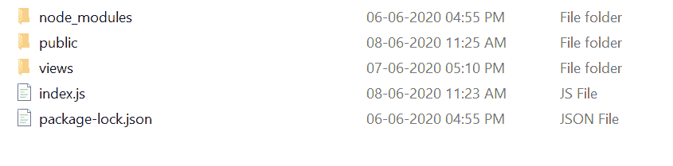

# Express.js express.static()功能

> 原文:[https://www . geesforgeks . org/express-js-express-static-function/](https://www.geeksforgeeks.org/express-js-express-static-function/)

**express.static()** 函数是 express 中内置的中间件函数。它服务于静态文件，并且基于 serve-static。

**语法:**

```js
express.static(root, [options])
```

**参数:**root 参数描述了为静态资产提供服务的根目录。

**返回值:**返回一个对象。

**快递模块安装:**

1.  您可以访问[安装快速模块](https://www.npmjs.com/package/express)的链接。您可以使用此命令安装此软件包。

    ```js
    npm install express
    ```

2.  安装快速模块后，您可以使用命令在命令提示符下检查您的快速版本。

    ```js
    npm version express
    ```

3.  之后，您可以创建一个文件夹并添加一个文件，例如 index.js。

    ```js
    node index.js
    ```

**示例 1:** **文件名:index.js**

```js
var express = require('express');
var app = express();
var path = require('path');
var PORT = 3000;

// Static Middleware 
app.use(express.static(path.join(__dirname, 'public')))

app.get('/', function (req, res, next) {
    res.render('home.ejs');
})

app.listen(PORT, function(err){
    if (err) console.log(err);
    console.log("Server listening on PORT", PORT);
});
```

现在，在视图文件夹中创建 **home.ejs** 文件，代码如下:
**文件名:home.ejs**

```js
<!DOCTYPE html> 
<html> 
<head> 
    <title>express.static() Demo</title> 
</head> 
<body> 
   <h2>Greetings from GeeksforGeeks</h2>
   
</body> 
</html> 
```

**运行程序的步骤:**

1.  项目结构会是这样的:
    
    **注:****Demo.jpg**被放置在公共文件夹中，因为公共文件夹现在被作为静态的提供给服务器。
2.  使用以下命令确保您已经安装了 **express** 和 **ejs** 模块:

    ```js
    npm install express
    npm install ejs

    ```

3.  Run index.js file using below command:

    ```js
    node index.js
    ```

    **输出:**

    ```js
    Server listening on PORT 3000

    ```

4.  现在打开浏览器，进入 *http://localhost:3000/* ，屏幕上会出现如下输出:
    

**示例 2:**
**文件名:index.js**

```js
var express = require('express');
var app = express();
var path = require('path');

// Static Middleware 
console.log(app.use(express.static(
    path.join(__dirname, 'public'))))
```

使用以下命令运行 index.js 文件:

```js
node index.js
```

**输出:**

```js
[Function: app] EventEmitter {
  _events: [Object: null prototype] { mount: [Function: onmount] },
  _eventsCount: 1,
  _maxListeners: undefined,
  setMaxListeners: [Function: setMaxListeners],
  getMaxListeners: [Function: getMaxListeners],
  emit: [Function: emit],
  .
  .
  .
  .
  locals: [Object: null prototype] {
    settings: {
      'x-powered-by': true,
      etag: 'weak',
      'etag fn': [Function: generateETag],
      env: 'development',
      'query parser': 'extended',
      'query parser fn': [Function: parseExtendedQueryString],
      'subdomain offset': 2,
      'trust proxy': false,
      'trust proxy fn': [Function: trustNone],
      view: [Function: View],
      views: 'C:\\Users\\Lenovo\\Downloads\\GFG 
        Reviewer Internship\\Program\\views',
      'jsonp callback name': 'callback'
    }
  },
  mountpath: '/',
  _router: [Function: router] {
    params: {},
    _params: [],
    caseSensitive: false,
    mergeParams: undefined,
    strict: false,
    stack: [ [Layer], [Layer], [Layer] ]
  }
}

```

**参考:** [官方文件](https://expressjs.com/en/4x/api.html#express.static)