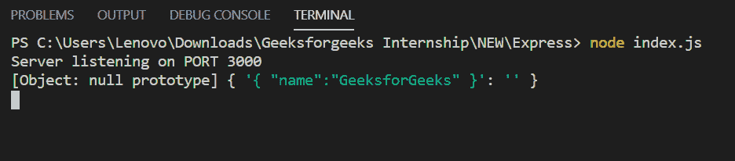

# express . js express . URL encoded()函数

> 原文:[https://www . geesforgeks . org/express-js-express-URL encoded-function/](https://www.geeksforgeeks.org/express-js-express-urlencoded-function/)

**express.urlencoded()** 函数是 express 中内置的中间件函数。它使用 urlencoded 有效负载解析传入的请求，并且基于 body-parser。
**语法:**

```js
express.urlencoded( [options] )
```

**参数:**选项参数包含扩展、膨胀、限制、验证等各种属性。
**返回值:**返回一个对象。
**快递模块安装:**

1.  您可以访问[安装快速模块](https://www.npmjs.com/package/express)的链接。您可以使用此命令安装此软件包。

```js
npm install express
```

1.  安装快速模块后，您可以使用命令在命令提示符下检查您的快速版本。

```js
npm version express
```

1.  之后，您可以创建一个文件夹并添加一个文件，例如 index.js。

```js
node index.js
```

**示例 1:** **文件名:index.js**

## java 描述语言

```js
var express = require('express');
var app = express();
var PORT = 3000;

app.use(express.urlencoded({extended:false}));

app.post('/', function (req, res) {
    console.log(req.body);
    res.end();
});

app.listen(PORT, function(err){
    if (err) console.log(err);
    console.log("Server listening on PORT", PORT);
});
```

**运行程序的步骤:**

1.  项目结构会是这样的:


1.  使用以下命令确保您已经安装了 **express** 模块:

```js
npm install express
```

1.  使用以下命令运行 index.js 文件:

```js
node index.js
```

1.  **输出:**

```js
Server listening on PORT 3000
```

2.  现在向 *http://localhost:3000/* 发出 POST 请求，头部设置为**‘内容类型:application/x-www-form-URL encoded’**和正文**{“title”:“geeks forgeeks”}**，然后您将在控制台上看到以下输出:



**示例 2:** **文件名:index.js**

## java 描述语言

```js
var express = require('express');
var app = express();
var PORT = 3000;

// Without this middleware
// app.use(express.urlencoded({extended:false}));

app.post('/', function (req, res) {
    console.log(req.body);
    res.end();
});

app.listen(PORT, function(err){
    if (err) console.log(err);
    console.log("Server listening on PORT", PORT);
});
```

使用以下命令运行 index.js 文件:

```js
node index.js
```

现在向 *http://localhost:3000/* 发出 POST 请求，头部设置为**‘内容类型:application/x-www-form-URL encoded’**和正文**{“title”:“geeks forgeeks”}**，然后您将在控制台上看到以下输出:

```js
Server listening on PORT 3000
undefined
```

**参考:**T2 官方文件