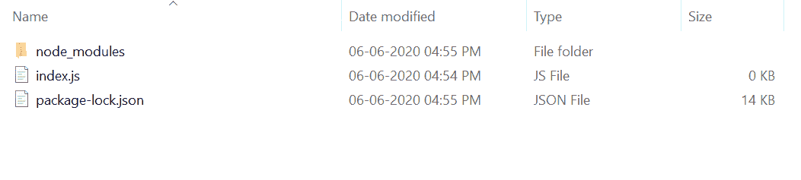

# Express.js req.ips 属性

> 原文:[https://www.geeksforgeeks.org/express-js-req-ips-property/](https://www.geeksforgeeks.org/express-js-req-ips-property/)

**req.ips** 属性包含一个在请求头中指定的 IP 地址数组。它返回一个 IP 地址数组。

**语法:**

```
req.ips
```

**参数:**无参数。

**返回值:**数组

**快递模块安装:**

1.  您可以访问[安装快速模块](https://www.npmjs.com/package/express)的链接。您可以使用此命令安装此软件包。

    ```
    npm install express
    ```

2.  安装快速模块后，您可以使用命令在命令提示符下检查您的快速版本。

    ```
    npm version express
    ```

3.  之后，您可以创建一个文件夹并添加一个文件，例如 index.js。

    ```
    node index.js
    ```

**示例 1:** **文件名:index.js**

```
var express = require('express');
var app = express(); 
var PORT = 3000;

app.get('/', function (req, res) {
  console.log(req.ips);
  res.send();
});

app.listen(PORT, function(err){
    if (err) console.log(err);
    console.log("Server listening on PORT", PORT);
});
```

**运行程序的步骤:**

1.  项目结构会是这样的:
    
2.  使用以下命令确保您已经安装了 **express** 模块:

    ```
    npm install express
    ```

3.  Run index.js file using below command:

    ```
    node index.js
    ```

    **输出:**

    ```
    Server listening on PORT 3000

    ```

4.  现在打开浏览器，转到 **http://localhost:3000/** ，现在你可以在控制台上看到如下输出:

    ```
    Server listening on PORT 3000
    []

    ```

**示例 2:** 考虑上面的代码，但是这次向 **http://localhost:3000/** 发出 GET 请求，标头设置为**x-forward-for:203.0.113.195、70.41.3.18、150.172.238.178**，现在您可以在控制台上看到以下输出:

```
Server listening on PORT 3000
[203.0.113.195, 70.41.3.18, 150.172.238.178]

```

**参考资料:**[https://expressjs . com/en/4x/API . html # req . IPS](https://expressjs.com/en/4x/api.html#req.ips)