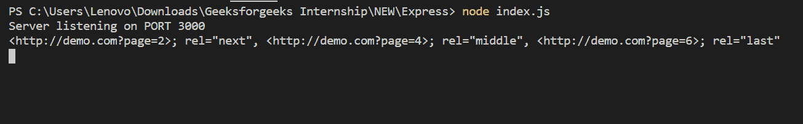

# Express.js res.links()功能

> 原文:[https://www . geesforgeks . org/express-js-RES-links-function/](https://www.geeksforgeeks.org/express-js-res-links-function/)

**res.links()** 函数用于连接作为参数属性提供的链接，以填充响应的链接 HTTP 头字段。
**语法:**

```
res.links( links )
```

**参数:**链接参数描述要加入的链接的名称。
**返回值:**返回一个对象。
**快递模块安装:**

1.  您可以访问[安装快速模块](https://www.npmjs.com/package/express)的链接。您可以使用此命令安装此软件包。

```
npm install express
```

1.  安装快速模块后，您可以使用命令在命令提示符下检查您的快速版本。

```
npm version express
```

1.  之后，您可以创建一个文件夹并添加一个文件，例如 index.js。

```
node index.js
```

**示例 1:** **文件名:index.js**

## java 描述语言

```
var express = require('express');
var app = express();
var PORT = 3000;

// Without middleware
app.get('/', function(req, res){
    res.links({
        next: 'http://demo.com?page=2',
        middle: 'http://demo.com?page=4',
        last: 'http://demo.com?page=6'
    });

    console.log(res.get('link'));
});

app.listen(PORT, function(err){
    if (err) console.log(err);
    console.log("Server listening on PORT", PORT);
});
```

**运行程序的步骤:**

1.  项目结构会是这样的:


1.  使用以下命令确保您已经安装了 **express** 模块:

```
npm install express
```

1.  使用以下命令运行 index.js 文件:

```
node index.js
```

1.  **输出:**

```
Server listening on PORT 3000
```

2.  现在打开浏览器，转到 *http://localhost:3000/* ，现在检查你的控制台，你会看到如下输出:



**示例 2:** **文件名:index.js**

## java 描述语言

```
var express = require('express');
var app = express();
var PORT = 3000;

// With middleware
app.use('/', function(req, res, next){
    res.links({
        next: 'http://demo.com?page=2',
        middle: 'http://demo.com?page=4',
        last: 'http://demo.com?page=6'
    });
    next();
})

app.get('/', function(req, res){
    console.log(res.get('link'));
    res.send();
});

app.listen(PORT, function(err){
    if (err) console.log(err);
    console.log("Server listening on PORT", PORT);
});
```

使用以下命令运行 index.js 文件:

```
node index.js
```

现在打开浏览器，转到 *http://localhost:3000/* ，现在检查你的控制台，你会看到如下输出:


**参考资料:**[https://expressjs . com/en/5x/API . html # RES . links](https://expressjs.com/en/5x/api.html#res.links)