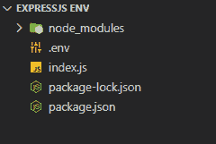

# 如何在 API 端点中访问 ExpressJS env 变量？

> 原文:[https://www . geesforgeks . org/如何访问-expressjs-env-变量-in-in-an-API-endpoint/](https://www.geeksforgeeks.org/how-to-access-expressjs-env-variables-in-an-api-endpoint/)

使用环境值允许从软件/应用程序本身之外配置软件/应用程序中的值。这确保了不必在代码本身中存储敏感数据。它还有助于在不重新部署的情况下重新配置应用程序中的设置。

在本文中，我们将使用 Node 和 Express 创建一个 RESTful API，它将从. env 文件中获取一个环境变量，并将其值作为响应返回。

**先决条件:**

1.  [Node.js](https://www.geeksforgeeks.org/introduction-to-nodejs/) 是一个开源和跨平台运行时环境，用于在浏览器外执行[<u>JavaScript</u>](https://www.geeksforgeeks.org/JavaScript-tutorial/)代码。
2.  [Express.js](https://www.geeksforgeeks.org/introduction-to-express/) 是一个小框架，位于 Node.js 的 web 服务器功能之上，用于简化其 API 并添加有用的新功能。

**按照以下步骤访问应用编程接口端点中的环境变量:**

**步骤 1:** 我们必须使用节点包管理器初始化一个新项目。我们可以通过选择所有默认选项来完成设置。

```js
npm init
```

**第二步:**我们必须安装快递和。环境包。

```js
npm install express dotenv --save
```

**第三步:**创建一个文件 index.js，这个应用程序的入口点将是 index.js 文件。我们所有的业务逻辑都在这里。REST API 将只包含一条返回我们将要设置的环境变量的路径。

## java 描述语言

```js
const express = require('express');

// Initialize app
const app = express();

// Assign route
app.use('/', (req, res, next) => {
  res.send('Hello World');
});

// Start server
app.listen(5000, () => {
  console.log('App listening on port 5000');
});
```

**第 4 步:**创建。env 文件。我们必须创造。包含我的名字环境变量的环境文件

```js
MY_NAME=Geeksforgeeks
```

**项目结构:**现在，我们将有以下文件结构。



项目的文件结构

**加载环境变量:**

接下来，我们必须导入。我们的 index.js 文件中的 env 包。

```js
const dotenv = require('dotenv');
```

现在，我们可以通过将路径设置为。并从中加载变量。

```js
dotenv.config({ path: './.env' });
```

现在，我们可以使用方法访问 index.js 文件中的环境变量

```js
process.env.VARIABLE_NAME
```

在这种情况下，它会是

```js
process.env.MY_NAME
```

**最终代码:**

## java 描述语言

```js
const dotenv = require('dotenv');
const express = require('express');

// Set path to .env file
dotenv.config({ path: './.env' });

// Initialize app
const app = express();

// Assign route
app.use('/', (req, res, next) => {
  const name = process.env.MY_NAME;
  res.status(200).json({ name });
});

// Start server
app.listen(5000, () => {
  console.log('App listening on port 5000');
});
```

**输出:**

```js
"name":"Geeksforgeeks"
```