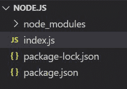
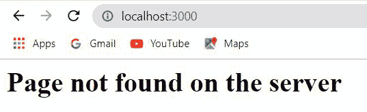

# 如何在快递中添加 404 错误页？

> 原文:[https://www . geesforgeks . org/how-add-a-404-快件中的错误页面/](https://www.geeksforgeeks.org/how-to-add-a-404-error-page-in-the-express/)

[Express.js](https://www.geeksforgeeks.org/working-of-express-js-middleware-and-its-benefits/) 是 node.js 的一个强大框架，这个框架的一个主要优势就是定义了不同的路由或者中间件来处理客户端不同的传入请求。在本文中，我们将讨论如何添加一个 404 错误页面，即使用快速服务器找不到。404 是状态码，表示在服务器中找不到。

**安装模块:**使用以下命令安装所需的模块。

```js
npm install express
```

**项目结构:**会是这样的。



## index.js

```js
// Requiring module
const express = require("express")
const app = express()

// Handling GET /hello request
app.get("/hello", (req, res, next) => {
    res.send("This is the hello response");
})

// Handling non matching request from the client
app.use((req, res, next) => {
    res.status(404).send(
        "<h1>Page not found on the server</h1>")
})

// Server setup
app.listen(3000, () => {
    console.log("Server is Running")
})
```

使用以下命令运行**index . js**文件:

```js
node index.js
```

**输出:**现在打开浏览器转到***http://localhost:3000/***，服务器会响应没有发现页面。

