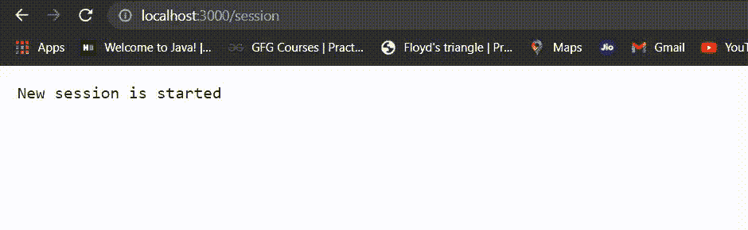

# 如何用 Express.js 统计一个网站的访问量？

> 原文:[https://www . geesforgeks . org/如何使用 express-js 计算网站访问次数/](https://www.geeksforgeeks.org/how-to-count-number-of-visits-to-a-website-using-express-js/)

会话管理可以通过使用 express-session 模块在 node.js 中完成。它有助于以键值形式保存数据。在本文中，我们将看到如何在 Express Js 中计算 Express Session 中的视图数量。

**先决条件:**

*   节点的基本知识。
*   已安装 Node.js(版本 12+)。
*   已安装 npm(版本 6+)。

要在编辑器中设置节点项目，您可以在此处看到。

**安装需要模块:**

```js
npm install express
npm install express-session
```

**调用 API:**

```js
var session = require('express-session')
```

**示例:**该示例说明了上述方法。

## app.js

```js
// Call Express Api.
var express=require('express'),

// Call express Session Api.
session = require('express-session'),

app=express();

// Session Setup
app.use (
    session ({

        // It holds the secret key for session
        secret: "I am girl",

        // Forces the session to be saved
        // back to the session store
        resave: true,

        // Forces a session that is "uninitialized"
        // to be saved to the store
        saveUninitialized: false,
        cookie: {
    })
);

// Get function in which send session as routes.
app.get('/session', function(req, res, next) {

    if (req.session.views) {

      // Increment the number of views.
      req.session.views++

      // Print the views.
      res.write('<p> No. of views: ' 
          + req.session.views + '</p>') 
      res.end()
    } else {
      req.session.views = 1
      res.end(' New session is started')
    }
  })

// The server object listens on port 3000.
app.listen(3000,function(){
    console.log("Express Started on Port 3000");
});
```

使用下面的命令运行 index.js 文件。

```js
node app.js
```


现在要设置您的会话，只需打开浏览器并键入此网址。

```js
http://localhost:3000/session
```

**输出:**

