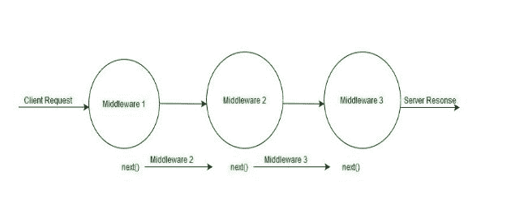
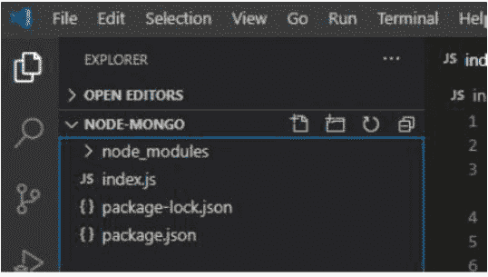
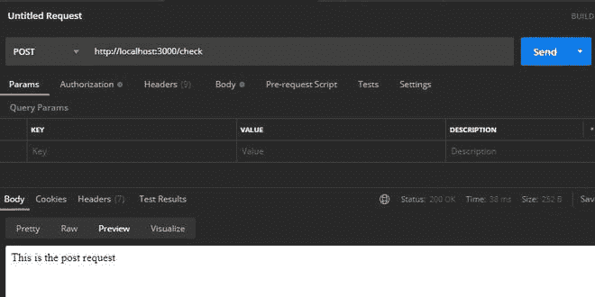
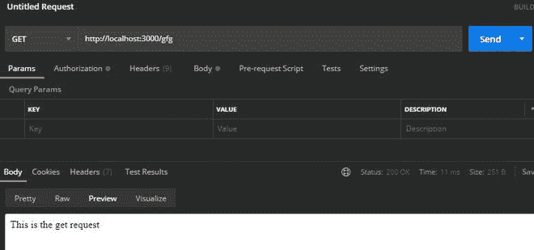

# 如何在 express 中创建定制中间件？

> 原文:[https://www . geesforgeks . org/如何在 express 中创建自定义中间件/](https://www.geeksforgeeks.org/how-to-create-custom-middleware-in-express/)

**Express.js** 是 [node.js](https://www.geeksforgeeks.org/working-of-express-js-middleware-and-its-benefits/) 最强大的框架。Express.js 是一个路由和中间件框架，用于处理网页的不同路由，它在请求和响应周期之间工作。Express.js 使用不同种类的中间件功能以便完成发出的不同请求客户端对于例如客户端可以发出 get、 put、 post 、和删除请求这些请求可以通过这些中间件功能轻松处理

**工作的** **中间件** **功能:**



**定制中间件:**

我们可以根据请求的路由使用 express.js 创建多个 Custom 中间件，也可以将请求转发给下一个中间件。

**语法:**

```js
app.<Middlewaretype>(path,(req,res,next))
```

**参数:**定制中间件取以下两个参数:

*   **路径:**调用特定中间件的路径或路径模式或正则表达式。
*   **回调:**第二个参数是回调函数，它以三个参数 request、response 和 next()函数作为参数。

**安装模块:**使用以下命令安装快速模块。

```js
npm install express
```

**项目结构:**我们的项目结构会是这样的。



## index.js

```js
// Requiring module 
const express = require("express"); 

// Creating express app object 
const app = express(); 

app.post("/check",(req,res,next)=>{
  res.send("This is the post request")
  next()
})

app.get("/gfg",(req,res,next)=>{
  res.send("This is the get request")
  res.end()
})

// Server setup 
app.listen(3000, () => { 
  console.log("Server is Running"); 
})
```

使用以下命令运行 **index.js** 文件:

```js
node index.js
```

**输出:**

```js
Server is Running
```

现在打开邮递员工具，发送以下请求:

*   **处理邮寄请求:**

    

*   **处理获取请求:**

    