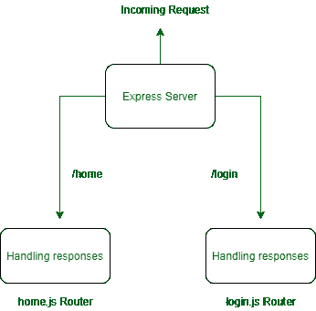

# 如何在同一个 express.js 服务器中创建多条路由？

> 原文:[https://www . geeksforgeeks . org/如何创建多路线同程快递-js-server/](https://www.geeksforgeeks.org/how-to-create-multiple-routes-in-the-same-express-js-server/)

[Express.js](https://www.geeksforgeeks.org/working-of-express-js-middleware-and-its-benefits/) 是 node.js 的一个强大框架，这个框架的一个主要优势就是定义了不同的路由或者中间件来处理客户端不同的传入请求。快递。js 允许我们在一台快递服务器上创建多条路线。在一台服务器上创建多条路由比创建一条路由来处理客户端发出的不同请求更好。在本文中，我们将讨论如何在单个快递服务器上创建多条路线。

**快车。Router()** 功能用于创建新的路由器对象。当您想在程序中创建一个新的路由器对象来处理请求时，可以使用这个函数。借助 Express.js 中的 Router()函数，可以轻松区分多个请求。这就是使用 Router 的优势。

**语法:**

```
express.Router( [options] )
```

**可选参数:**

*   **区分大小写:**这将启用区分大小写。
*   **合并参数:**保留请求。来自父路由器的参数值。
*   **严格:**这样可以实现严格的路由。

**返回值:** 该函数返回新的路由器对象。

结构模型:



**安装模块:**

```
npm install express
```

**项目结构:**


**路线:**

## Home.js

```
// Importing express module
const express=require("express")
const router=express.Router()

// Handling request using router
router.get("/",(req,res,next)=>{
    res.send("This is the homepage request")
})

// Importing the router
module.exports=router
```

## log in . js-登入

```
// Importing the module
const express=require("express")

// Creating express Router
const router=express.Router()

// Handling login request
router.get("/",(req,res,next)=>{
    res.send("This is the login request")
})
module.exports=router
```

## Index.js

```
const express=require("express")

// Importing all the routes
const homeroute=require("./routes/Home.js")
const loginroute=require("./routes/login")

// Creating express server
const app=express()

// Handling routes request
app.use("/home",homeroute)
app.use("/login",loginroute)
app.listen((3000),()=>{
    console.log("Server is Running")
})
```

使用以下命令运行 **index.js** :

```
node index.js
```

**输出:处理客户端的/home 请求。**

