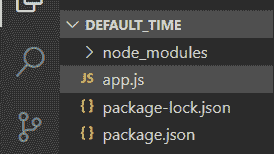
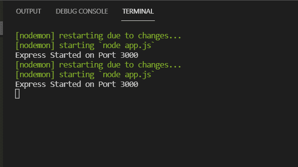
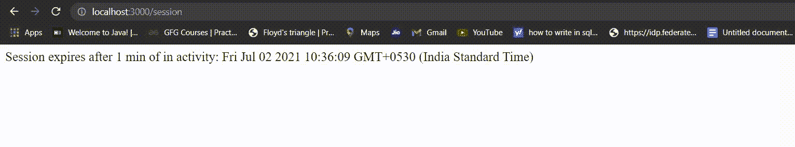

# 在 Express.js 的 express-session 中，1 分钟不活动后如何终止会话？

> 原文:[https://www . geeksforgeeks . org/express-session-of-express-js/](https://www.geeksforgeeks.org/how-to-expire-session-after-1-min-of-inactivity-in-express-session-of-express-js/)1 分钟不活动后如何终止会话

在本文中，我们将看到如何在 express-session 中的 1 分钟不活动后终止会话

**先决条件**

*   [在 Windows 上安装 node . js](https://www.geeksforgeeks.org/installation-of-node-js-on-windows/)
*   要在编辑器中设置节点项目，请参见这里的。

**需要模块:**

```
npm install express
npm install express-session
```

**调用 API:**

```
var session = require('express-session')
```

为了在 Express.js 的 express-session 中 1 分钟不活动后终止会话，我们在中间件功能中使用 **expires: 60000** 。

**项目结构:**



**以下示例说明了上述方法:**

**示例:**

**文件名:app.js**

## java 描述语言

```
// Call Express Api.
var express = require('express'),

    // Call express Session Api.
    session = require('express-session'),

    app = express();

// Session Setup
app.use(
    session({

        // It holds the secret key for session
        secret: "I am girl",

        // Forces the session to be saved
        // back to the session store
        resave: true,

        // Forces a session that is "uninitialized"
        // to be saved to the store
        saveUninitialized: false,
        cookie: {

            // Session expires after 1 min of inactivity.
            expires: 60000
        }
    })
);

// Get function in which send session as routes.
app.get('/session', function (req, res, next) {

    if (req.session.views) {

        // Increment the number of views.
        req.session.views++

        // Session will expires after 1 min
        // of in activity
        res.write(
'
<p> Session expires after 1 min of in activity: '
+ (req.session.cookie.expires) + '</p>
')
        res.end()
    } else {
        req.session.views = 1
        res.end(' New session is started')
    }
})

// The server object listens on port 3000.
app.listen(3000, function () {
    console.log("Express Started on Port 3000");
});
```

使用以下命令运行 index.js 文件:

```
node app.js
```



现在要设置您的会话，只需打开浏览器并键入以下网址:

```
http://localhost:3000/session

```

**输出**:1 分钟不活动后，将启动新会话，旧会话过期。

