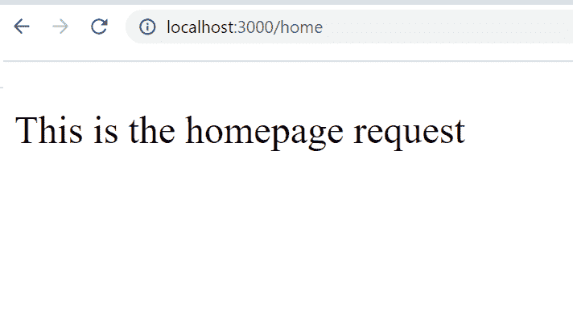

# 如何在 Express.js 中过滤路径的路径？

> 原文:[https://www . geesforgeks . org/如何过滤快递路线-js/](https://www.geeksforgeeks.org/how-to-filter-path-of-routes-in-express-js/)

[Express.js](https://www.geeksforgeeks.org/working-of-express-js-middleware-and-its-benefits/) 是 node.js 的一个强大框架，这个框架的一个主要优势就是定义了不同的路由或者中间件来处理客户端不同的传入请求。在本文中，我们将讨论如何使用 node.js 中的 express.js 过滤路由路径。

**app.use()** 方法用于处理不同的过滤节点中特定路由的请求。该函数用于在指定的路径上安装指定的中间件函数。它主要用于为您的应用程序设置中间件。

**语法:**

```
app.use(path, callback)
```

**参数:**该方法取以下两个参数:

*   **路径:**是调用中间件函数的路径。它可以是表示路径或路径模式的字符串，也可以是匹配路径的正则表达式模式。
*   **回调:**是一个中间件函数或一系列/数组中间件函数。

**安装模块:**使用以下命令安装所需的模块。

```
npm install express
```

**项目结构:**会是这样的。


**注意:** *Home.js* 和 *login.js* 文件存在于 ***路由*** 文件夹中。

## Home.js

```
// Importing express module
const express = require("express")
const router = express.Router()

// Handling request using router
router.get("/home", (req, res, next) => {
    res.send("This is the homepage request")
})

// Exporting the router
module.exports = router
```

## log in . js-登入

```
// Importing the module
const express = require("express")

// Creating express Router
const router = express.Router()

// Handling login request
router.get("/login", (req, res, next) => {
  res.send("This is the login request")
})

// Exporting the router
module.exports = router
```

## index.js

```
// Requiring module
const express = require("express")

// Importing all the routes
const homeroute = require("./routes/Home.js")
const loginroute = require("./routes/login")

// Creating express server
const app = express()

// Filtering the routes path
app.use("/", homeroute)
app.use("/", loginroute)

// Server setup
app.listen((3000), () => {
    console.log("Server is Running")
})
```

使用以下命令运行 **index.js** 文件:

```
node index.js
```

**输出:**现在打开浏览器，转到***http://localhost:3000/home***，会看到如下输出:

