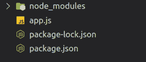
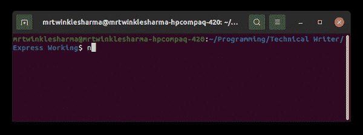
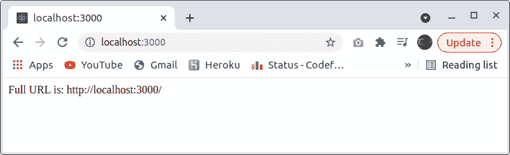

# 如何在 ExpressJS 中获取完整的 URL？

> 原文:[https://www . geesforgeks . org/如何获取完整的 URL in-express js/](https://www.geeksforgeeks.org/how-to-get-the-full-url-in-expressjs/)

网址代表统一资源定位器。它被用来定位互联网上的一些资源，它可以被认为是一个网址。您在浏览器搜索栏上键入的从互联网获取内容的字符串是一个 URL，因此在此过程中，浏览器以某种方式找到与该网址相关联的服务器地址，并说嘿，这是我从用户那里获得的内容(一个 URL)，现在告诉我应该如何响应。现在服务器有责任根据该请求做出响应。在收到响应后，浏览器有责任按照预期的方式将收到的数据提供给用户。

**问题陈述:**那么这基本上是关于 URL 的，现在我们的问题陈述是如何在服务器上获取该 URL？因为在生产应用的过程中，有几次我们需要 URL 的整体组件来理解用户需求，以便以后的服务器可以通过发送适当的响应来满足它们。

**方法:**有一种简单易行的方法可以解决这个问题，因为用户直接或间接发送请求对象，并且它包含服务器的足够信息。我们可以根据自己的需要从那个物体中提取出必要的属性。在本文的第 4 步，我们将讨论如何从用户发送的请求对象中构造 URL。

**步骤 1:** 创建 nodejs 项目并安装包。

1.创建一个**节点**应用程序。由于整个操作将使用 express framework 进行，因此创建节点应用程序是第一个必须的步骤。

```
npm init
```

2.这将要求您对您的项目进行一些配置，您可以相应地填充它们，也可以稍后从 package.json 文件中进行更改，您可以使用` **npm init -y** '进行默认初始化。

安装**快递**框架

```
npm install express
```

3.创建一个新的文件 **app.js，**在这个文件里面，我们将编写整个快递代码。

**项目结构:**如下图。



**步骤 2:** 创建快速应用程序。因此在 **app.js** 中，请执行以下操作:

1.  使用必需关键字导入快递，
2.  然后调用 express 框架提供的 express()函数。
3.  该函数调用将返回我们创建的应用程序，将其存储在一个常量变量中。
4.  默认情况下，为应用程序 3000 设置一个端口，但您可以根据可用性选择任何其他端口。
5.  然后，调用 listen()函数，这样我们的 express 服务器就开始监听指定路径上的连接。
6.  listen 函数以端口和回调函数作为参数。

作为参数提供的回调函数要么在服务器成功启动时执行，要么由于失败而提供错误。

## app.js

```
const express = require('express'); // Import
const app = express();              // Create
const PORT = 3000;                  // Configure

// Do your task here, in this space.

app.listen(PORT, (error) => {       // Listen
    if(!error)
        console.log("Server is Successfully Running,
            and App is listening on port "+ PORT)
    else
        console.log("Error occured, server can't start", error);
    }
);
```

**步骤 3:** 现在使用提供的命令运行服务器，检查是否一切正常。

```
node app.js
```

如果是，那么你会在你的终端收到类似这样的信息，否则，如果你的服务器没有启动，分析错误并检查语法等，然后重新启动服务器。



**第 4 步:**所以现在我们将继续创建路由并找到请求的完整 URL，但是让我们首先了解 URL 的各个部分。下面是描述和图片，显示了一个网址的结构。

1.  **方案:**是用来从 web 访问资源的协议，可能是 HTTP 或者 HTTPS，其中的' s '代表安全，这个方案可以由。请求对象的协议属性，如 **req.protocol.**
2.  **主机:**这是服务器所需的所有文件在现实中存在的地方的名称。主机的名称可以从。请求对象的主机名属性，如 **req.hostname.**
3.  **端口:**是服务器监听的端口号，这个端口可以直接在服务器中提取，因为我们在开始监听之前就指定了。
4.  **路径**这个路径决定了文件、页面、资源被访问的实际位置，其实你可以把它当成一个子地址，它可以通过**(req . baseurl**+**req . path)的串联来提取。**
5.  **查询**该查询用于在访问资源之前提供一些数据，以便服务器能够做出相应的响应，可以通过请求对象的 **req.query** 属性提取。

**注意:**我们不需要单独访问 baseUrl、路径和查询 express 为我们提供了一个名为**req . originalur**的属性，它包含了主机名之后的所有内容。


当您从**geeksforgeeks.org**主页点击算法部分时，我们显示的上述示例网址将出现在您浏览器的搜索栏中

**示例:**在本例中，我们正在创建接收用户请求的路由。我们将使用以下方法:

1.  在下面提供的路线中，我们在****“***路径上为 GET 方法指定了一个函数。**
2.  **这是因为现在我们可以从浏览器发送任何网址来执行给定的功能。**
3.  **然后我们简单地访问请求对象的一些属性， **objectName.propertyName** 这是提取数据的方法之一。**
4.  **我们提取了 3 个变量作为协议、主机名和原始网址。**
5.  **在下一行中，我们将存储之前设置的端口号。**
6.  **后来，我们用 ES6 的模板文字创建了一个网址字符串，倒勾**“**是创建字符串模板的方式，我们可以在 **${}** 中注入任何 javascript 表达式。**
7.  **最后，函数 **send()** 只是返回字符串作为响应。**

## **app.js**

```
app.get('*', function (req, res) {    
    const protocol = req.protocol;
    const host = req.hostname;
    const url = req.originalUrl;
    const port = process.env.PORT || PORT;

    const fullUrl = `${protocol}://${host}:${port}${url}`

    const responseString = `Full URL is: ${fullUrl}`;                       
    res.send(responseString);  
})
```

****运行应用程序的步骤:**打开终端，键入以下命令。**

```
node app.js
```

****输出:****

****

****说明:**当我们在浏览器搜索栏中输入任何一个 Url 时，浏览器都会向服务器发送一个请求对象，在我们的例子中，服务器是一个 localhost。并且快速捕获所提供路由上以及该路由功能内部的所有用户请求。方案 **http** 提取自 req.protocol，主机名 **localhost** 提取自 req.hostname， **3000** 正在从我们在第 3 步运行服务器之前设置的 PORT 进行访问，剩下的 URL 提取自 req.originalUrl**