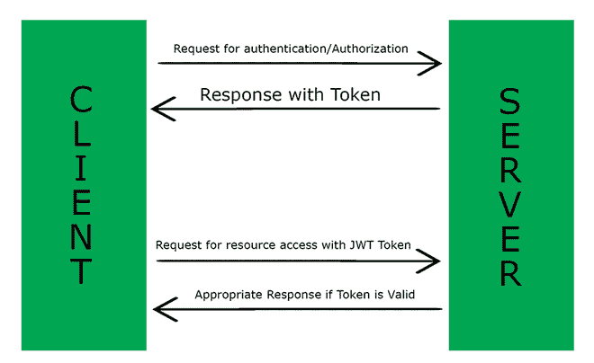
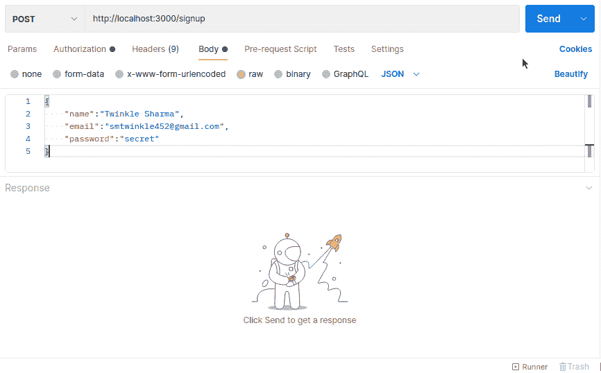
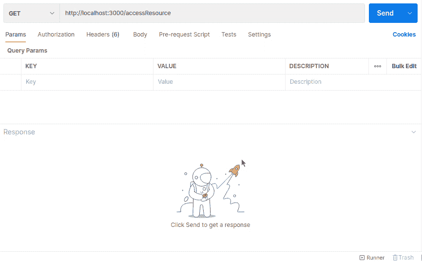

# 如何在 Express.js app 中实现 JWT 认证？

> 原文:[https://www . geeksforgeeks . org/how-implementation-jwt-authentication-in-express-js-app/](https://www.geeksforgeeks.org/how-to-implement-jwt-authentication-in-express-js-app/)

**JSON 网络令牌**

一个 **JSON 网络令牌(JWT)** 是 JSON 对象，用于通过网络(在双方之间)安全地传输信息。它通常用于身份验证系统，也可用于信息交换。

这用于通过加密在互联网上传输数据，并且通过使用额外的签名，这些令牌可以更加安全。这些令牌由报头 JSON 和有效载荷 JSON 以及可选签名组成，三者中的每一个都用“.”连接，下面是 JSON 网络令牌的示例。

> -=伊甸园美剧 http://sfile . ydy . com =-荣誉出品本字幕仅供学习交流，严禁用于商业用途

**JWT 认证的实现:** JWT 非常流行通过 HTTP 进行认证和授权。这些令牌可用作授予访问服务器资源权限的凭据。

**为什么认证中需要 JWT:**由于 HTTP 请求是无状态的，知道当前请求与过去的请求相关是一项具有挑战性的任务。例如，登录用户拥有更改其数据的某些权限，但在下一次请求时，服务器将如何识别是同一用户较早请求登录。为了解决这个挑战，我们使用 JWT。

在第一步中，服务器生成具有一些配置的令牌，即有效载荷、签名、到期等。下一次，当来自客户端的任何请求带有包含 JWT 令牌的授权头时，服务器解码该令牌并使用详细信息，并相应地允许访问。



**示例:-** 让我们创建一个具有登录和注册功能的简单服务器。

**第一步:初始化服务器&安装 JWT 包。**

```js
npm init
npm install jsonwebtoken
```

**步骤 2:为令牌创建路线**

**说明:-**

*   我们已经在第一行导入了 express、mongoose 和 *jsonwebtoken* ，还导入了 User 模型，因为这是与数据库交互所必需的。在下一行中，我们调用了 express 方法，该方法返回一个应用程序，我们可以用它来配置我们的服务器。我们在开始时使用 express.json 中间件，因为这样服务器就可以将传入的请求识别为 json 对象。
*   之后，我们创建了两条路线，一条用于登录，另一条用于注册。
*   在登录路径中，我们从请求正文中提取了电子邮件和密码，然后在数据库中搜索用户。如果找到，我们将继续检查提供的密码是否与实际密码匹配。
*   在注册路线中，我们提取了姓名、电子邮件和密码等详细信息，使用猫鼬提供的保存方法在数据库中注册用户。

最后，我们通过提供有效载荷作为用户 id 和电子邮件创建了一个 1 小时到期的**令牌**，因为只有这样才足以提取用户信息。sign 方法接受有效负载、秘密 jwt 密钥和到期时间，然后生成一个令牌。

**文件名:app.js**

## java 描述语言

```js
// Importing modules
const express = require("express");
const mongoose = require("mongoose");

const jwt = require("jsonwebtoken");
const User = require("./userModel");

const app = express();

app.use(express.json());

// Handling post request
app.post("/login", async (req, res, next) => {
  let { email, password } = req.body;

  let existingUser;
  try {
    existingUser = await User.findOne({ email: email });
  } catch {
    const error = new Error("Error! Something went wrong.");
    return next(error);
  }
  if (!existingUser || existingUser.password != password) {
    const error = Error("Wrong details please check at once");
    return next(error);
  }
  let token;
  try {
    //Creating jwt token
    token = jwt.sign(
      { userId: existingUser.id, email: existingUser.email },
      "secretkeyappearshere",
      { expiresIn: "1h" }
    );
  } catch (err) {
    console.log(err);
    const error = new Error("Error! Something went wrong.");
    return next(error);
  }

  res
    .status(200)
    .json({
      success: true,
      data: {
        userId: existingUser.id,
        email: existingUser.email,
        token: token,
      },
    });
});

// Handling post request
app.post("/signup", async (req, res, next) => {
  const { name, email, password } = req.body;
  const newUser = User({
    name,
    email,
    password,
  });

  try {
    await newUser.save();
  } catch {
    const error = new Error("Error! Something went wrong.");
    return next(error);
  }
  let token;
  try {
    token = jwt.sign(
      { userId: newUser.id, email: newUser.email },
      "secretkeyappearshere",
      { expiresIn: "1h" }
    );
  } catch (err) {
    const error = new Error("Error! Something went wrong.");
    return next(error);
  }
  res
    .status(201)
    .json({
      success: true,
      data: { userId: newUser.id, 
          email: newUser.email, token: token },
    });
});

//Connecting to the database
mongoose
  .connect("mongodb://localhost:27017/testDB")
  .then(() => {
    app.listen("3000", () => {
      console.log("Server is listening on port 3000");
    });
  })
  .catch((err) => {
    console.log("Error Occured");
  });
```

**输出:**我们正在用 Postman 测试我们的 API，我们已经在请求体中提供了注册的数据，最后，用一些其他细节获得我们的令牌。



**第三步:解码 JWT 令牌**

*   我们可以用一个令牌来接收我们授予权限的请求，这里我们展示了一个令牌如何被解码的简单例子。
*   令牌通过请求头发送，我们在这里从授权头提取令牌，我们使用分割函数，因为令牌仍然是“承载令牌”的形式，我们只想提取令牌，这就是为什么提供 1 索引。
*   验证方法接受令牌和 jwt 密钥，并提供令牌的解码。在此之后，我们可以获得用户的信息。

## java 描述语言

```js
app.get('/accessResource', (req, res)=>{   
    const token = req.headers.authorization.split(' ')[1];  
    //Authorization: 'Bearer TOKEN'
    if(!token)
    {
        res.status(200).json({success:false, message: "Error!
                       Token was not provided."});
    }
    //Decoding the token
    const decodedToken = jwt.verify(token,"secretkeyappearshere" );
    res.status(200).json({success:true, data:{userId:decodedToken.userId,
     email:decodedToken.email});    
})
```

**输出:**这里我们在测试负责接受令牌的 API，我们已经在头部传递了令牌，最终服务器成功解码用户详细信息。



**结论:**至此我们已经成功实现了从创建到解码的令牌。这个“*访问资源*”路由的例子足以说明工作原理，您可以在内部以您想要的方式使用您的令牌，并且可以相应地允许用户使用。这意味着我们能够成功地保存无状态 HTTP 请求的信息。