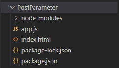

# 如何在 Express.js 中接收 post 参数？

> 原文:[https://www . geesforgeks . org/how-to-receive-post-parameter-in-express-js/](https://www.geeksforgeeks.org/how-to-receive-post-parameter-in-express-js/)

[Express](https://www.geeksforgeeks.org/introduction-to-express/) 是一个小框架，位于 Node.js 的 web 服务器功能之上，用于简化其 API 并添加有用的新功能。它使得用中间件和路由来组织应用程序的功能变得更加容易；它为 Node.js 的 HTTP 对象添加了有用的实用程序；它方便了动态 HTTP 对象的呈现。Express.js 提供了各种类型的方法来处理来自客户端的不同类型的传入请求，如 get、Post 等。在本文中，我们将讨论如何在 express.js 中接收 post 参数。

**POST 参数**可以从使用[**express . URL encoded()**](https://www.geeksforgeeks.org/express-js-express-urlencoded-function/)中间件和 **req.body** 对象的表单中接收。express.urlencoded()中间件有助于解析来自客户端的数据。

**语法:**

```js
 express.urlencoded( [options] )
```

**参数**:选项参数包含扩展、膨胀、限制、验证等多种属性。

**返回值:**返回一个对象。

**示例:**我们来逐一讨论一下在 express.js 中接收 post 参数的每个步骤

**步骤 1:** 创建一个“ ***app.js*** ”文件，并使用 *npm 初始化您的项目。*

```js
npm init
```

**步骤 2:** 创建一个“**index.html**文件，并使用 *npm* 安装 ***express*** 包。

```js
npm install express
```

**项目结构:**



项目/文件结构

**第三步:**现在我们先对“**index.html**文件进行编码。在其中，我们制作了一个表格并将该表格作为*方法*”**POST**”提交到“**/提交**”路线，我们将在后面的“ *app.js* ”文件中声明该路线。

index.html