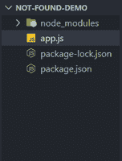
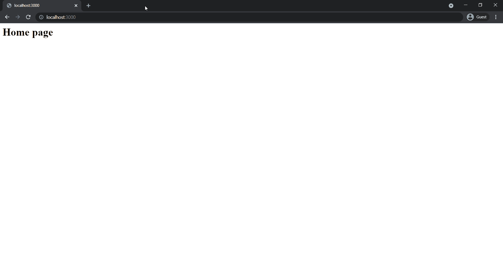

# 如何在 Express.js 中将 404 错误重定向到一个页面？

> 原文:[https://www . geesforgeks . org/how-redirect-404-errors-to-a-page-in-express-js/](https://www.geeksforgeeks.org/how-to-redirect-404-errors-to-a-page-in-express-js/)

[Express Js](https://www.geeksforgeeks.org/introduction-to-express/) 是一个基于 Node.js web 服务器功能的 web 应用框架，帮助我们创建复杂度更低、组织有序的 web 服务器。Express 提供路由服务，帮助我们创建基于 HTTP 请求方法(GET、POST、DELETE 等)和请求的路由进行响应的应用程序端点。

在 Express 中，如果我们想将用户重定向到 404 错误页面，如果特定路由不存在，那么我们可以使用 [app.all()](https://www.geeksforgeeks.org/express-js-app-all-function/) 方法作为最后一个路由处理程序方法，并使用 ***** (星号)作为路由名称。星号是匹配任何路由名称的通配符。

**语法:**

```js
app.all('*', (req, res) => {
    // code logic
})
```

上面提到的路由可以处理各种 HTTP 请求方法和对任何路由名称的请求。

**项目设置**

**第一步:** [如果你还没有安装 Node.js](https://www.geeksforgeeks.org/installation-of-node-js-on-windows/) 。

**第二步:**为你的项目创建一个文件夹，并将 cd(变更目录)放入其中。在该文件夹中创建一个名为 app.js 的新文件。现在，使用以下命令用默认配置初始化一个新的 Node.js 项目。

```js
npm init -y
```

**步骤 3:** 现在使用命令行中的以下命令在项目内部安装 express。

```js
npm install express
```

**项目结构:**按照步骤操作后，您的项目结构将如下所示。



## app.js

```js
const express = require('express');
const app = express();

app.get('/', (req, res) => {
  res.send('<h1>Home page</h1>');
});

app.get('/products', (req, res) => {
  res.send('<h1>Products page</h1>');
});

// This route will handle all the requests that are 
// not handled by any other route handler. In 
// this hanlder we will redirect the user to 
// an error page with NOT FOUND message and status
// code as 404 (HTTP status code for NOT found)
app.all('*', (req, res) => {
  res.status(404).send('<h1>404! Page not found</h1>');
});

app.listen(3000, () => {
  console.log('Server is up on port 3000');
});
```

**运行** **应用程序的步骤:**您可以使用命令行上的以下命令运行您的快递服务器。

```js
node app.js
```

**输出:**打开浏览器转到 **http://localhost:3000** ，手动切换到**http://localhost:3000/some _ invalid _ route**会重定向到我们的错误页面，并显示一条消息。

