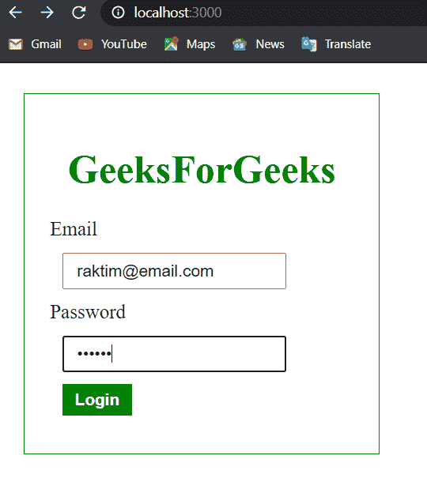
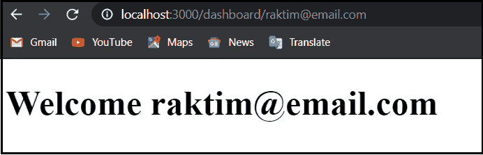

# 如何用 ExpressJS 重定向到生成的 URL？

> 原文:[https://www . geesforgeks . org/how-to-redirect-to-generated-URL-with-express js/](https://www.geeksforgeeks.org/how-to-redirect-to-generated-url-with-expressjs/)

在本文中，我将向您展示如何使用 ExpressJS 重定向用户。首先，当你想重定向用户时？这里有一些真实的场景。

例如，当用户成功登录时，您可以将他重定向到仪表板。另一个例子，当用户请求重置密码时，我们通常会用用户的旧密码哈希生成一个网址，并发送到用户的电子邮件中。在这里，我将向您展示如何在成功登录后将用户重定向到仪表板。

**概述:**

> **客户端:**在**/**的网址上进行**获取请求**登录页面。
> **服务器:**渲染登录页面
> **客户端:**接下来，用户填写表单数据，并在网址**/【登录】**上发出**开机自检请求**。
> **服务器:**如果用户数据匹配，则重定向至**'/dashboard/[USER EMAIL]'。**
> **客户端:**用户在**'/dashboard/【用户邮箱】'**上发出 **GET 请求**。
> **服务器:**渲染仪表盘页面。

**项目结构:**最终的项目目录结构会是这样的。

```js
Project
|
|-> node_modules
|-> views
  |-> login.ejs
  |-> dashboard.ejs
|-> package.json
|-> package-lock.json
|-> server.js
```

**步骤 1:** 创建空的 npm 项目文件夹，并将其命名为**项目**。

```js
mkdir Project
cd Project 
npm init -y
```

**第二步:**安装需要依赖。

**要求依赖关系:**

1.  ExpressJS
2.  EJS
3.  正文分析器

```js
npm i express ejs body-parser
```

**第 3 步:**客户端文件，EJS 的默认行为是查看“视图”文件夹中的模板进行渲染。因此，让我们在主节点项目文件夹中创建一个“视图”文件夹，并创建两个名为“ **login.ejs** ”和“ **dashboard.ejs** ”的文件。

**login.js** 负责用户登录请求，如果登录成功，用户将重定向到 **dashboard.ejs** 。

## 登录。例如

```js
<!DOCTYPE html>
<html>
<head>
    <title></title>
    <style type="text/css">
        body{
            margin: 0% auto;
        }
        h1{
            color: green;
        }
        input{
            margin: 10px;
            display: block;
            padding: 5px 10px;
        }
        button{
            margin: 10px;
            display: block;
            padding: 5px 10px;
            cursor: pointer;
            background-color: green;
            border: none;
            color: white;
            font-weight: bold;            
        }
        form{
            margin: 10% auto;
            padding: 20px;
            width: 20%;
            border: 1px solid green;
        }
    </style>
</head>
<body>
    <form>
        <center><h1>GeeksForGeeks</h1></center>

        <label>Email</label>
        <input type="email" id="userEmail">

        <label>Password</label>
        <input type="password" id="userPassword">

        <button onClick = "login(event)"> Login </button>
    </form>

    <script>
        const login = e =>{
            e.preventDefault();

            const email = document.getElementById('userEmail').value;
            const password = document.getElementById('userPassword').value;

            const option = {
                headers:{
                    "Content-Type": "application/json"
                },
                method: "POST",
                body: JSON.stringify({
                    email: email,
                    password: password
                }),
                redirect: "follow"
            }    

            // fetching data
            fetch(`<%= url %>`, option)
                .then(res => res.redirected && ( location.href = res.url ))
                .catch(err => alert('Something happen wrong!'));
        }
    </script>
</body>
</html>
```

## 仪表板。例如

```js
<!DOCTYPE html>
<html>
<head>
    <title>Dashboard</title>
</head>
<body>
    <h1>Welcome <%= email %></h1>
</body>
</html>
```

**步骤 4:** 在根文件夹上创建一个文件名 **server.js** 。这个文件是有一些中间件的，它响应用户的请求。一般来说，用户登录信息是从数据库中获取的，但对我们来说，从一个大数据库中获取信息是公平的。

在这里，如果用户数据与带有 HTTP 客户端错误代码 401 的其他响应相匹配，则登录处理程序路由被重定向到**/dash board/[USER EMAIL]'**。**T3】**

## server.js

```js
const express = require('express');
const path = require('path');    
const bodyParser = require('body-parser'); 
const ejs = require('ejs');

const app = express();
const PORT = 3000;

app.set('view engine', 'ejs');
app.use(bodyParser.json());

//login page route
app.get('/', (req,res)=>{
    res.render(path.join(__dirname, 'views/login.ejs'), {url: '/login'});
})

// login handler route
app.post('/login', (req,res)=>{
    const {email, password} = req.body;

    findUser(email, password) ?
        // if user is registered
        // generate a dynamic url
        // redirect to user
        res.redirect(301, `/dashboard/${email}`) :
        res.status(401).end();

});

// dashboard route
app.get('/dashboard/:email', (req, res)=>{
    const {email} = req.params;
    res.render(path.join(__dirname, 'views/dashboard.ejs'), {email: email})
});

// damy user db
const users = [
    {
        name: "Raktim Banerjee",
        email: "raktim@email.com",
        password: "Raktim"
    },
    {
        name: "Arpita Banerjee",
        email: "arpita@email.com",
        password :"Arpita"
    }
];

// find user 
const findUser = (email, password)=> users.some(user => 
      user.email === email && user.password === password 
)

// Start the server
app.listen(PORT, err =>{
    err ? 
    console.log("Error in server setup") :
    console.log("Server listening on Port", PORT)
});
```

**第五步:**启动服务器。

```js
node server.js
```

**输出:**

 