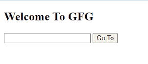
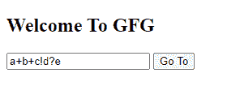
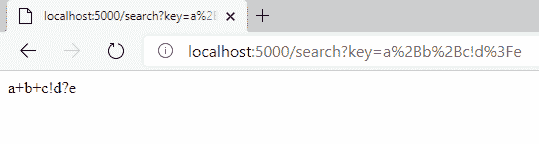

# 如何在 ExpressJS 路由器 URL 请求中保留特殊字符？

> 原文:[https://www . geesforgeks . org/如何保留特殊字符-in-express js-router-URL-request/](https://www.geeksforgeeks.org/how-to-retain-special-characters-in-expressjs-router-url-request/)

有一些特殊的字符可能会用于其他一些事情，而不仅仅是显示在网址上。如果我们想在网址中使用特殊字符，我们需要对它们进行编码。下表显示了每个特殊字符的编码值。


我们也可以使用名为**encodeURIComponent(“a+b！c+d")**

**设置环境和执行:**

**前端:**

*   **第一步:**创建 HTML 文件，粘贴下面的代码进行 UI。

    ## index.html

    ```js
    <!DOCTYPE html>
    <html>
        <head>
            <title>Page Title</title>
        </head>
        <body>
            <h2>Welcome To GFG</h2>
            <input id="inp" type="text">
            <button onclick="encode()">Go To</button>

            <script src="./app.js"></script>
        </body>
    </html>
    ```

*   **第二步:**创建 JS 文件，粘贴下面的代码。

    ## java 描述语言

    ```js
    let encode = () => {
        let input = document.getElementById('inp');
        let url = input.value;

        url = encodeURIComponent(url);

        window.location.href = `http://localhost:5000/search?key=${url}`;
    }
    ```

*   **输出:**运行 index.html 文件，输出将

    

**后端:**

*   **步骤 1:** 初始化 node.js 项目

    ```js
    npm init
    ```

*   **步骤 2:** 安装所需模块

    ```js
    npm install express
    ```

*   **第三步:**index . js 文件中的代码

    ## index.js

    ```js
    const express = require("express");

    const app = express();

    // Start server on port 5000
    app.listen(5000, () => {
      console.log(`Server is up and running on 5000 ...`);
    });

    app.get("/search", (req, res) => {
        res.send(req.query.key);

    });
    ```

*   **步骤 4:** 运行服务器节点 index.js。

**输出:**

*   **用户 puttong 提交值:**
    
*   **获得数值后:**
    