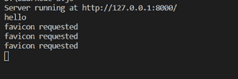

# 如何在 ExpressJS 中将/favicon.ico 作为 req.url 返回？

> 原文:[https://www . geesforgeks . org/how-return-fav icon-ico-as-req-URL-in-express js/](https://www.geeksforgeeks.org/how-to-return-favicon-ico-as-req-url-in-expressjs/)

[Favicon](https://www.geeksforgeeks.org/what-is-favicon-and-what-is-the-size-of-it-in-html/) 是您在标签中看到的小图标，位于标题的左侧……根据用户的浏览器，它可能(或不)要求该文件，与特定的网站或网页相关联。

[Node.js](https://www.geeksforgeeks.org/introduction-to-nodejs/) 是一个开源的跨平台运行时环境，用于在浏览器外执行 JavaScript 代码。它被广泛用于从小公司到大公司开发 API 和微服务。

[Express](https://www.geeksforgeeks.org/introduction-to-express/) 是一个小框架，位于 Node.js 的 web 服务器功能之上，用于简化其 API 并添加有用的新功能。它使得用中间件和路由来组织应用程序的功能变得更加容易；它为 Node.js 的 HTTP 对象添加了有用的实用程序；它方便了动态 HTTP 对象的呈现。

**安装模块:**

```js
npm install http
```

*   **导入模块:**

    ```js
    var http = require('http');
    ```

*   **createServer():** 在 main.js 中运行 Node.js:在终端中运行 node main.js。刚开始就结束了；我们做了一个服务器，但没有激活它。

    ```js
    let http = require('http');
    let server = http.createServer();
    ```

*   **侦听():**侦听 8000 端口。联系上了；但是，服务器一直在等待响应。

    ```js
    let http = require('http');
    let server = http.createServer();
    server.listen(8000);
    ```

*   **response():**response . write()只能取一个字符串。

    ```js
    http.createServer(function (q, r) {
       r.writeHead('hi' );
       r.end();
    });
    ```

*   **理解网址:**HTTP 200，表示请求已经完成，并导致新的资源被创建

    ```js
    http.createServer(function (q, r) {  
       if (q.url === '/favicon.ico') {
         r.writeHead(200, {'Content-Type': 'image/x-icon'} );
         r.end();
         console.log('favicon requested');
         return;
       }
    ```

*   **更改查询字符串**

    ```js
    //  if not favicon
     console.log('hello');
     r.writeHead(200, {'Content-Type': 'text/plain'} );
     r.write('Hello, world!');
     r.end();
    }).listen(8000);
    ```

**示例:**

## index.js

```js
var http = require('http');

http.createServer(function (q, r) {  

 // control for favicon

 if (q.url === '/favicon.ico') {
   r.writeHead(200, {'Content-Type': 'image/x-icon'} );
   r.end();
   console.log('favicon requested');
   return;
 }

 // not the favicon? say hai
 console.log('hello');
 r.writeHead(200, {'Content-Type': 'text/plain'} );
 r.write('Hello, world!');
 r.end();

}).listen(8000);

console.log('Server running at http://127.0.0.1:8000/');
```

```js
node index
```

**输出:**

