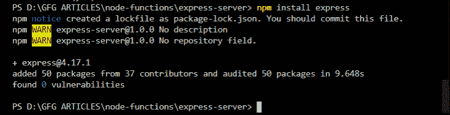
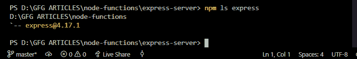
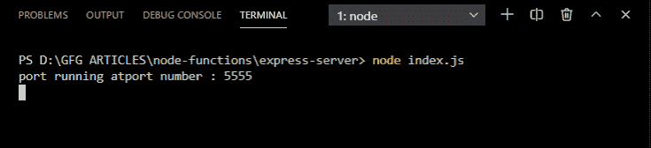
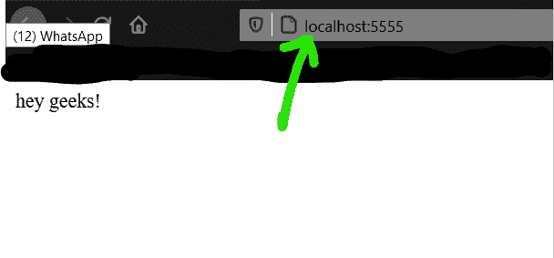

# 如何从浏览器运行 ExpressJS 服务器？

> 原文:[https://www . geesforgeks . org/how-run-expressjs-server-from-browser/](https://www.geeksforgeeks.org/how-to-run-expressjs-server-from-browser/)

Express 是用于创建服务器的节点模块，在我们的服务器上接受 get 请求。我们可以使用以下 5 个简单的步骤从浏览器运行 ExpressJS 服务器:

**步骤 1:** 通过以下命令将 Express 本地安装到您的系统中:

```
npm install express
```



**第二步:**在终端使用下面的命令检查快递服务器的版本:

```
npm ls express
```



**步骤 3:** 在任意项目目录下创建一个名为 **index.js** 的文件。

**第四步:**在 **index.js** 文件中写下以下代码。

## index.js

```
// Requiring express.js
const express = require('express')

// Changing the module to object to use its inbuilt functions
const app = express()

// Port number to run the port
const port_no = 5555

// Get request to send the data to the server
app.get('/' , (req,res) => {
    res.send('hey geeks!')
})

// Server Setup
app.listen(port_no, () => {
    console.log('port running atport number : 5555')
})
```

**步骤 5:** 使用以下步骤运行应用程序。

使用以下命令运行 **index.js** 文件:

```
node index.js
```

**输出:**你会在控制台屏幕上看到如下输出。



现在进入浏览器，进入***http://localhost:5555/***打开服务器:

