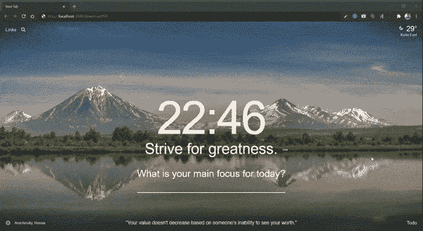
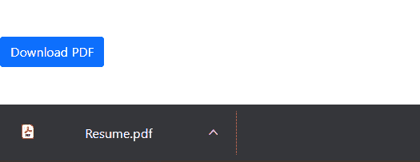

# 快递路线响应中如何发送 PDF，强制浏览器下载？

> 原文:[https://www . geesforgeks . org/how-send-pdf-in-express-route-response-and-force-browser-download/](https://www.geeksforgeeks.org/how-to-send-pdf-in-express-route-response-and-force-browser-download/)

在本文中，我们将看到如何在快速路由的响应中发送 PDF 文件，并使浏览器强制下载该文件。

**进场:**

1.  加载所需的包，然后创建一个快速应用程序。
2.  定义主页和 PDF 下载请求的路由。
3.  用一个按钮创建一个*index.html*文件来下载 PDF。
4.  点击按钮执行 ajax 调用，获取 PDF。
5.  在 *xhrFields* 中将 ajax 调用的*响应类型*指定为“blob”，因为“blob”用于存储图像、音频和视频等对象，因为它们比其他数据类型需要更多的空间。
6.  成功调用 ajax 后，将收到的 PDF 文件从 blob 格式转换为 PDF 格式。
7.  现在，让浏览器强制下载 PDF–
    a .创建一个隐藏的 *< a >* 标签。
    b .使用窗口创建对文件的引用。方法。
    c .将其 *href* 属性设置为斑点的网址。
    d .将其*下载*属性设置为文件名。
    e .点击 *< a >* 标签。
    f .从 DOM 中移除< a >标签。
    g .释放一个已有的对象 URL，(对文件的引用)，让浏览器知道不再保留对文件的引用。

**第一步:安装必要的软件包**

首先，安装以下节点包。

```js
npm install --save express
```

****第二步:创建基本的快递服务器设置****

创建一个名为 *app.js* 的文件，代码如下。

## App.js

```js
// Load necessary packages
const express = require("express");

// create an express app
const app = express();

// define PORT number to listen to the requests
const PORT = process.env.PORT || 3000;

// to serve files from uploads directory
app.use("/uploads", express.static("uploads"));

// express routes
app.use("/", require("./routes"));

// listen to requests
app.listen(PORT, () => console.log(`Server started running on PORT ${PORT}`));
```

**第三步:为应用**定义路线

创建一个名为 **routes.js** 的文件，代码如下所示。

## routes.js

```js
// Load necessary packages
const express = require("express");

// express router 
const router = express.Router();

// respond with index.html when a GET request is made to the homepage
router.get("/", (req, res) => {
    res.sendFile(__dirname + "/views/index.html");
});

// route for handling PDF request
router.get("/downloadPDF", (req, res) => {
    res.download("uploads/Resume.pdf");
});

// export router middleware and use it in app.js
module.exports = router;
```

**第四步:运行服务器**

现在使用以下命令启动您的快速服务器:

```js
node app.js
```

**第五步:打开浏览器，输入 URL**

打开你喜欢的浏览器，在地址栏输入*http://localhost:3000/download pdf*然后点击回车，Resume.pdf 文件会自动下载。

**输出:**



**第六步:通过按钮下载 PDF。**

您可以让浏览器使用按钮上的点击事件监听器一键下载 PDF，然后向上面的 URL 发出 ajax 请求。

点击按钮进行 PDF 下载，首先创建一个*index.html*文件，内容如下:

## index.html

```js
<!DOCTYPE html>
<html lang="en">
<head>
 <meta charset="UTF-8" />
 <meta http-equiv="X-UA-Compatible" content="IE=edge" />
 <meta name="viewport" 
       content="width=device-width, initial-scale=1.0" />
 <link
  href=
"https://cdn.jsdelivr.net/npm/bootstrap@5.0.0-beta3/dist/css/bootstrap.min.css"
  rel="stylesheet"
  integrity=
"sha384-eOJMYsd53ii+scO/bJGFsiCZc+5NDVN2yr8+0RDqr0Ql0h+rP48ckxlpbzKgwra6"
  crossorigin="anonymous"
 />
</head>
<body>
 <div class="container">
  <button id="download" class="btn btn-primary my-5">
   Download PDF
  </button>
 </div>
 <script src=
"https://code.jquery.com/jquery-3.6.0.js"
         integrity=
"sha256-H+K7U5CnXl1h5ywQfKtSj8PCmoN9aaq30gDh27Xc0jk="
  crossorigin="anonymous">
 </script>
 <script src=
"https://cdn.jsdelivr.net/npm/bootstrap@5.0.0-beta3/dist/js/bootstrap.bundle.min.js"
         integrity=
"sha384-JEW9xMcG8R+pH31jmWH6WWP0WintQrMb4s7ZOdauHnUtxwoG2vI5DkLtS3qm9Ekf"
  crossorigin="anonymous">
 </script>

 <script>
  $("#download").click(function (e) {
   $.ajax({
    type: "GET",
    url: "/downloadPDF",
    xhrFields: {
     // specify response type as "blob" to handle objects
     responseType: "blob",
    },
    success: function (data) {

     // creating a hidden <a> tag
     var a = document.createElement("a");

     // creating a reference to the file
     var url = window.URL.createObjectURL(data);

     // setting anchor tag's href attribute to the blob's URL
     a.href = url;

     // setting anchor tag's download attribute to the filename
     a.download = "Resume.pdf";
     document.body.append(a);

     // click on the <a> tag
     a.click();

     // after clicking it, remove it from the DOM
     a.remove();
     // release an existing object URL which was previously 
     // created by calling URL.createObjectURL()
     // once we have finished using an object URL, let the
     // browser know not to keep the reference to the file any longer.
     window.URL.revokeObjectURL(url);
    },
    error: function (result) {
     alert("error");
    },
   });
  });
 </script>
</body>
</html>
```

**输出:**

