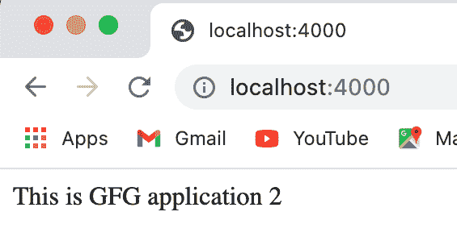

# 如何在同一快件服务器上设置多个基础目录不同的 Web 应用？

> 原文:[https://www . geeksforgeeks . org/如何在同一个快速服务器上设置具有不同基础目录的多个网络应用/](https://www.geeksforgeeks.org/how-to-set-multiple-web-apps-with-different-base-directories-on-the-same-express-server/)

[<u>Node.js</u>](https://www.geeksforgeeks.org/introduction-to-nodejs/) 使用 [<u>Express</u>](https://www.geeksforgeeks.org/working-of-express-js-middleware-and-its-benefits/) 支持服务器端功能。它允许我们添加新功能和组织功能。使用 Express 时，我们可以为给定的基本目录设置自己的本地服务器。下面的方法介绍了如何在同一个 express 服务器上为多个具有不同基础目录的 web 应用程序提供服务。

**设置环境和执行:**

**步骤 1:** 使用以下命令初始化 node.js 项目。

```js
npm init
```

**步骤 2:** 使用以下命令安装所需模块。

```js
npm install express
```

**步骤 3:** 安装 express 后，我们可以使用以下代码要求模块。

```js
const express = require('express');
const app = express();
```

[*<u>app . listen()</u>*](https://www.geeksforgeeks.org/express-js-app-listen-function/)有助于将应用程序绑定到指定的主机和端口。因此，我们可以在不同的端口上设置多个应用程序，同时使用同一个快速服务器。

**第 4 步:**用以下代码创建一个 ***index1.js*** 文件。我们正在使用端口 3000。我们目前正在发送一个简单的消息，表示第一个应用程序。

**index1.js**

## java 描述语言

```js
// Requiring express
const express= require('express');
const app = express();

// Sending message for first application
app.get("/",function(req,res){
  res.send('<p>This is GFG application 1</p>')
});

// Listening on port 3000
app.listen(3000,function(){
  console.log("Server is running on port 3000");
});
```

**第 5 步:**使用以下命令运行 ***index1.js*** 文件。

```js
node index1.js
```

**输出:**现在打开浏览器，转到***http://localhost:3000/***，会看到如下输出:


**第 6 步:**用以下代码创建一个*索引 2.js* 文件。我们正在使用端口 4000。我们目前正在发送一条简单的消息，表示第二个应用程序。

**索引 2.js**

## java 描述语言

```js
// Requiring express
const express= require('express');
const app = express();

// Sending message for second application
app.get("/",function(req,res){
  res.send('<p>This is GFG application 2</p>')
});

// Listening on port 4000
app.listen(4000,function(){
  console.log("Server is running on port 4000");
});
```

**步骤 7:** 使用以下命令运行 ***index2.js*** 文件。

```js
node index2.js
```

**输出:**现在打开浏览器，转到***http://localhost:4000/***，会看到如下输出:

