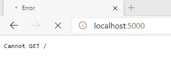
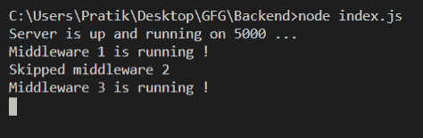

# 如何在 Express.js 中跳过一个中间件？

> 原文:[https://www . geeksforgeeks . org/如何跳过中间件 in-express-js/](https://www.geeksforgeeks.org/how-to-skip-a-middleware-in-express-js/)

如果我们想跳过一个中间件，我们可以将参数传递给中间件函数，并根据该参数决定调用哪个中间件和不调用哪个中间件。

**先决条件:**

*   **express.js:** 处理路由。

**设置环境和执行:**

*   **步骤 1:** 初始化节点项目

    ```
    npm init
    ```

*   **步骤 2:** 安装所需模块

    ```
    npm install express
    ```

**示例:**

## index.js

```
const express = require("express");
// const database = require('./sqlConnection');

const app = express();

// Start server on port 5000
app.listen(5000, () => {
  console.log(`Server is up and running on 5000 ...`);
});

// define middleware 1
let middleware1 = (req, res, next) => {

    // decide a parameter
    req.shouldRunMiddleware2 = false;

    console.log("Middleware 1 is running !");
    next();
}

// define middleware 2
let middleware2 = (req, res, next) => {
    if(!req.shouldRunMiddleware2) {
        console.log("Skipped middleware 2");
        return next();
    }

    console.log("Middleware 2 is running !");
}

// define middleware 3
let middleware3 = (req, res, next) => {
    console.log("Middleware 3 is running !");
}

// create route for home page '/'
app.get("/", middleware1, middleware2, middleware3);
```

**输出:**运行以下命令启动服务器。之后转到浏览器上的***http://localhost:5000***查看控制台中的输出

```
node index.js
```

*   **在浏览器中。**
    
*   **控制台:**
    