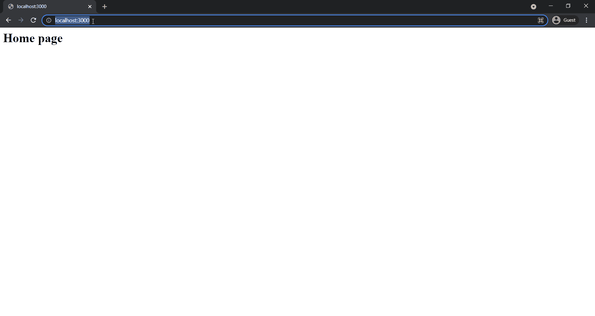

# 如何在 Express.js 中使用 get 参数？

> 原文:[https://www . geesforgeks . org/如何使用-获取参数-in-express-js/](https://www.geeksforgeeks.org/how-to-use-get-parameter-in-express-js/)

[Express Js](https://www.geeksforgeeks.org/introduction-to-express/) 是一个基于 Node.js 网络服务器功能的网络应用框架，降低了创建网络服务器的复杂性。Express 提供路由服务，即应用程序端点如何基于请求的路由和 HTTP 请求方法(GET、POST、PUT、DELETE、UPDATE 等)做出响应。

我们可以借助 app.get()方法创建一个接收 GET 请求的 API 端点。

**语法:**

```js
app.get(route, (req, res) => {
    // Code logic
});
```

路由参数是名称 URL 段，用于捕获在其位置提供的值。我们可以使用下面显示的语法在 req.params 对象上访问这些路由参数。

```js
app.get(/:id, (req, res) => {
    const id = req.params.id;
});
```

**项目设置:**

**第一步:** [如果你还没有安装 Node.js](https://www.geeksforgeeks.org/installation-of-node-js-on-windows/) 。

**第二步:**为你的项目创建一个文件夹，并将 [**cd**](https://www.geeksforgeeks.org/cd-command-in-linux-with-examples/) (更改目录)放入其中。在该文件夹中创建一个名为 **app.js** 的新文件。现在，使用以下命令用默认配置初始化一个新的 Node.js 项目。

```js
npm init -y
```

**步骤 3:** 现在使用命令行中的以下命令在项目内部安装 express。

```js
npm install express
```

**项目结构:**按照步骤操作后，您的项目结构将如下所示。


## app.js

```js
const express = require('express');
const app = express();

app.get('/', (req, res) => {
  res.send('<h1>Home page</h1>');
});

app.get('/:id', (req, res) => {
  res.send(`<h1>${req.params.id}</h1>`);
});

app.listen(3000, () => {
  console.log('Server is up on port 3000');
});
```

**运行应用程序的步骤:**您可以在命令行上使用以下命令运行您的 express 服务器。

```js
node app.js
```

**输出:**打开浏览器转到 **http://localhost:3000** ，手动切换到**http://localhost:3000/some _ id**会看到如下输出。

