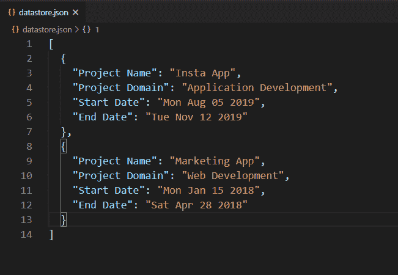
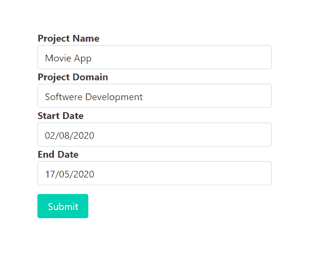
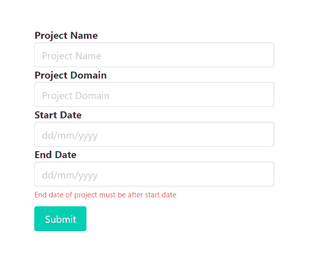
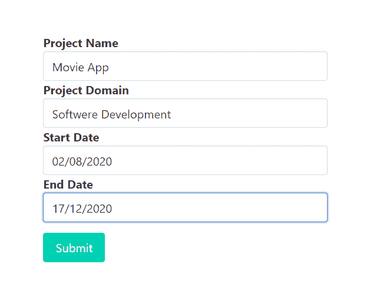
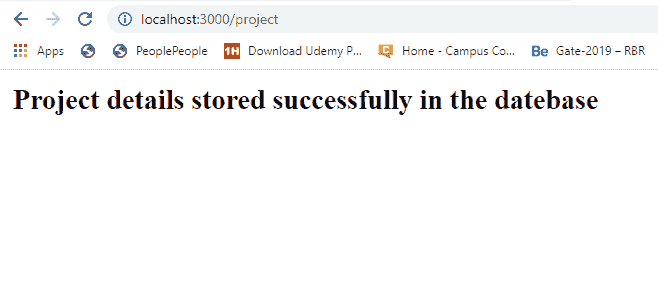
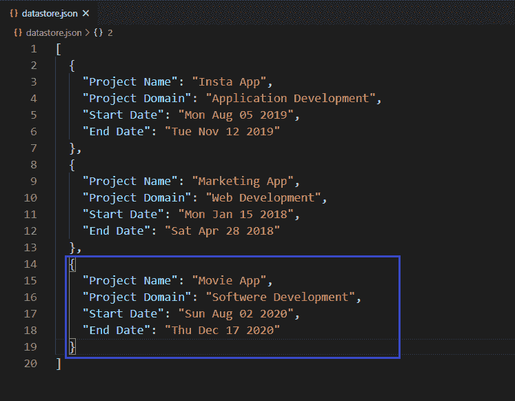

# 如何使用快速验证器验证输入字段中的输入日期(结束日期)是否必须在给定日期(开始日期)之后？

> 原文:[https://www . geesforgeks . org/如何验证输入日期-输入字段中的结束日期-必须在给定日期之后-开始日期-使用快速验证器/](https://www.geeksforgeeks.org/how-to-validate-if-input-date-end-date-in-input-field-must-be-after-a-given-date-start-date-using-express-validator/)

在 HTML 表单中，我们经常需要不同类型的验证。验证现有电子邮件、验证密码长度、验证确认密码、验证为仅允许整数输入，这些都是验证的一些示例。在某些情况下，我们希望用户键入一个必须在某个给定日期之后的日期(例如。“结束日期”必须在“开始日期”之后)，基于此，我们授予用户对请求的访问权限或拒绝请求访问权限。我们还可以使用 express-validator 中间件来验证这些输入字段。

**安装快速验证器的命令:**

```js
npm install express-validator
```

**使用快速验证器实现逻辑的步骤:**

*   安装快速验证中间件。
*   创建一个 validator.js 文件来编码所有的验证逻辑。
*   使用自定义验证器验证并获取开始日期作为请求正文。
*   将日期字符串转换为有效日期，并根据需要进行比较。
*   在路由中使用验证名称(validateInputField)作为一个中间件，作为一个验证数组。
*   从快速验证器中析构“验证结果”函数，用它来查找任何错误。
*   如果发生错误，重定向到传递错误信息的同一页。
*   如果错误列表为空，则允许用户访问后续请求。

**注意:**这里我们使用本地或自定义数据库来实现逻辑，同样的步骤也可以在 MongoDB 或 MySql 这样的常规数据库中实现逻辑。

**示例:**此示例说明了如何验证输入字段，以仅允许给定日期之后的日期。

**文件名–index . js**

## java 描述语言

```js
const express = require('express')
const bodyParser = require('body-parser')
const {validationResult} = require('express-validator')
const repo = require('./repository')
const { validateEndDate } = require('./validator')
const formTemplet = require('./form')

const app = express()
const port = process.env.PORT || 3000

// The body-parser middleware to parse form data
app.use(bodyParser.urlencoded({extended : true}))

// Get route to display HTML form
app.get('/', (req, res) => {
  res.send(formTemplet({}))
})

// Post route to handle form submission logic and
app.post(
  '/project',
  [validateEndDate],
  async (req, res) => {
    const errors = validationResult(req)
    if (!errors.isEmpty()) {
      console.log(errors)
      return res.send(formTemplet({errors}))
    }

    const {name, domain, sdate, edate, } = req.body

    // Fetch year, month, day of respective dates
    const [sd, sm, sy] = sdate.split('/')
    const [ed, em, ey] = edate.split('/')

    // New record
    await repo.create({
      'Project Name': name,
      'Project Domain': domain,
      'Start Date': new Date(sy, sm-1, sd).toDateString(),
      'End Date': new Date(ey, em-1, ed).toDateString()
    })
 res.send('<strong>Project details stored '
    + 'successfully in the datebase</strong>')
})

// Server setup
app.listen(port, () => {
  console.log(`Server start on port ${port}`)
})
```

**Filename–repository . js:**该文件包含创建本地数据库并与之交互的所有逻辑。

## java 描述语言

```js
// Importing node.js file system module
const fs = require('fs')

class Repository {
  constructor(filename) {

    // Filename where data are going to store
    if (!filename) {
      throw new Error(
'Filename is required to create a datastore!')
    }

    this.filename = filename

    try {
      fs.accessSync(this.filename)
    } catch(err) {

      // If file not exist it is
      // created with empty array
      fs.writeFileSync(this.filename, '[]')
    }
  }

  // Get all existing records
  async getAll(){
    return JSON.parse(
      await fs.promises.readFile(this.filename, {
        encoding : 'utf8'
      })
    )
  }

  // Create new record
  async create(attrs){
    // Fetch all existing records
    const records = await this.getAll()

    // All the existing records with new
    // record push back to database
    records.push(attrs)
    await fs.promises.writeFile(
      this.filename,
      JSON.stringify(records, null, 2)  
    )
    return attrs
  }
}

// The 'datastore.json' file created at runtime
// and all the information provided via signup form
// store in this file in JSON formet.
module.exports = new Repository('datastore.json')
```

**Filename–form . js:**该文件包含显示表单的逻辑，以提交带有开始和结束日期的项目数据。

## java 描述语言

```js
const getError = (errors, prop) => {
  try {
    return errors.mapped()[prop].msg
  } catch (error) {
    return ''
  }
}

module.exports = ({errors}) => {
  return `
    <!DOCTYPE html>
    <html>
      <head>
        <link rel='stylesheet'
href='https://cdnjs.cloudflare.com/ajax/libs/bulma/0.9.0/css/bulma.min.css'>
        <style>
          div.columns{
            margin-top: 100px;
          }
          .button{
            margin-top : 10px
          }
        </style>
      </head>
      <body>
        <div class='container'>
          <div class='columns is-centered'>
            <div class='column is-5'>
              <form action='/project' method='POST'>           
                <div>
                  <div>
                    <label class='label' id='name'>Project Name</label>
                  </div>
                  <input class='input' type='text' name='name'
                  placeholder='Project Name' for='name'>
                </div>
                <div>
                  <div>
                    <label class='label' id='domain'>Project Domain</label>
                  </div>
                  <input class='input' type='text' name='domain'
                  placeholder='Project Domain' for='base64data'>
                </div>
                <div>
                  <div>
                    <label class='label' id='sdate'>Start Date</label>
                  </div>
                  <input class='input' type='text' name='sdate'
                  placeholder='dd/mm/yyyy' for='sdate'>
                </div>
                <div>
                  <div>
                    <label class='label' id='edate'>End Date</label>
                  </div>
                  <input class='input' type='text' name='edate'
                  placeholder='dd/mm/yyyy' for='edate'>
                  <p class="help is-danger">${getError(errors, 'edate')}</p>

                </div>
                <div>
                  <button class='button is-primary'>Submit</button>
                </div>
              </form>
            </div>
          </div>
        </div>
      </body>
    </html>  
  `
}
```

**Filename–validator . js:**该文件包含所有验证逻辑(验证输入字段的逻辑，只接受给定日期之后的日期)。

## java 描述语言

```js
const {check} = require('express-validator')
const repo = require('./repository')
module.exports = {

  validateEndDate : check('edate')

    // To delete leading and trailing space
    .trim()

    // Custom validator
    .custom((edate, {req}) => {

      // Fetch year, month and day of respective dates
      const [sd, sm, sy] = req.body.sdate.split('/')
      const [ed, em, ey] = edate.split('/')

      // Constructing dates from given string date input
      const startDate = new Date(sy, sm, sd)
      const endDate = new Date(ey, em, ed)

      // Validate end date so that it must after start date
      if (endDate <= startDate) {
        throw new Error(
'End date of project must be after start date')
      }
      return true
    }) 
}
```

**文件名–package . JSON**


package.json 文件

**数据库:**



数据库ˌ资料库

**输出:**



当结束日期早于开始日期时，尝试提交表单



尝试提交结束日期早于开始日期的表单时的响应



当结束日期晚于开始日期时，尝试提交表单



尝试提交结束日期晚于开始日期的表单时的响应

**成功提交表单后的数据库:**



成功提交表单后的数据库

**注意:**我们在注册. js 文件中使用了一些布尔玛类(CSS 框架)来设计内容。