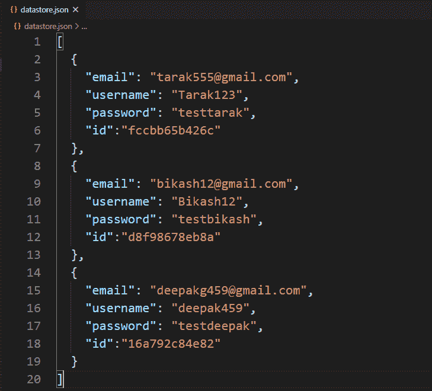
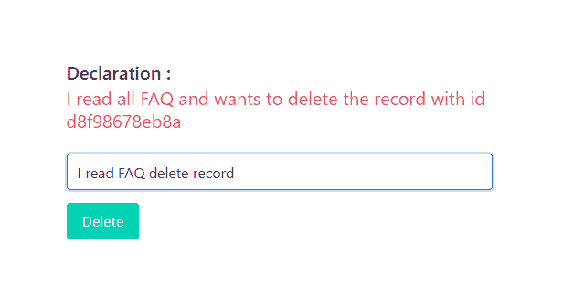
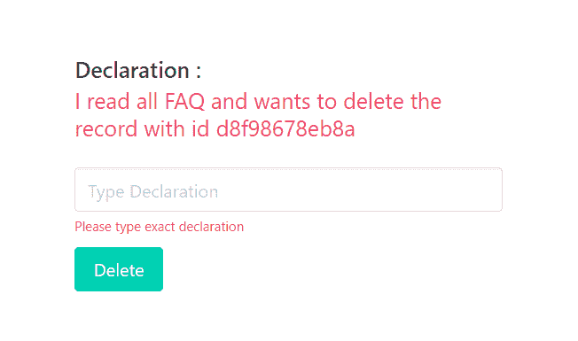
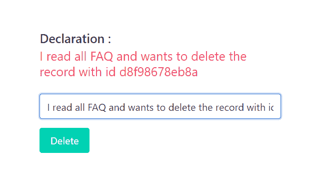
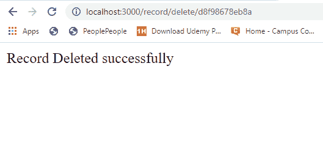
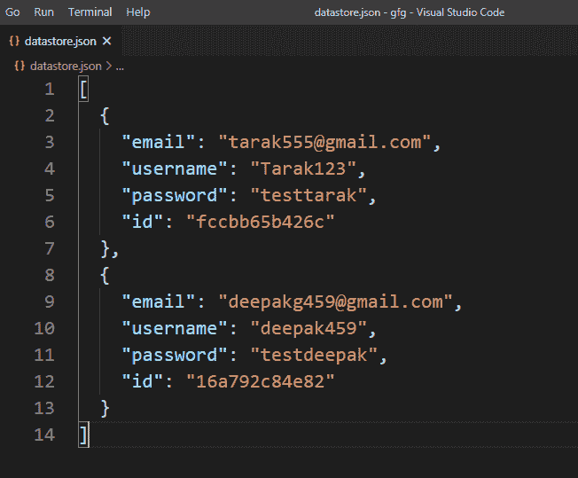

# 如何使用 express-validator 验证输入字段中的输入是否正好等于某个其他值？

> 原文:[https://www . geesforgeks . org/如何验证输入字段中的输入是否完全等于其他值使用快速验证器/](https://www.geeksforgeeks.org/how-to-validate-if-input-in-input-field-exactly-equals-to-some-other-value-using-express-validator/)

在 HTML 表单中，我们经常需要不同类型的验证。验证现有电子邮件、验证密码长度、验证确认密码、验证为仅允许整数输入，这些都是验证的一些示例。在某些情况下，我们希望用户键入一些确切的值，并在此基础上授予用户对请求的访问权限或拒绝请求访问权限。我们还可以验证这些输入字段，以接受一些确切的必需值，否则使用 express-validator 中间件拒绝请求。

**安装快速验证器的命令:**

```js
npm install express-validator
```

**使用快速验证器实现逻辑的步骤:**

*   安装快速验证中间件。
*   创建一个 validator.js 文件来编码所有的验证逻辑。
*   通过 validateInputField 验证输入:检查(输入字段名)和验证上的链等于带“.”的()
*   我们还可以使用自定义验证器来验证是否要将所需的文本作为请求正文传递到输入字段中。
*   在路由中使用验证名称(validateInputField)作为一个中间件，作为一个验证数组。
*   从快速验证器中析构“验证结果”函数，用它来查找任何错误。
*   如果发生错误，重定向到传递错误信息的同一页。
*   如果错误列表为空，则允许用户访问后续请求。

**注意:**这里我们使用本地或自定义数据库来实现逻辑，同样的步骤也可以在 MongoDB 或 MySql 这样的常规数据库中实现逻辑。

**示例:**此示例说明了如何验证输入字段，使其只允许一些精确的值。

**文件名–index . js**

```js
const express = require('express')
const bodyParser = require('body-parser')
const {validationResult} = require('express-validator')
const repo = require('./repository')
const { validateDeclaration } = require('./validator')
const showTemplet = require('./show')

const app = express()
const port = process.env.PORT || 3000

// The body-parser middleware to parse form data
app.use(bodyParser.urlencoded({extended : true}))

// Get route to display HTML form to type declaration 
// and submit to delete the record
app.get('/', (req, res) => {
  res.send(showTemplet({}))
})

// Post route to handle form submission logic and 
app.post(
  '/record/delete/:id',
  [validateDeclaration],
  async (req, res) => {
    const errors = validationResult(req)
    if(!errors.isEmpty()){
      return res.send(showTemplet({errors}))
    }
    const id = req.params.id
    await repo.delete(id)
    res.send('Record Deleted successfully')
})

// Server setup
app.listen(port, () => {
  console.log(`Server start on port ${port}`)
})
```

**Filename–repository . js:**该文件包含创建本地数据库并与之交互的所有逻辑。

```js
// Importing node.js file system module 
const fs = require('fs')

class Repository {
  constructor(filename) {

    // Filename where datas are going to store
    if(!filename){
      throw new Error('Filename is required to create a datastore!')
    }

    this.filename = filename

    try {
      fs.accessSync(this.filename)
    } catch(err) {
      // If file not exist it is created with empty array
      fs.writeFileSync(this.filename, '[]')
    }
  }

  // Get all existing records
  async getAll(){
    return JSON.parse(
      await fs.promises.readFile(this.filename, {
        encoding : 'utf8'
      })
    )
  }

  // Delete record
  async delete(id) {
    const records = await this.getAll()
    const filteredRecords = records.filter(record => record.id !== id)
    await fs.promises.writeFile(
      this.filename,
      JSON.stringify(filteredRecords, null, 2)   
    )
  }
}

// The 'datastore.json' file created at runtime 
// and all the information provided via signup form
// store in this file in JSON formet.
module.exports = new Repository('datastore.json')
```

**文件名–show . js:**该文件包含显示声明的逻辑和类型声明的输入字段。

```js
const getError = (errors, prop) => {
  try {
    return errors.mapped()[prop].msg
  } catch (error) {
    return ''
  } 
}

module.exports = ({errors}) => {
  const id = 'd8f98678eb8a'
  const declaration=
`I read all FAQ and wants to delete the record with id ${id}`
  return `
    <!DOCTYPE html>
    <html>
      <head>
        <link rel='stylesheet' 
href='https://cdnjs.cloudflare.com/ajax/libs/bulma/0.9.0/css/bulma.min.css'>
        <style>
          div.columns{
            margin-top: 100px;
          }
          .button{
            margin-top : 10px
          }
        </style>
      </head>
      <body>
        <div class='container'>
          <div class='columns is-centered'>
            <div class='column is-5'>
              <div class='title is-5'>Declaration :</div>
              <h2 class='subtitle is-5 has-text-danger'>
                ${declaration}
              </h2>
              <form action='record/delete/${id}' method='POST'>             
                <div>
                  <input type='text' hidden name='declaration' 
                  value='${declaration}'>
                  <input class='input' type='text' 
                  name='typedDeclaration' placeholder
                                      ='Type Declaration'>
                  <p class="help is-danger">${getError(errors, 
                  'typedDeclaration')}</p>
                </div>
                <div>
                  <button class='button is-primary'>Delete</button>
                </div>
              </form>
            </div>
          </div>
        </div>
      </body>
    </html>   
  `
}
```

**Filename–validator . js:**该文件包含所有的验证逻辑(验证输入字段只允许某些精确值的逻辑)。

```js
const {check} = require('express-validator')
const repo = require('./repository')
module.exports = {

  validateDeclaration : check('typedDeclaration')

    // To delete leading and trailing space
    .trim()

    // Custom validator
    // Check string matches with comparision
    // (some exact value) or not
    .custom(async (typedDeclaration, {req}) => {
      const declaration = req.body.declaration
      if( typedDeclaration !== declaration){
        throw new Error('Please type exact declaration')
      }
    })
}
```

**文件名–package . JSON**


package.json 文件

**数据库:**



数据库ˌ资料库

**输出:**



当输入不完全等于声明时，尝试提交表单



当输入不完全等于声明时，尝试提交表单时的响应



当输入与声明完全相等时，尝试提交表单



当输入与声明完全相等时，尝试提交表单时的响应

**成功提交表单后的数据库:**



成功提交表单后的数据库

**注意:**我们在注册. js 文件中使用了一些布尔玛类(CSS 框架)来设计内容。