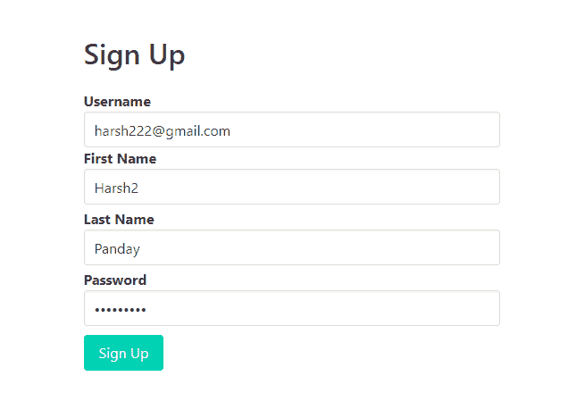
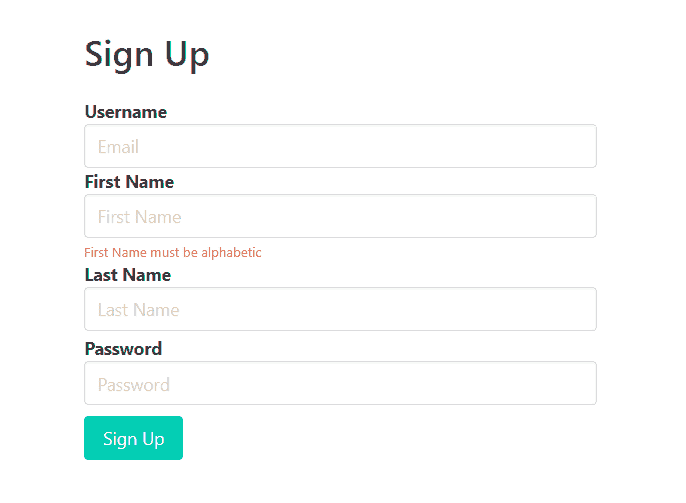
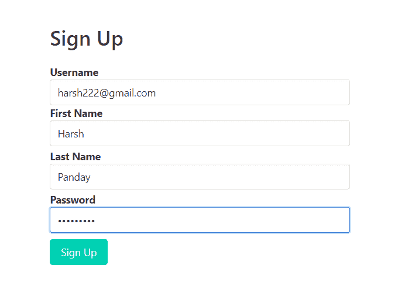
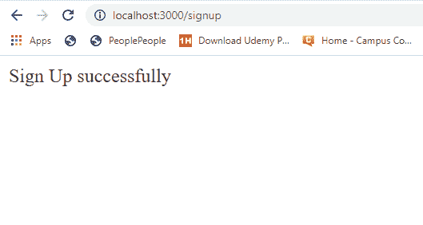

# 如何使用快速验证器验证输入字段中的输入是否有字母？

> 原文:[https://www . geesforgeks . org/如何验证输入字段中的输入是否只有字母使用快速验证器/](https://www.geeksforgeeks.org/how-to-validate-if-input-in-input-field-has-alphabets-only-using-express-validator/)

在 HTML 表单中，我们经常需要不同类型的验证。验证现有电子邮件、验证密码长度、验证确认密码、验证为仅允许整数输入，这些都是验证的一些示例。在某个输入字段中，只允许字母，即不允许任何数字或特殊字符。我们还可以使用 express-validator 中间件验证这些输入字段，使其只接受字母。

**安装快速验证器的命令:**

```js
npm install express-validator
```

**使用快速验证器实现逻辑的步骤:**

*   安装快速验证中间件。
*   创建一个 validator.js 文件来编码所有的验证逻辑。
*   通过 validateInputField 验证输入:在带有“.”的验证 isAlpha()上检查(输入字段名)和链
*   在路由中使用验证名称(validateInputField)作为一个中间件，作为一个验证数组。
*   从快速验证器中析构“验证结果”函数，用它来查找任何错误。
*   如果发生错误，重定向到传递错误信息的同一页。
*   如果错误列表为空，则允许用户访问后续请求。

**注意:**这里我们使用本地或自定义数据库来实现逻辑，同样的步骤也可以在 MongoDB 或 MySql 这样的常规数据库中实现逻辑。

**示例:**该示例说明了如何验证输入字段以仅允许字母。

**文件名–index . js**

```js
const express = require('express')
const bodyParser = require('body-parser')
const {validationResult} = require('express-validator')
const repo = require('./repository')
const { validateFirstName, validateLastName } = require('./validator')
const signupTemplet = require('./signup')

const app = express()
const port = process.env.PORT || 3000

// The body-parser middleware to parse form data
app.use(bodyParser.urlencoded({extended : true}))

// Get route to display HTML form to sign up
app.get('/signup', (req, res) => {
  res.send(signupTemplet({}))
})

// Post route to handle form submission logic and 
app.post(
  '/signup',
  [validateFirstName, validateLastName],
  async (req, res) => {
    const errors = validationResult(req)
    if(!errors.isEmpty()){
      return res.send(signupTemplet({errors}))
    }
    const {email, fn, ln, password} = req.body
    await repo.create({
      email, 
      'First Name':fn,
      'Last Name': ln,
      password
    })
    res.send('Sign Up successfully')
})

// Server setup
app.listen(port, () => {
  console.log(`Server start on port ${port}`)
})
```

**Filename–repository . js:**该文件包含创建本地数据库并与之交互的所有逻辑。

```js
// Importing node.js file system module 
const fs = require('fs')

class Repository {
  constructor(filename) {

    // The filename where datas are going to store
    if(!filename) {
      throw new Error('Filename is required to create a datastore!')
    }

    this.filename = filename

    try {
      fs.accessSync(this.filename)
    } catch(err) {

      // If file not exist it is created with empty array
      fs.writeFileSync(this.filename, '[]')
    }
  }

  // Get all existing records
  async getAll(){
    return JSON.parse(
      await fs.promises.readFile(this.filename, {
        encoding : 'utf8'
      })
    )
  }

  // Create new record
  async create(attrs){
    const records = await this.getAll()
    records.push(attrs)
    await fs.promises.writeFile(
      this.filename,
      JSON.stringify(records, null, 2)   
    )
    return attrs
  }
}

// The 'datastore.json' file created at runtime 
// and all the information provided via signup form
// store in this file in JSON format.
module.exports = new Repository('datastore.json')
```

**文件名–注册. js:** 该文件包含显示注册表单的逻辑。

```js
const getError = (errors, prop) => {
  try {
    return errors.mapped()[prop].msg
  } catch (error) {
    return ''
  } 
}

module.exports = ({errors}) => {
  return `
    <!DOCTYPE html>
    <html>
      <head>
        <link rel='stylesheet' 
href='https://cdnjs.cloudflare.com/ajax/libs/bulma/0.9.0/css/bulma.min.css'>
        <style>
          div.columns{
            margin-top: 100px;
          }
          .button{
            margin-top : 10px
          }
        </style>
      </head>
      <body>
        <div class='container'>
          <div class='columns is-centered'>
            <div class='column is-5'>
              <h1 class='title'>Sign Up<h1>
              <form method='POST'>             
                <div>
                  <div>
                    <label class='label' id='email'>Username</label>
                  </div>
                  <input class='input' type='text' name='email' 
                  placeholder='Email' for='email'>
                </div>
                <div>
                  <div>
                    <label class='label' id='fn'>First Name</label>
                  </div>
                  <input class='input' type='text' name='fn' 
                  placeholder='First Name' for='fn'>
                  <p class="help is-danger">${getError(errors, 'fn')}</p>
                </div>
                <div>
                  <div>
                    <label class='label' id='ln'>Last Name</label>
                  </div>
                  <input class='input' type='text' name='ln' 
                  placeholder='Last Name' for='ln'>
                  <p class="help is-danger">${getError(errors, 'ln')}</p>
                </div>
                <div>
                  <div>
                    <label class='label' id='password'>Password</label>
                  </div>
                  <input class='input' type='password' name='password'
                  placeholder='Password' for='password'>
                </div>
                <div>
                  <button class='button is-primary'>Sign Up</button>
                </div>
              </form>
            </div>
          </div>
        </div>
      </body>
    </html>   
  `
}
```

**Filename–validator . js:**该文件包含所有验证逻辑(验证输入字段只允许字母的逻辑)。

```js
const {check} = require('express-validator')
const repo = require('./repository')
module.exports = {

  validateFirstName : check('fn')
    // To delete leading and triling space
    .trim()

    // Validate the minimum length of the password
    // Optional for this context
    .isLength({min:3}) 
    // Custom message
    .withMessage('First Name must be 3 characters long')

    // Name must contains only alphabets
    .isAlpha()
    // Custom message
    .withMessage('First Name must be alphabetic'),

    validateLastName : check('ln')
    // To delete leading and triling space
    .trim()

    // Validate the minimum length of the password
    // Optional for this context
    .isLength({min:2})
    // Custom message
    .withMessage('Last Name must be 2 characters long')

    // Name must contains only alphabets
    .isAlpha()
    // Custom message
    .withMessage('Last Name must be alphabetic')
}
```

**文件名–package . JSON**


package.json 文件

**输出:**



当名字输入字段不仅仅包含字母时，尝试注册



尝试用不仅仅包含字母输入字段“名字”注册时的响应



当名字和姓氏输入字段仅包含字母时，尝试注册



尝试使用仅包含字母输入字段'名字'，'姓氏'注册时得到响应

**成功注册后的数据库:**


成功注册后的数据库

**注意:**我们在注册. js 文件中使用了一些布尔玛类(CSS 框架)来设计内容。