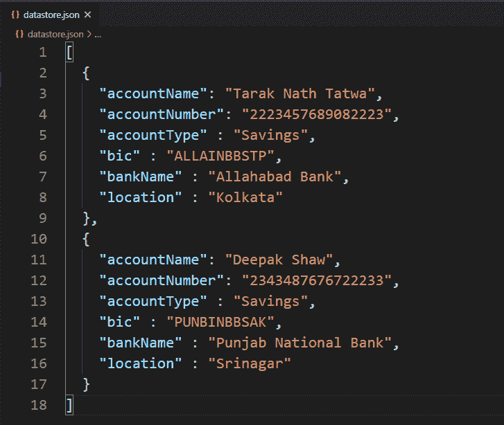
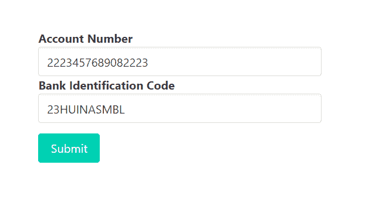
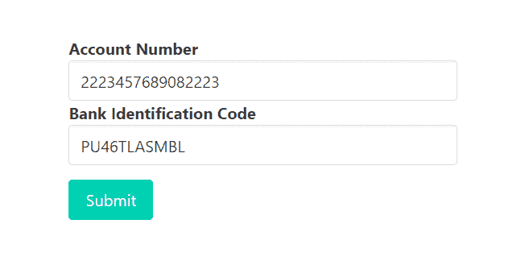
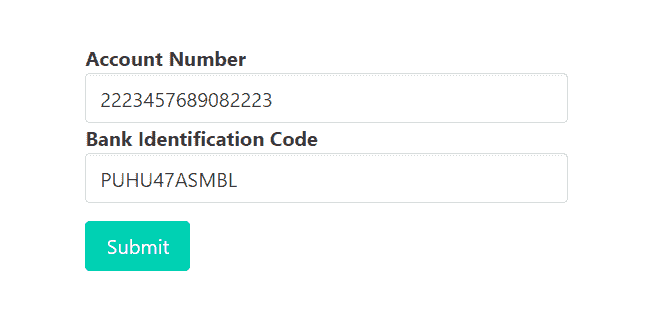
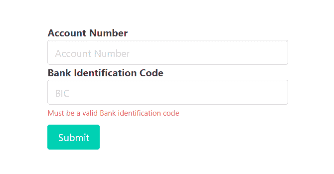
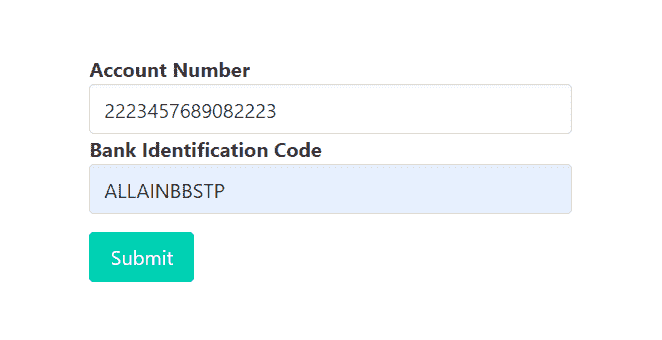

# 如何使用快速验证器验证输入字段中的输入是否有 BIC 或 Swift 代码？

> 原文:[https://www . geesforgeks . org/如何验证输入字段中的输入是否有 bic 或 swift 代码-仅使用快速验证器/](https://www.geeksforgeeks.org/how-to-validate-if-input-in-input-field-has-bic-or-swift-code-only-using-express-validator/)

在 HTML 表单中，我们经常需要不同类型的验证。验证现有电子邮件、验证密码长度、验证确认密码、验证为仅允许整数输入，这些都是验证的一些示例。使用银行系统时，在某个输入字段中，只允许输入有效的银行识别码(BIC)。BIC 是一个 8 或 11 位数的字符串。它代表一个有效的银行，其位置是唯一的。我们还可以使用 express-validator 中间件验证这些输入字段，以便只接受有效的 BIC。

**有效 BIC 的条件:**

*   **银行代码:** 4 个字母代码，只允许大写字母。
*   **国家代码:** 2 个字母代码，只允许大写字母。
*   **位置代码:** 2 个字母代码，允许数字(0 到 9)或大写字母。
*   **分行代码:** 3 个字母可选代码，可以是数字(0-9)或大写字母。

**安装快速验证器的命令:**

```js
npm install express-validator
```

**使用快速验证器实现逻辑的步骤:**

*   安装快速验证中间件。
*   创建一个 validator.js 文件来编码所有的验证逻辑。
*   通过 validateInputField 验证输入:检查(输入字段名)和带有“.”的验证 isBIC()上的链
*   在路由中使用验证名称(validateInputField)作为一个中间件，作为一个验证数组。
*   从快速验证器中析构“验证结果”函数，用它来查找任何错误。
*   如果发生错误，重定向到传递错误信息的同一页。
*   如果错误列表为空，则允许用户访问后续请求。

**注意:**这里我们使用本地或自定义数据库来实现逻辑，同样的步骤也可以在 MongoDB 或 MySql 这样的常规数据库中实现逻辑。

**示例:**此示例说明了如何验证输入字段以仅接受有效的 BIC。

**文件名–index . js**

```js
const express = require('express')
const bodyParser = require('body-parser')
const {validationResult} = require('express-validator')
const repo = require('./repository')
const { validateBic } = require('./validator')
const formTemplet = require('./form')
const showTemplet = require('./show')

const app = express()
const port = process.env.PORT || 3000

// The body-parser middleware to parse form data
app.use(bodyParser.urlencoded({extended : true}))

// Get route to display HTML form
app.get('/', (req, res) => {
  res.send(formTemplet({}))
})

// Post route to handle form submission logic and 
app.post(
  '/account',
  [validateBic],
  async (req, res) => {
    const errors = validationResult(req)
    if(!errors.isEmpty()){
      return res.send(formTemplet({errors}))
    }
    const {aNumber, bic} = req.body
    const account = await repo.getOneBy({
      'accountNumber': aNumber,
      'bic': bic
    })
    if(account){
      console.log(account)
      res.send(showTemplet(account))
    }else{
      res.send('<strong>Account Not Found</strong>')
    }
})

// Server setup
app.listen(port, () => {
  console.log(`Server start on port ${port}`)
})
```

**Filename–repository . js:**该文件包含创建本地数据库并与之交互的所有逻辑。

```js
// Importing node.js file system module 
const fs = require('fs')

class Repository {
  constructor(filename) {

    // The filename where datas are going to store
    if(!filename) {
      throw new Error('Filename is required to create a datastore!')
    }

    this.filename = filename

    try {
      fs.accessSync(this.filename)
    } catch(err) {
      // If file not exist it is created with empty array
      fs.writeFileSync(this.filename, '[]')
    }
  }

  // Get all existing records
  async getAll(){
    return JSON.parse(
      await fs.promises.readFile(this.filename, {
        encoding : 'utf8'
      })
    )
  }

  // Find record by property
  async getOneBy(filters){
    const records = await this.getAll()
    for(let record of records){
      let found = true
      for(let key in filters){
        if(record[key] !== filters[key]){
          found = false
        }
      }
      if(found) return record;
    }
  }

}

// The 'datastore.json' file created at runtime 
// and all the information provided via signup form
// store in this file in JSON format.
module.exports = new Repository('datastore.json')
```

**文件名–form . js:**该文件包含显示获取银行信息的表单的逻辑。

```js
const getError = (errors, prop) => {
  try {
    return errors.mapped()[prop].msg
  } catch (error) {
    return ''
  } 
}

module.exports = ({errors}) => {
  return `
    <!DOCTYPE html>
    <html>
      <head>
        <link rel='stylesheet' 
href='https://cdnjs.cloudflare.com/ajax/libs/bulma/0.9.0/css/bulma.min.css'>
        <style>
          div.columns{
            margin-top: 100px;
          }
          .button{
            margin-top : 10px
          }
        </style>
      </head>
      <body>
        <div class='container'>
          <div class='columns is-centered'>
            <div class='column is-5'>
              <form action='/account' method='POST'>             
                <div>
                  <div>
                    <label class='label' id='aNumber'>
                      Account Number
                    </label>
                  </div>
                  <input class='input' type='text' name='aNumber' 
                  placeholder='Account Number' for='aNumber'>
                </div>
                <div>
                 <div>
                  <label class='label' id='bic'>
                    Bank Identification Code
                   </label>
                 </div>
                 <input class='input' type='text' name='bic' 
                 placeholder='BIC' for='bic'>
                 <p class="help is-danger">
                   ${getError(errors, 'bic')}
                 </p>
                </div>
                <div>
                  <button class='button is-primary'>
                    Submit
                  </button>
                </div>
              </form>
            </div>
          </div>
        </div>
      </body>
    </html>   
  `
}
```

**文件名–show . js:**该文件包含显示提取的银行信息的逻辑。

```js
module.exports = (account) => {
  return `
    <div>
      <div>
        <strong>Account Name :</strong>
        ${account.accountName}
      </div>
      <div>
        <strong>Account Number :</strong>
        ${account.accountNumber}
      </div>
      <div>
        <strong>Account Type :</strong>
        ${account.accountType}
      </div>
      <div>
        <strong>BIC :</strong>
        ${account.bic}
      </div>
      <div>
        <strong>Bank Name :</strong>
        ${account.bankName}
      </div>
      <div>
        <strong>Bank Location :</strong>
        ${account.bankLocation}
      </div>
    <div>
  `
}
```

**Filename–validator . js:**该文件包含所有的验证逻辑(验证输入字段只接受有效 BIC 的逻辑)。

```js
const {check} = require('express-validator')
const repo = require('./repository')
module.exports = {

  validateBic : check('bic')

    // To delete leading and trialing space
    .trim()

    // Validate input field to accept only BIC
    .isBIC()
    .withMessage('Must be a valid Bank identification code')
}
```

**文件名–package . JSON**


package.json 文件

**数据库:**



数据库ˌ资料库

**输出:**



前两位无效(仅允许字母)



第三和第四位数字无效(仅允许字母)



第 5 位和第 6 位无效(仅允许字母)



提交无效 BIC 时的响应(在前三种情况下)



有效 BIC


提交有效 BIC 时的回应

**注意:**我们在 form.js 文件中使用了一些布尔玛类(CSS 框架)来设计内容。