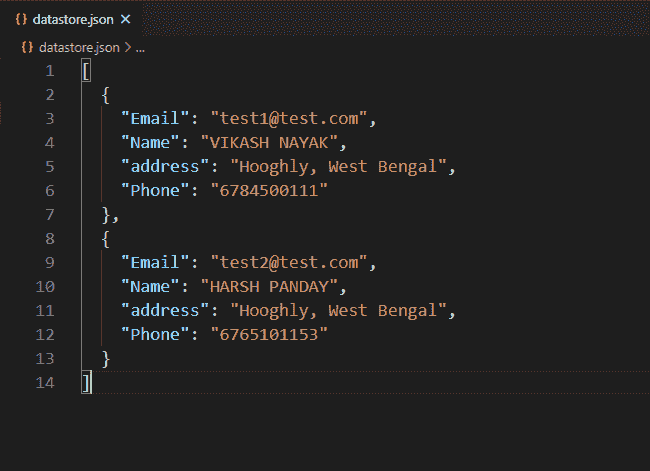
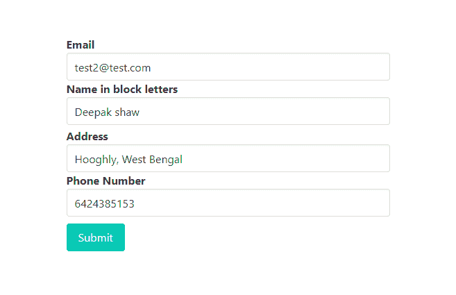
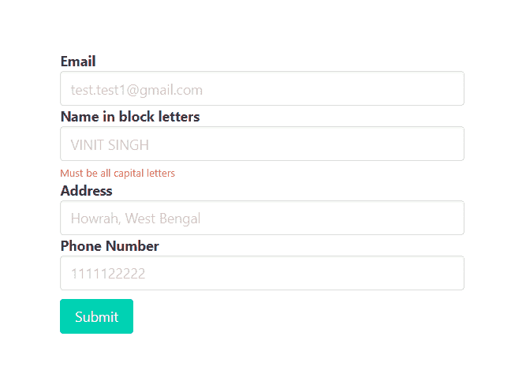
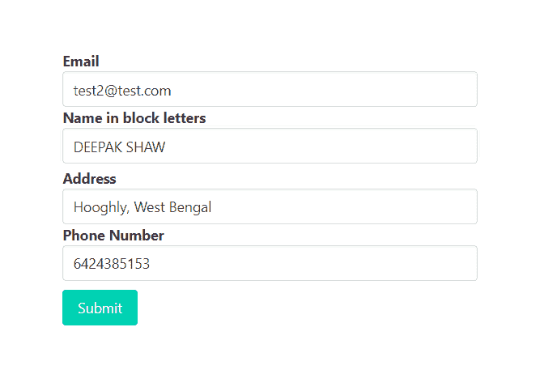
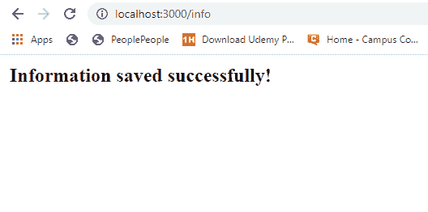
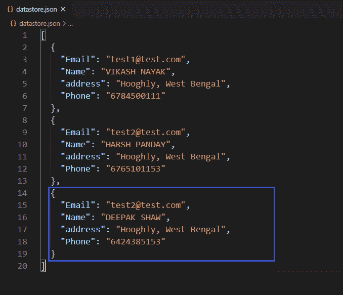

# 如何使用 express-validator 验证输入字段中的输入是否只有大写字母？

> 原文:[https://www . geesforgeks . org/如何验证输入字段中的输入是否只有大写字母使用快速验证器/](https://www.geeksforgeeks.org/how-to-validate-if-input-in-input-field-has-uppercase-letters-only-using-express-validator/)

在 HTML 表单中，我们经常需要不同类型的验证。验证现有电子邮件、验证密码长度、验证确认密码、验证为仅允许整数输入，这些都是验证的一些示例。在某个输入字段中，只允许大写字母。我们还可以使用 express-validator 中间件验证这些输入字段，使其只接受大写字母。

**安装快速验证器的命令:**

```
npm install express-validator

```

**使用快速验证器实现逻辑的步骤:**

*   安装快速验证中间件。
*   创建一个 validator.js 文件来编码所有的验证逻辑。
*   通过验证输入验证输入:检查(输入字段名)和验证链是否为带“.”的
*   在路由中使用验证名称(validateInputField)作为一个中间件，作为一个验证数组。
*   从快速验证器中析构“验证结果”函数，用它来查找任何错误。
*   如果发生错误，重定向到传递错误信息的同一页。
*   如果错误列表为空，则允许用户访问后续请求。

**注意:**这里我们使用本地或自定义数据库来实现逻辑，同样的步骤也可以在 MongoDB 或 MySQL 这样的常规数据库中实现逻辑。

**示例:**此示例说明了如何验证输入字段以仅允许大写字母。

**文件名–index . js**

```
const express = require('express')
const bodyParser = require('body-parser')
const {validationResult} = require('express-validator')
const repo = require('./repository')
const { validateName } = require('./validator')
const formTemplet = require('./form')

const app = express()
const port = process.env.PORT || 3000

// The body-parser middleware to parse form data
app.use(bodyParser.urlencoded({extended : true}))

// Get route to display HTML form
app.get('/', (req, res) => {
  res.send(formTemplet({}))
})

// Post route to handle form submission logic and 
app.post(
  '/info',
  [validateName],
  async (req, res) => {
    const errors = validationResult(req)

    if(!errors.isEmpty()) {
      return res.send(formTemplet({errors}))
    }

    const {email, name, addr, phone} = req.body

    // New record
    await repo.create({
      'Email':email,
      'Name':name,
      'address':addr,
      'Phone':phone
    })
    res.send('<strong>Information saved successfully!</strong>')
})

// Server setup
app.listen(port, () => {
  console.log(`Server start on port ${port}`)
})
```

**Filename–repository . js:**该文件包含创建本地数据库并与之交互的所有逻辑。

```
// Importing node.js file system module 
const fs = require('fs')

class Repository {

  constructor(filename) {

    // Filename where data are going to store
    if(!filename) {
      throw new Error(
'Filename is required to create a datastore!')
    }

    this.filename = filename

    try {
      fs.accessSync(this.filename)
    } catch(err) {

      // If file not exist it is created
      // with empty array
      fs.writeFileSync(this.filename, '[]')
    }
  }

  // Get all existing records
  async getAll(){
    return JSON.parse(
      await fs.promises.readFile(this.filename, {
        encoding : 'utf8'
      })
    )
  }

  // Create new record
  async create(attrs){

    // Fetch all existing records
    const records = await this.getAll()

    // All the existing records with new 
    // record push back to database
    records.push(attrs)
    await fs.promises.writeFile(
      this.filename,
      JSON.stringify(records, null, 2)   
    )
    return attrs
  }
}

// The 'datastore.json' file created at runtime 
// and all the information provided via signup form
// store in this file in JSON formet.
module.exports = new Repository('datastore.json')
```

**Filename–form . js:**该文件包含显示表单提交数据的逻辑。

```
const getError = (errors, prop) => {
  try {
    return errors.mapped()[prop].msg
  } catch (error) {
    return ''
  } 
}

module.exports = ({errors}) => {
  return `
<!DOCTYPE html>
<html>

<head>
  <link rel='stylesheet' href=
'https://cdnjs.cloudflare.com/ajax/libs/bulma/0.9.0/css/bulma.min.css'>
  <style>
    div.columns {
      margin-top: 100px;
    }

    .button {
      margin-top: 10px
    }
  </style>
</head>

<body>
  <div class='container'>
    <div class='columns is-centered'>
      <div class='column is-5'>
        <form action='/info' method='POST'>
          <div>
            <div>
              <label class='label' id='email'>
                Email
              </label>
            </div>
            <input class='input' type='text' 
              name='email' placeholder=
              'test.test1@gmail.com' for='email'>
          </div>
          <div>
            <div>
              <label class='label' id='name'>
                Name in block letters
              </label>
            </div>
            <input class='input' type='text' 
              name='name' placeholder='VINIT SINGH'
              for='name'>
            <p class="help is-danger">
              ${getError(errors, 'name')}
            </p>
          </div>
          <div>
            <div>
              <label class='label' id='addr'>
                Address
              </label>
            </div>
            <input class='input' type='text' name='addr'
              placeholder='Howrah, West Bengal' for='addr'>
          </div>
          <div>
            <div>
              <label class='label' id='phone'>
                Phone Number
              </label>
            </div>
            <input class='input' type='text' name='phone'
              placeholder='1111122222' for='phone'>
          </div>
          <div>
            <button class='button is-primary'>
              Submit
            </button>
          </div>
        </form>
      </div>
    </div>
  </div>
</body>

</html>
  `
}
```

**Filename–validator . js:**该文件包含所有验证逻辑(验证输入字段只允许大写字母的逻辑)。

```
const {check} = require('express-validator')
const repo = require('./repository')
module.exports = {

  validateName : check('name')

    // To delete leading and trailing space
    .trim()

    // Validate name to accept only
    // uppercase letters
    .isUppercase()

    // Custom message
    .withMessage('Must be all capital letters')   
}
```

**文件名–package . JSON**


package.json 文件

**数据库:**



数据库ˌ资料库

**输出:**



当名称输入字段不全是大写字母时，尝试提交表单数据



当试图提交名称输入字段不全是大写字母表单数据时的响应



当名称输入字段全部为大写字母时，尝试提交表单数据



当试图提交名称输入字段全部为大写字母表单数据时的响应

**成功提交表单后的数据库:**



成功提交表单后的数据库

**注意:**我们在 form.js 文件中使用了一些布尔玛类(CSS 框架)来设计内容。