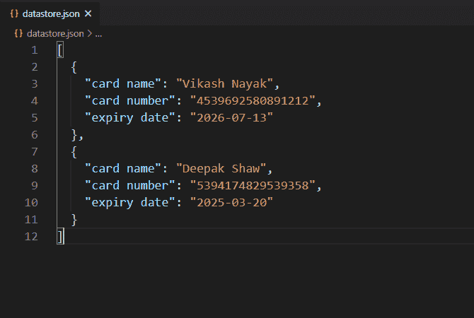
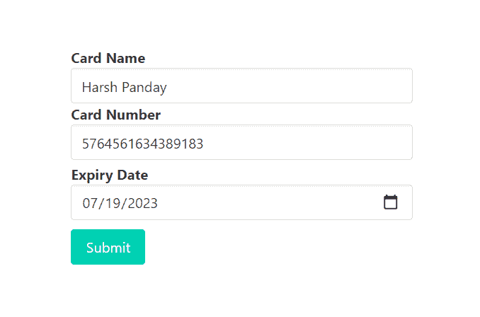
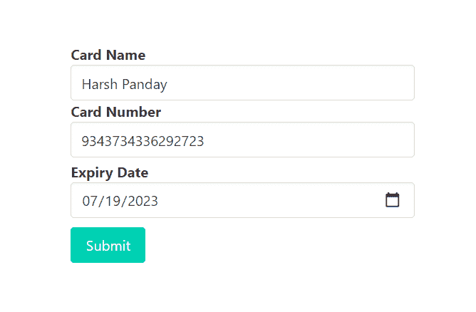
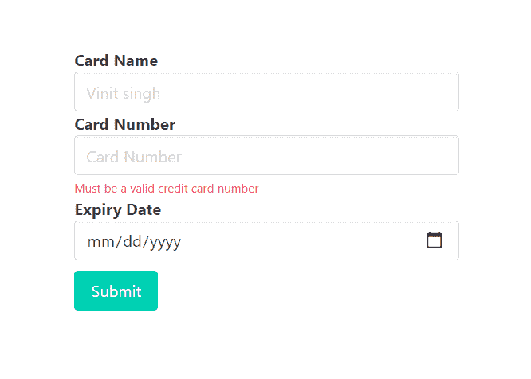
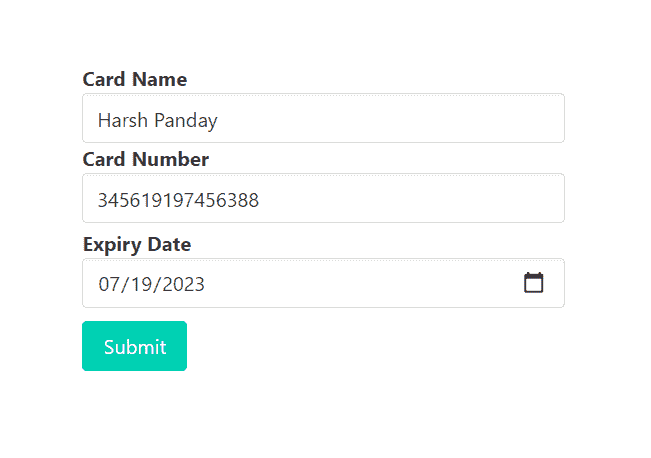
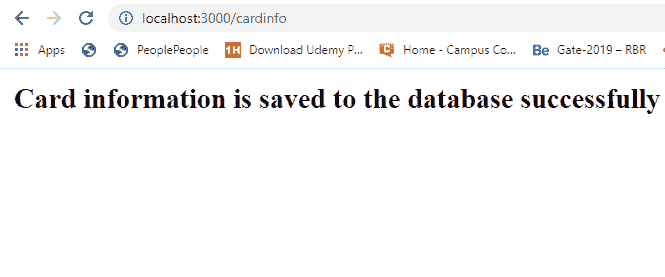
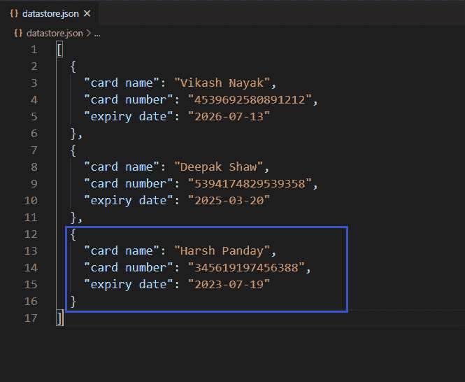

# 如何使用快速验证器验证输入字段中的输入是否是有效的信用卡号？

> 原文:[https://www . geeksforgeeks . org/如果输入字段中的输入是有效的信用卡号码使用快速验证器，如何验证/](https://www.geeksforgeeks.org/how-to-validate-if-input-in-input-field-is-a-valid-credit-card-number-using-express-validator/)

在 HTML 表单中，我们经常需要不同类型的验证。验证现有电子邮件、验证密码长度、验证确认密码、验证为仅允许整数输入，这些都是验证的一些示例。在某个输入字段中，只允许有效的信用卡号码，即不允许任何其他不符合规则的字符串或号码成为有效的信用卡。我们还可以使用 express-validator 中间件验证这些输入字段，使其只接受有效的信用卡号。

**有效信用卡号的条件:**

信用卡号必须遵循如下所示的鲁恩算法:

**鲁恩公式:**

*   删除数字的最后一位。最后一个数字是我们要检查的。
*   颠倒数字。
*   将奇数位置的数字相乘(1、3、5 等)。)除以 2，然后将所有高于 9 的结果减去 9。
*   把所有的数字加起来。
*   校验位(卡片的最后一个数字)是您需要相加得到 10 的倍数(模 10)的金额。

**示例:**
原始数字:4 5 5 6 7 3 7 5 8 6 8 9 8 5 5
删除最后一位数字:4 5 5 6 7 3 7 5 8 6 8 9 8 9 8 5
反转数字:5 8 9 8 6 8 5 7 3 7 6 5 5 4
将多个奇数位数字乘以 2:10 8 18 9 16 16 5 14 3 14 6 10 5 8
将 9 减 9 得到 9:1 8 9 9 7 6 7 5 3 5 6 1 5 8
将所有数字相加:1 8 9 9 7 6 7 5 3 5 6 1 5 8 = 85
Mod 10:85 模 10 = 5(卡片的最后一位数字)

**安装快速验证器的命令:**

```
npm install express-validator
```

**使用快速验证器实现逻辑的步骤:**

*   安装快速验证中间件。
*   创建一个 validator.js 文件来编码所有的验证逻辑。
*   通过 validateInputField 验证输入:在带有“.”的验证 isCreditCard()上检查(输入字段名)和链
*   在路由中使用验证名称(validateInputField)作为一个中间件，作为一个验证数组。
*   从快速验证器中析构“验证结果”函数，用它来查找任何错误。
*   如果发生错误，重定向到传递错误信息的同一页。
*   如果错误列表为空，则允许用户访问后续请求。

**注意:**这里我们使用本地或自定义数据库来实现逻辑，同样的步骤也可以在 MongoDB 或 MySql 这样的常规数据库中实现逻辑。

**示例:**此示例说明了如何验证输入字段以仅允许有效的信用卡号。

## java 描述语言

```
const express = require('express')
const bodyParser = require('body-parser')
const {validationResult} = require('express-validator')
const repo = require('./repository')
const { validateCardNumber } = require('./validator')
const formTemplet = require('./form')

const app = express()
const port = process.env.PORT || 3000

// The body-parser middleware to parse form data
app.use(bodyParser.urlencoded({extended : true}))

// Get route to display HTML form
app.get('/', (req, res) => {
  res.send(formTemplet({}))
})

// Post route to handle form submission logic and
app.post(
  '/cardinfo',
  [validateCardNumber],
  async (req, res) => {
    const errors = validationResult(req)
    if (!errors.isEmpty()) {
      return res.send(formTemplet({errors}))
    }

    const {cname, cno, edate} = req.body

    // New record
    await repo.create({
      'card name':cname,
      'card number':cno,
      'expiry date':edate.toString()
    })

    res.send('<strong>Card information is saved '
    + 'to the database successfully</strong>')
})

// Server setup
app.listen(port, () => {
  console.log(`Server start on port ${port}`)
})
```

**Filename–repository . js:**该文件包含创建本地数据库并与之交互的所有逻辑。

## java 描述语言

```
// Importing node.js file system module
const fs = require('fs')

class Repository {
    constructor(filename) {

        // Filename where datas are going to store
        if (!filename) {
            throw new Error(
'Filename is required to create a datastore!')
        }

        this.filename = filename try {
            fs.accessSync(this.filename)
        }

        catch (err) {

            // If file not exist it is created
            // with empty array
            fs.writeFileSync(this.filename, '[]')
        }
    }

    // Get all existing records
    async getAll() {
        return JSON.parse(
            await fs.promises.readFile(this.filename, {
                encoding: 'utf8'
            }))
    }

    // Create new record
    async create(attrs) {

        // Fetch all existing records
        const records = await this.getAll()

        // All the existing records with new
        // record push back to database
        records.push(attrs)
        await fs.promises.writeFile(this.filename,
            JSON.stringify(records, null, 2))

        return attrs
    }
}

// The 'datastore.json' file created at runtime
// and all the information provided via signup form
// store in this file in JSON formet.
module.exports = new Repository('datastore.json')
```

**文件名–form . js:**该文件包含显示表单提交卡片信息的逻辑。

## java 描述语言

```
const getError = (errors, prop) => {
  try {
    return errors.mapped()[prop].msg
  } catch (error) {
    return ''
  }
}

module.exports = ({errors}) => {
  return `
<!DOCTYPE html>
<html>

<head>
  <link rel='stylesheet' href=
'https://cdnjs.cloudflare.com/ajax/libs/bulma/0.9.0/css/bulma.min.css'>
  <style>
    div.columns {
      margin-top: 100px;
    }

    .button {
      margin-top: 10px
    }
  </style>
</head>

<body>
  <div class='container'>
    <div class='columns is-centered'>
      <div class='column is-5'>
        <form action='/cardinfo'
          method='POST'>
          <div>
            <div>
              <label class='label' id='cname'>
                Card Name
              </label>
            </div>
            <input class='input' type='text'
              name='cname' placeholder='Vinit singh'
              for='cname'>
          </div>
          <div>
            <div>
              <label class='label' id='cno'>
                Card Number
              </label>
            </div>
            <input class='input' type='text' name='cno'
              placeholder='Card Number' for='cno'>
            <p class="help is-danger">
              ${getError(errors, 'cno')}
            </p>

          </div>
          <div>
            <div>
              <label class='label' id='edate'>
                Expiry Date
              </label>
            </div>
            <input class='input' type='date' name='edate'
              placeholder='23/9/2026' for='cdate'>
          </div>
          <div>
            <button class='button is-primary'>
              Submit
            </button>
          </div>
        </form>
      </div>
    </div>
  </div>
</body>

</html>
  `
}
```

**Filename–validator . js:**该文件包含所有验证逻辑(用于验证输入字段以仅允许有效信用卡号的逻辑)。

## java 描述语言

```
const {check} = require('express-validator')
const repo = require('./repository')
module.exports = {

  validateCardNumber : check('cno')

    // To delete leading and trailing space
    .trim()

    // Validate height to accept
    // only decimal number
    .isCreditCard()

    // Custom message
    .withMessage('Must be a valid credit card number')  
}
```

**文件名–package . JSON**


package.json 文件

**数据库:**



数据库ˌ资料库

**输出:**



尝试使用无效卡号提交表格(不遵循 luhn 公式)



尝试使用无效的卡号提交表格(不遵循 luhn 公式，也没有以数字 9 开头的信用卡)



尝试提交卡号无效的表格时的响应



尝试使用有效的卡号提交表格(遵循 luhn 公式)



尝试使用有效卡号提交表格时的回应

**成功提交表单后的数据库:**



成功提交表单后的数据库

**注意:**我们在 form.js 文件中使用了一些布尔玛类(CSS 框架)来设计内容。