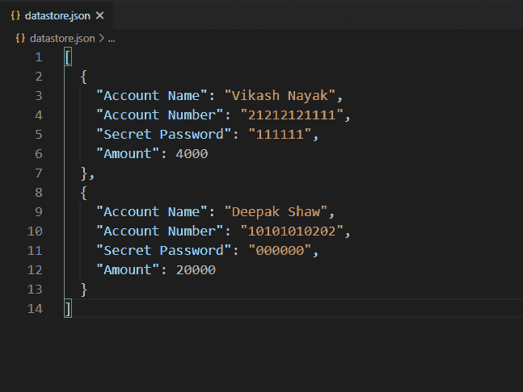
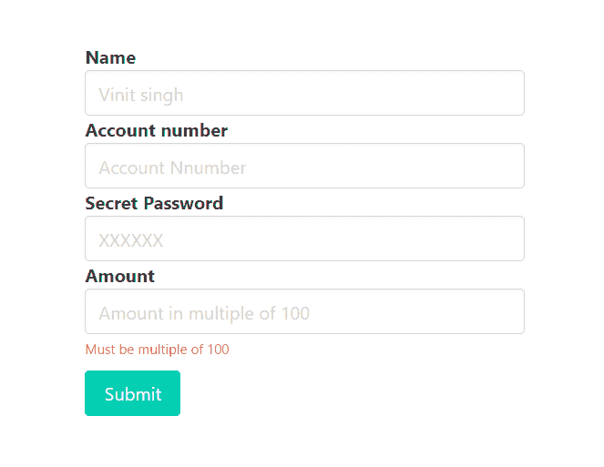
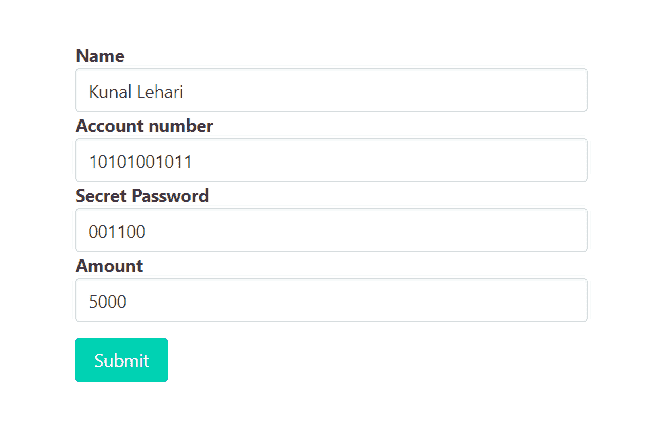
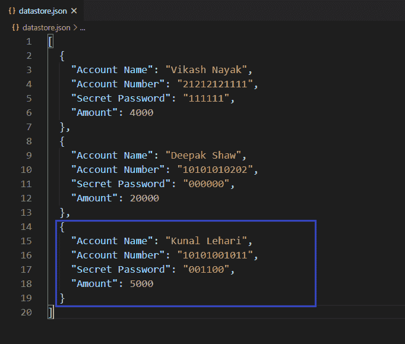

# 如何使用 express-validator 验证输入字段中的输入是否可被数字整除或倍数？

> 原文:[https://www . geesforgeks . org/如何验证输入字段中的输入是否可被使用快速验证器的数字整除或倍数整除/](https://www.geeksforgeeks.org/how-to-validate-if-input-in-input-field-is-divisible-by-or-multiple-of-a-number-using-express-validator/)

在 HTML 表单中，我们经常需要不同类型的验证。验证现有电子邮件、验证密码长度、验证确认密码、验证为仅允许整数输入，这些都是验证的一些示例。在某个输入字段中，只允许是特定数字倍数的数字，即不允许有任何字母、特殊字符或不是特定数字倍数的数字。我们还可以使用 express-validator 中间件验证这些输入字段，以便只接受那些特定的数字。

**安装快速验证器的命令:**

```
npm install express-validator
```

**使用快速验证器实现逻辑的步骤:**

*   安装快速验证中间件。
*   创建一个 validator.js 文件来编码所有的验证逻辑。
*   通过 validateInputField 验证输入:检查(输入字段名)和带有“.”的验证链
*   通过将净化方法链接到带“.”的 toInt()上，净化输入以将其从字符串转换为整数
*   在路由中使用验证名称(validateInputField)作为一个中间件，作为一个验证数组。
*   从快速验证器中析构“验证结果”函数，用它来查找任何错误。
*   如果发生错误，重定向到传递错误信息的同一页。
*   如果错误列表为空，则允许用户访问后续请求。

**注意:**这里我们使用本地或自定义数据库来实现逻辑，同样的步骤也可以在 MongoDB 或 MySql 这样的常规数据库中实现逻辑。

**示例:**此示例说明了如何验证输入字段，以仅允许可被某个特定数字整除的数字。

**文件名–index . js**

## java 描述语言

```
const express = require('express')
const bodyParser = require('body-parser')
const {validationResult} = require('express-validator')
const repo = require('./repository')
const { validateAmount } = require('./validator')
const formTemplet = require('./form')

const app = express()
const port = process.env.PORT || 3000

// The body-parser middleware to parse form data
app.use(bodyParser.urlencoded({extended : true}))

// Get route to display HTML form
app.get('/', (req, res) => {
  res.send(formTemplet({}))
})

// Post route to handle form submission logic and
app.post(
  '/info',
  [validateAmount],
  async (req, res) => {
    const errors = validationResult(req)
    if(!errors.isEmpty()){
      return res.send(formTemplet({errors}))
    }
    const {name, ano, pin, amount} = req.body

    // New record
    await repo.create({
      'Account Name':name,
      'Account Number':ano,
      'Secret Password':pin,
      'Amount':amount,
    })
    res.send(
'<strong>Transaction successful!</strong>')
})

// Server set to run
app.listen(port, () => {
  console.log(`Server start on port ${port}`)
})
```

**Filename–repository . js:**该文件包含创建本地数据库并与之交互的所有逻辑。

## java 描述语言

```
// Importing node.js file system module
const fs = require('fs')

class Repository {

  constructor(filename) {

    // Filename where datas are going to store
    if (!filename) {
      throw new Error(
'Filename is required to create a datastore!')
    }

    this.filename = filename

    try {
      fs.accessSync(this.filename)
    } catch(err) {

      // If file not exist it is created
      // with empty array
      fs.writeFileSync(this.filename, '[]')
    }
  }

  // Get all existing records
  async getAll(){
    return JSON.parse(
      await fs.promises.readFile(this.filename, {
        encoding : 'utf8'
      })
    )
  }

  // Create new record
  async create(attrs){

    // Fetch all existing records
    const records = await this.getAll()

    // All the existing records with new
    // record push back to database
    records.push(attrs)
    await fs.promises.writeFile(
      this.filename,
      JSON.stringify(records, null, 2)  
    )
    return attrs
  }
}

// The 'datastore.json' file created at runtime
// and all the information provided via signup form
// store in this file in JSON formet.
module.exports = new Repository('datastore.json')
```

**Filename–form . js:**该文件包含显示表单提交数据的逻辑。

## java 描述语言

```
const getError = (errors, prop) => {
  try {
    return errors.mapped()[prop].msg
  } catch (error) {
    return ''
  }
}

module.exports = ({errors}) => {
  return `
<!DOCTYPE html>
<html>

<head>
  <link rel='stylesheet' href=
'https://cdnjs.cloudflare.com/ajax/libs/bulma/0.9.0/css/bulma.min.css'>
  <style>
    div.columns {
      margin-top: 100px;
    }

    .button {
      margin-top: 10px
    }
  </style>
</head>

<body>
  <div class='container'>
    <div class='columns is-centered'>
      <div class='column is-5'>
        <form action='/info' method='POST'>
          <div>
            <div>
              <label class='label' id='name'>
                Name
              </label>
            </div>
            <input class='input' type='text'
              name='name' placeholder='Vinit singh'
              for='name'>
          </div>
          <div>
            <div>
              <label class='label' id='ano'>
                Account number
              </label>
            </div>
            <input class='input' type='text'
              name='ano' placeholder='Account Nnumber'
              for='ano'>
          </div>
          <div>
            <div>
              <label class='label' id='pin'>
                Secret Password
              </label>
            </div>
            <input class='input' type='text' name='pin'
              placeholder='XXXXXX' for='pin'>
          </div>
          <div>
            <div>
              <label class='label' id='amount'>
                Amount
              </label>
            </div>
            <input class='input' type='text' name='amount'
              placeholder='Amount in multiple of 100'
              for='amount'>
            <p class="help is-danger">
              ${getError(errors, 'amount')}
            </p>

          </div>
          <div>
            <button class='button is-primary'>
              Submit
            </button>
          </div>
        </form>
      </div>
    </div>
  </div>
</body>

</html>
  `
}
```

**Filename–validator . js:**该文件包含所有验证逻辑(验证输入字段只允许大写字母的逻辑)。

## java 描述语言

```
const {check} = require('express-validator')
const repo = require('./repository')
module.exports = {

  validateAmount : check('amount')

    // To delete leading and trailing space
    .trim()

    // Convert amount to integer from string
    .toInt()

    // Validate name to accept only a
    // number divisible by 'num'
    .isDivisibleBy(100)

    // Custom message
    .withMessage('Must be multiple of 100')  
}
```

**文件名–package . JSON**


package.json 文件

**数据库:**



数据库

**输出:**


当金额输入字段不能被 100 整除或 100 的倍数时，尝试提交表单数据



试图提交金额输入字段不能被 100 整除或 100 的倍数的表单数据时的响应



当金额输入字段可被 100 整除或为 100 的倍数时，尝试提交表单数据


尝试提交金额输入字段可被 100 整除或倍数的表单数据时的响应

**成功提交表单后的数据库:**



成功提交表单后的数据库

**注意:**我们在 form.js 文件中使用了一些布尔玛类(CSS 框架)来设计内容。