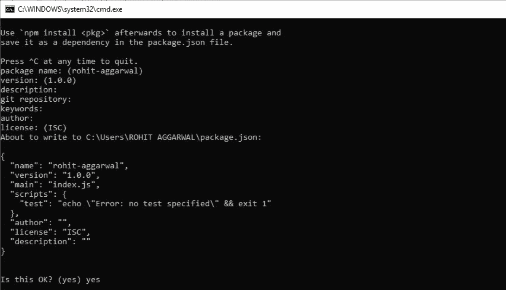
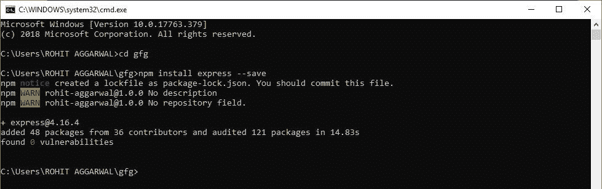

# 快递简介

> 原文:[https://www.geeksforgeeks.org/introduction-to-express/](https://www.geeksforgeeks.org/introduction-to-express/)

先决条件–[节点. js](https://www.geeksforgeeks.org/installation-of-node-js-on-windows/)

# **什么是快递？**

Express 是一个小框架，位于 Node.js 的 web 服务器功能之上，用于简化其 API 并添加有用的新功能。它使得用中间件和路由来组织应用程序的功能变得更加容易；它为 Node.js 的 HTTP 对象添加了有用的实用程序；它方便了动态 HTTP 对象的呈现。

Express 是 **MEAN** 栈的一部分，这是一个全栈 JavaScript 解决方案，用于构建快速、健壮和可维护的生产 web 应用程序。

**M** ongoDB(数据库)

**E**Xpresjs(网络框架)

**前端框架**

**N** odeJS(应用服务器)

# **在 Windows (WINDOWS 10)上安装 Express**

假设您已经在系统上安装了 node.js，那么在 Windows 上安装 express 应该遵循以下步骤:

**STEP-1:** 为我们的项目创建一个目录，并将其作为我们的工作目录。

```js
$ mkdir gfg
$ cd gfg 

```

**STEP-2:** 使用 npm init 命令为我们的项目创建一个 package.json 文件。

```js
$ npm init

```

这个命令描述了我们项目的所有依赖关系。该文件将在开发过程中添加更多依赖项时更新，例如在您设置构建系统时。

继续按回车，在终点站相应输入“是/否”。

**STEP-3:** 安装快递

现在在你的 *gfg(你的文件夹名称)*文件夹中键入以下命令行:

```js
$ npm install express --save

```



**注意-** 此处 ***【警告】*** 表示必须在 STEP-2 中输入的字段。

**STEP-4:** 验证您的 Windows 上是否安装了 Express.js:

要检查系统上是否安装了 express.js，可以在 cmd 上运行以下命令行:

```js
C:\Users\Admin\gfg\node_modules>npm --version express

```


安装成功会显示 express.js 版本。