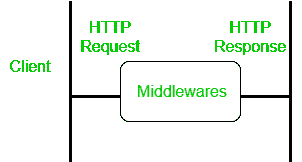
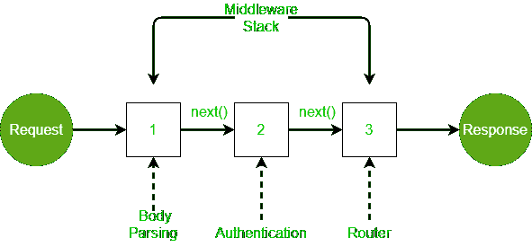

# express . js 中的中间件

> 原文:[https://www.geeksforgeeks.org/middleware-in-express-js/](https://www.geeksforgeeks.org/middleware-in-express-js/)

[Node.js](https://www.geeksforgeeks.org/nodejs-tutorials/) 是一个开源的跨平台运行时环境，构建在 Chrome 的 V8 JavaScript 引擎上，用于在浏览器之外执行 JavaScript 代码。你需要记住 NodeJS 不是一个框架，也不是一种编程语言。在本文中，我们将讨论什么是 express.js 中的中间件

**Express.js** 是一个路由和中间件框架，用于处理网页的不同路由，它在请求和响应周期之间工作。中间件在服务器收到请求后，控制器动作发送响应前执行。中间件可以访问请求对象、响应对象，接下来，它可以在服务器发送响应之前处理请求。基于 Express 的应用程序是一系列中间件函数调用。



中间件工作正常

**使用中间件的优势:**

*   在服务器处理请求之前，中间件可以多次处理请求对象。
*   中间件可用于添加日志记录和身份验证功能。
*   中间件提高了客户端渲染性能。
*   中间件用于设置一些特定的 HTTP 头。
*   中间件有助于优化和提高性能。

**中间件链接:**中间件可以从一个链接到另一个，因此创建了按顺序执行的功能链。最后一个函数将响应发送回浏览器。因此，在将响应发送回浏览器之前，不同的中间件会处理请求。

express 中的 [next()](https://www.geeksforgeeks.org/what-is-the-use-of-next-function-in-express-js/) 函数负责调用下一个中间件函数(如果有)。

**修改后的请求将通过下一个功能**提供给每个中间件



中间件链接示例

在上面的例子中，传入的请求被修改，使用几个中间件执行各种操作，并且使用下一个函数链接中间件。路由器将响应发送回浏览器。

**中间件语法:**中间件功能的基本语法如下–

```js
app.get(path, (req, res, next) => {}, (req, res) => {})
```

中间部分 **(req，res，next)= > {}** 是中间件功能。在这里，我们通常在允许用户查看网页或调用数据和许多其他功能之前执行所需的操作。所以让我们创建自己的中间件，看看它的用途。

让我们创建我们的中间件，看看它是如何执行的。

**步骤 1:** 转到您的项目目录，输入以下命令创建 NodeJs 项目。确保 NodeJs 安装在您的机器上。

```js
npm init -y
```

它将创建一个 package.json 文件。

**步骤 2:** 使用以下命令安装两个依赖项。

```js
npm install express nodemon
```

**步骤 3:** 在 package.json 文件的 scripts 部分，添加以下代码行。

```js
"start": "nodemon index.js", 
```

**步骤 4:** 在目录中创建一个 index.js 文件。确保它不在您正在使用的目录的任何子目录中。

**项目结构:**如下图。


项目结构

现在我们将设置我们的**快递应用程序**，并向我们的**服务器**发送**回复**。

下面是 **index.js** 文件的代码。

## java 描述语言

```js
const express = require("express");
const app = express();

const port = process.env.port || 3000;
app.get("/", (req, res) => {
  res.send(`<div>
    <h2>Welcome to GeeksforGeeks</h2>
    <h5>Tutorial on Middleware</h5>
  </div>`);
});
app.listen(port, () => {
  console.log(`Listening to port ${port}`);
});
```

**运行应用程序的步骤:**通过在终端上输入以下命令来运行代码。

```js
npm start
```

**输出:**


**创建中间件:**在 **app.get()** 功能中，按照以下代码进行修改。

**index.js**

## java 描述语言

```js
app.get(
  "/",
  (req, res, next) => {
    console.log("hello");
    next();
  },
  (req, res) => {
    res.send(`<div>
    <h2>Welcome to GeeksforGeeks</h2>
    <h5>Tutorial on Middleware</h5>
  </div>`);
  }
);
```

**输出:**


中间件