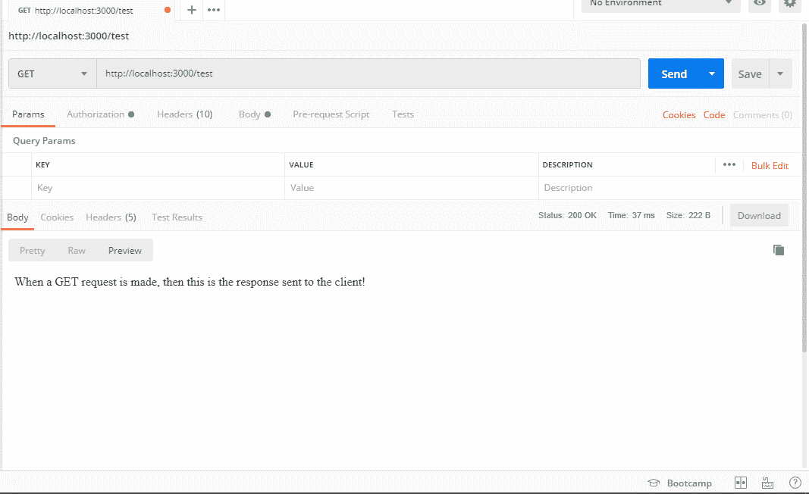
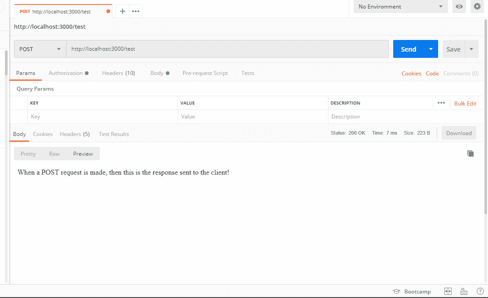

# 快速路的路由路径

> 原文:[https://www.geeksforgeeks.org/routing-path-for-expressjs/](https://www.geeksforgeeks.org/routing-path-for-expressjs/)

**什么和为什么？**
ExpressJS 中的路由用于将 web 应用程序细分并组织成多个小应用程序，每个小应用程序都有自己的功能。它通过细分 web 应用程序来提供更多功能，而不是将所有功能都包含在一个页面上。这些小应用程序组合在一起形成一个网络应用程序。Express 中的每条路由都响应客户端对特定路由/端点的请求和 HTTP 请求方法(GET、POST、PUT、DELETE、UPDATE 等)。每条路线基本上都是指网站中不同的网址。因此，当一个网址(如:www.geeksforgeeks.org/login)匹配一条路线时，与该特定路线相关联的函数就会被执行(在这种情况下，该函数会将用户重定向到 GeeksforGeeks 的登录页面)。

**快递是怎么做的？**
Express Router 用于在 Express 中定义小型应用程序，以便可以更详细地处理每个端点/路由。因此，首先，我们需要在应用程序中包含 express。然后我们有两种方法来定义快速路。

**方法 1:不使用 Router:** 不使用 express.router，而是使用 app.method(路由、功能)

**示例:**

```js
const express = require("express");
const app = express();

app.get("/", function(req, res) {
  res.send("This is a get request!!\n");
});
app.post("/", function(req, res) {
  res.send("This is a post request!!\n");
});

app.put("/", function(req, res) {
  res.send("This is a put request!!\n");
});

app.get("/hey", function(req, res) {
  res.send("This is a get request to '/hey'!!\n");
});

app.listen(3000);
```

**输出:**


**方法二:使用路由器:**我们可以利用 express.router 来简化我们的代码。我们不必每次都为特定的请求指定路径，只需指定一次路径，然后就可以使用快速路由器将请求方法链接到该路径。那个。所有都将应用于所有类型的请求方法。而其余的将基于请求方法应用。

**示例:**

```js
const express = require('express');
const Router = express.Router();

Router.route('/')
.all((req, res, next) => { 
    res.statusCode = 200;
    res.setHeader('Content-Type', 'text/plain');
    next();
})
.get((req, res, next) => {
    res.end('When a GET request is made, then this '
            + 'is the response sent to the client!');
})
.post((req, res, next) => {
    res.end('When a POST request is made, then this '
            + 'is the response sent to the client!');
})
.put((req, res, next) => {
    res.end('When a PUT request is made, then this '
            + 'is the response sent to the client!');
})
.delete((req, res, next) => {
    res.end('When a DELETE request is made, then this '
            + 'is the response sent to the client!');
});

module.exports = Router;
```

我们把这个文件保存为 **test.js**

现在我们使用 **index.js** 文件中的快速路由器如下:

```js
const express = require('Express');
const app = express();

const test = require('./test.js');

app.use('/test', test);

app.listen(3000);
```

**注意:** index.js 和 test.js 应该在同一个目录下。

**输出:**通过邮递员软件获得的不同请求方法的输出。


