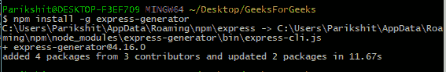
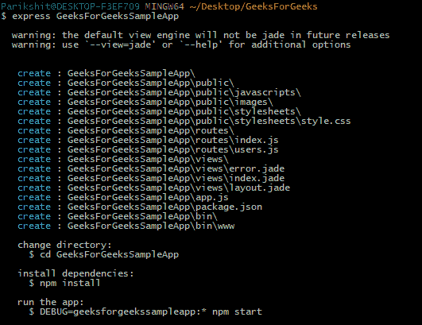
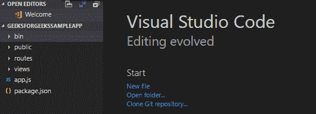

# 从头开始搭建一个 ExpressJS 应用

> 原文:[https://www . geesforgeks . org/scaffolding-expressjs-app-scratch/](https://www.geeksforgeeks.org/scaffolding-expressjs-app-scratch/)

[脚手架](https://en.wikipedia.org/wiki/Scaffold_(programming))正在创建应用的骨架结构。它允许用户创建自己的公共目录、路线、视图等。一旦构建了应用程序的结构，用户就可以开始构建它。
[Express](https://en.wikipedia.org/wiki/Express.js) 是 Node.js 的开源 web 开发框架，用于构建 web 应用程序和 API。要在 Node.js 环境中安装 **express** ，请使用 [NPM(节点包管理器)](https://www.geeksforgeeks.org/node-js-npm-node-package-manager/)。
**语法:**

```js
npm install express --save
```

要在节点中使用 express，请使用以下语法:

```js
var express = require('express');

```

**先决条件:**应事先安装 Node.js。
使用链接了解先决条件:
[https://www . geeksforgeeks . org/nodejs-connect-MongoDB-node-app-using-mongoosejs/](https://www.geeksforgeeks.org/nodejs-connect-mongodb-node-app-using-mongoosejs/)。

**入门:**
使用**快递生成器**包安装**【快递】**命令行工具。**快速生成器**用于创建应用程序的结构。

**安装快递发电机:**
**步骤:**
1。使用终端导航到要构建应用程序的文件夹。
2。现在在终端中，使用以下命令安装**快速发电机**。

```js
npm install express-generator -g 
```



全局安装快速生成器

**注意:** **npm** 以两种方式安装软件包:**本地(默认)**和**全局**
本地安装的软件包是当前项目的本地软件包，全局安装的软件包是全局软件包，一旦安装，就可以在系统的任何地方使用。

**搭建应用:**
下图展示了应用的搭建。如果观察，应用程序的基本结构正在创建。公共目录、路径、路线、视图等。将形成应用程序的结构。



快递应用搭建

**项目文件夹:**
项目文件夹由各种文件夹/文件组成，可以在图像中看到。比较支架结构和项目结构可以清楚地看到，在结构模式下创建的文件夹/文件存在于项目文件夹中，这是支架应用程序的目的。



搭建的 GeeksForGeeks 示例应用程序构成了这个图像。各种文件和文件夹，如 routes、public、package.json 等。可以看出

**解释:**
解释项目中的文件/文件夹。
**1。bin:**bin 里面的文件叫 www，是我们 app 的主要配置文件。
**2。public:** 公共文件夹包含要公开使用的文件，如 JavaScript 文件、CSS 文件、图像等。
**r3。outes:**routes 文件夹包含文件，这些文件包含帮助导航到地图不同区域的方法。它包含各种 js 文件。
**4。视图:**视图文件夹包含构成应用程序视图部分的各种文件。
**示例:**主页、注册页面等。

**注:**撰写本文时文件的扩展名为**。翡翠**。将这些文件扩展名更改为**。帕格**作为翡翠项目已经改成了帕格。

```js
In the app.js file, change the following code:
app.set('view engine', 'jade'); (most probably in line 15)
to :
app.set('view engine', 'pug');

This will change the view engine to pug.

```

**5。app . js**:app . js 文件是主文件，是所有其他文件的头部。这里安装的各种软件包必须是**【必需】**。除此之外，它还有许多其他用途，如处理路由器、中间件等。
**6。[package . JSON](https://www.geeksforgeeks.org/node-js-package-json/):**package . JSON 文件是任意 Node.js 项目和 express.js 应用的清单文件。
包含项目的元数据，如 app 中使用的包及其版本(称为依赖项)、start 和 test(从终端作为‘NPM start’运行)等各种脚本、app 的名称、app 的描述、app 的版本等。

**运行脚手架应用程序:**
使用以下命令安装运行该应用程序所需的[包. json](https://www.geeksforgeeks.org/node-js-package-json/) 文件中提到的所有依赖项:

```js
npm install
```

安装依赖项后，运行以下命令启动 ExpressJs 应用程序:

```js
npm start
```