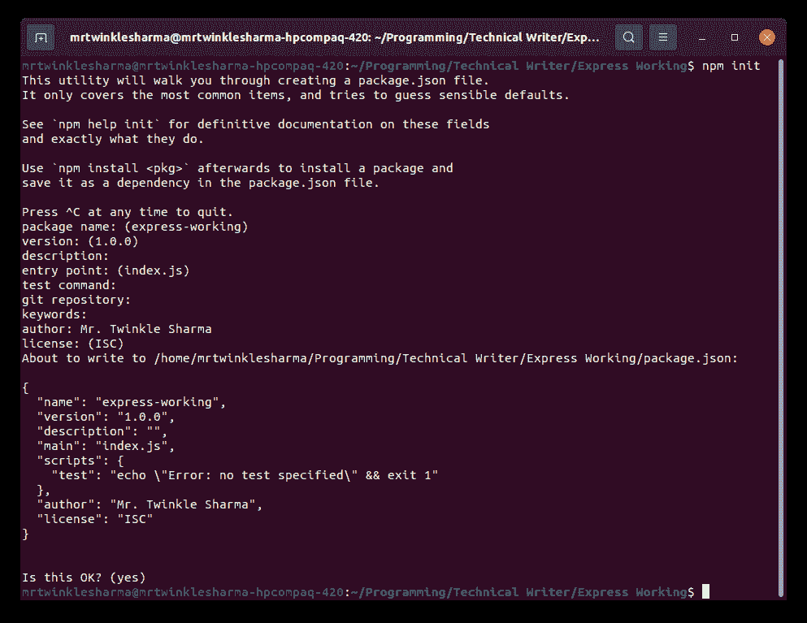
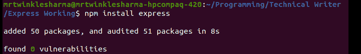
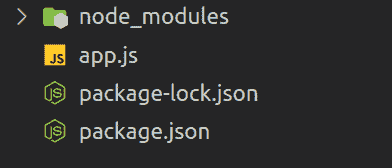
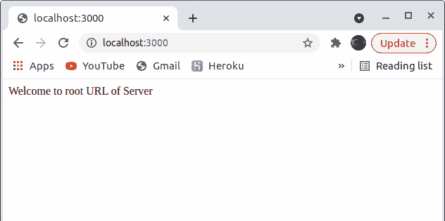
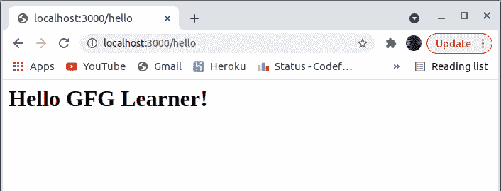
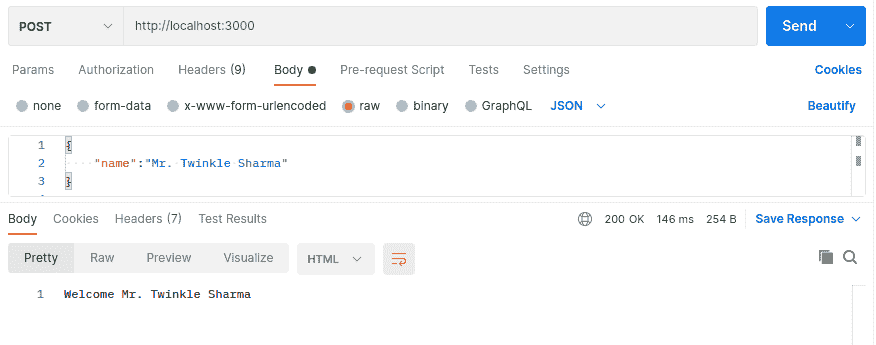
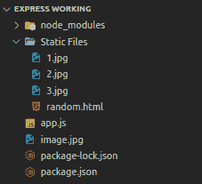
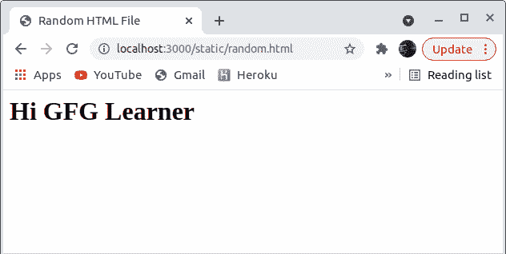

# 创建 Express.js 应用程序的步骤

> 原文:[https://www . geesforgeks . org/steps-to-create-an-express-js-application/](https://www.geeksforgeeks.org/steps-to-create-an-express-js-application/)

Express 是最流行的极简框架。它建立在 NodeJS 的内置模块 HTTP 之上，通过 API 方便了前端和后端逻辑之间的简单和容易的交互，也使我们能够以非常好的方式组织我们的业务逻辑。它非常灵活，我们可以将其用于网络和安卓系统。此外，它还提供了一个非常简单的错误处理过程。

**方法:**下面是编写快递 app 的基本步骤。在这里，我们将讨论一些主题，如安装模块来设置环境、创建应用程序、运行 web 服务器以及执行与服务器的基本通信。必须知道如何使用节点包管理器进行基本工作，安装依赖项和模块的终端的基本知识，网络应用程序如何工作的基本知识，以及 ES6 的良好知识。

**分步实施:**

**第一步:**在你的终端写这个命令，创建一个 nodejs 应用，因为我们的快递服务器会在节点应用里面工作。

**语法:**

```
npm init
```

这将要求您对您的项目进行一些配置，您可以相应地进行填充，也可以稍后从 **package.json** 文件中进行更改。

**注意:**使用` **npm init -y** '进行默认初始化



**步骤 2:** 为我们的应用程序安装必要的依赖项。

```
npm install express
```

类似这样的内容将在成功安装时显示出来，



**第三步:**项目结构如下。



创建一个文件 **app.js，**对于本文，我们将在该文件中编写整个 express 代码。这将是我们的文件夹结构。现在在 app.js 里面，导入带有 require 关键字的 express，通过调用 express 框架提供的 **express()** 函数创建一个 app。为我们的本地应用程序设置端口，默认为 3000，但您可以根据端口的可用性选择任何端口。调用 **listen()** 函数，需要路径和回调作为参数。它开始监听指定路径上的连接，默认主机是 localhost，我们本地机器的默认路径是 **localhost:3000** ，这里的 3000 是我们之前设置的端口。回调函数在服务器成功启动时或由于错误而被执行。

## app.js

```
const express = require('express');

const app = express();
const PORT = 3000;

app.listen(PORT, (error) =>{
    if(!error)
        console.log("Server is Successfully Running, 
                   and App is listening on port "+ PORT)
    else 
        console.log("Error occured, server can't start", error);
    }
);
```

**运行应用程序的步骤:**现在我们已经创建了一个服务器，我们可以成功地开始运行它来查看它是否工作，在您的终端中编写以下命令来启动快速服务器。

```
node app.js
```

**输出:**你会在终端上看到类似这样的东西。


现在有了所有这些，我们已经成功地创建并运行了服务器，如果您的服务器没有启动，那么可能会有一些错误，尝试分析和读取该错误并相应地解决它。
最后，在成功运行之后，如果您尝试在浏览器上打开 URL **(localhost:3000)** ，它将向您显示**无法获取/** ，因为我们尚未在此应用程序上配置任何路由。

**步骤 4:** 现在我们将为我们的应用程序设置所有路线。

路由是服务器的端点，在我们的后端服务器上配置，每当有人试图访问这些端点时，他们都会相应地响应后端的定义。如果您是初学者，您可以将 route 视为一个函数，当有人请求与该函数相关联的特殊路径并返回预期值作为响应时，就会调用该函数。我们可以为 HTTP 方法创建路由，比如 get、post、put 等等。

**语法**这些类型路由的基本语法看起来是这样的，当路径和请求方法相似时，给定的函数就会执行。

```
app.anyMethod(path, function)
```

**示例 1:** 在服务器的根 URL(“/”路径)上设置基本的 get 请求路由。

1.  借助 **app.get()** 我们正在配置我们的第一条路由，它需要两个参数第一个是路径，第二个是一个函数，当任何人用 get 方法请求这个路径时都会执行这个函数。express 将请求和响应对象作为参数提供给所有这些类型的函数。
2.  **请求**是将从用户接收的巨大对象， **res** 是将在功能完成执行后发送给用户的对象。
3.  稍后我们调用 **status()** 方法，它以一个 HTTP 状态代码作为参数，当返回响应时，状态将被一起发送。
4.  最后，我们正在向用户返回响应。 **send()** 方法以字符串、对象、数组或缓冲区为参数，用于将数据对象作为 HTTP 响应发送回客户端，express 中也有很多类型的响应，比如 res.json()用于发送 json 对象，res.sendFile()用于发送文件等。

## app.js

```
const express = require('express');

const app = express();
const PORT = 3000;

app.get('/', (req, res)=>{
    res.status(200);
    res.send("Welcome to root URL of Server");
});

app.listen(PORT, (error) =>{
    if(!error)
        console.log("Server is Successfully Running,
                    and App is listening on port "+ PORT)
    else 
        console.log("Error occured, server can't start", error);
    }
);
```

**运行应用程序的步骤:**保存这段代码，重启服务器，打开给定端口上的 localhost。当客户端在指定的路径上用适当的方法请求时**例如:在“/”路径上获取请求，**我们的功能是以纯文本方式返回响应如果我们在 chrome developers tools 中打开网络部分(按 Ctrl+Shift+I 打开)，我们将看到 localhost 返回的响应以及所有信息。

**输出:**



**示例 2:** 在**/【你好】**路径上再设置一条获取请求路线。

1.  大部分事情都和前面的例子一样。
2.  **set()** 功能用于将 HTTP 头的内容类型设置为 HTML。当浏览器收到此响应时，它将被解释为 HTML，而不是纯文本。
3.  同样在这个例子中，我们没有显式设置状态，它现在与发送响应的语句连接在一起。这是发送状态和响应的另一种方式。

## app.js

```
const express = require('express');

const app = express();
const PORT = 3000;

app.get('/hello', (req, res)=>{
    res.set('Content-Type', 'text/html');
    res.status(200).send("<h1>Hello GFG Learner!</h1>");
});

app.listen(PORT, (error) =>{
    if(!error)
        console.log("Server is Successfully Running, and App is
                      listening on port "+ PORT)
    else 
        console.log("Error occured, server can't start", error);
    }
);
```

**运行应用程序的步骤:**保存这段代码，重启服务器，打开给定端口上的 localhost。现在从浏览器访问“/hello”路由，HTML 中的 h1 文本将显示为响应。

**输出:**



**第五步:**现在我们来看看如何向服务器发送数据。

有时，我们必须将数据发送到服务器进行处理，例如，当您尝试登录脸书时，您向服务器发送了密码和电子邮件，下面我们将了解如何从用户请求中接收数据。我们可以使用适当的 HTTP 方法在指定的路径上发送带有请求对象的数据。到目前为止，我们使用浏览器与服务器交互，但是在这一步中，必须需要任何工具或前端表单来发送数据，因为浏览器搜索栏只能发送 get 请求来从服务器接收资源。

**示例:**设置用户访问的路由，发送带有 post 请求的数据。

1.  在创建接收数据的路径之前，我们使用一个内置的中间件，中间件是一个如此广泛和更高级的主题，所以我们不打算在这里讨论它，只是为了理解一点，您可以把它看作是一段在请求-响应周期之间执行的代码。
2.  **express.json()** 中间件用于将传入的请求对象解析为 json 对象。app.use()是使用任何中间件的语法。
3.  之后，我们在路径**/**上创建了一条路线，用于发布请求。
4.  **const {name}，**这是 ES6 中从对象中提取给定属性/es 的语法。这里，我们提取了用户用这个请求对象发送的 name 属性。
5.  之后，我们只是发送一个**响应**来表明我们已经成功接收到数据。如果这个 **`${} `** 在你看来很奇怪，那么让我告诉你，在 ES6 中用 javascript 表达式生成字符串是 ES6 中的语法。我们可以在${}中注入任何 javascript 表达式。

## app.js

```
const express = require('express');

const app = express();
const PORT = 3000;

app.use(express.json());
app.post('/', (req, res)=>{
    const {name} = req.body;

    res.send(`Welcome ${name}`);
})

app.listen(PORT, (error) =>{
    if(!error)
        console.log("Server is Successfully Running, and 
                    App is listening on port "+ PORT)
    else 
        console.log("Error occured, server can't start", error);
    }
);
```

**运行应用程序的步骤:**我们正在使用邮递员访问路线。这是一个测试 APIs 的工具，我们可以使用任何其他东西，比如 Axios、fetch，或者任何其他来自前端的东西，或者来自终端的 CUlR，但是这将使你偏离主题，只要记住我们的 express 服务器只需要一个带有请求对象的路径，它来自哪里并不重要。我们已经将数据作为带有请求主体的 JSON 对象发送，express 正在将响应连同数据一起发送回我们。这表明我们向服务器发送数据的目标成功了。

**输出:**



### 步骤 5:从服务器发送文件

**第 6 步:**现在我们来看看如何从服务器发送文件。

有几次我们需要根据用户请求从服务器转移资源，发送文件主要有两种方法一种是使用中间件发送静态文件，另一种是在路由上发送单个文件。
这是我们的文件夹结构，我们希望将**静态文件**目录中的文件作为静态文件提供，并将**image.jpg**放在单独的路径上。



**示例 1:** 使用中间件
Express 为我们提供了一个中间件 **express.static()，**它接受两个参数第一个是我们要服务的文件所在目录的绝对根目录路径。
我们可以简单地用它来服务静态文件，通过提供给 **app.use()** 。

**语法:**

```
app.use(path, express.static(root, [options]));
```

1.  首先，我们要导入一个内置模块“路径”，因为稍后我们将使用这个模块提供的一个函数。
2.  我们只是在**/**路线上安装一个中间件。
3.  静态()中间件需要一个绝对路径，所以我们使用路径模块的连接方法。
4.  join()方法取两个参数并把它们连接成一个路径，在 NodeJS 中我们有一个全局属性 **__dirname** ，它包含当前文件所在目录的路径。
5.  我们提供了中间件的连接路径，这样它就可以开始在给定的路径上为目录中的文件提供服务。

## app.js

```
const express = require('express');

const app = express();
const PORT = 3000;

const path = require('path')
app.use('/static', express.static(path.join(__dirname, 'Static Files')))

app.listen(PORT, (error) =>{
    if(!error)
        console.log("Server is Successfully Running, 
                   and App is listening on port "+ PORT)
    else 
        console.log("Error occured, server can't start", error);
    }
);
```

**运行应用程序的步骤:**这将是当我们从作为静态文件的目录中请求一些静态文件时返回的响应。在这里你可以看到我们收到了一个 HTML 文件作为对**/【静态/随机. HTML】**的回应。当我们请求**/static/1 . jpg 时，同样的事情也会发生。**

**输出:**



**示例 2:** 使用 sendFile()函数在路由上发送单个文件。
该函数接受文件的绝对 URL，并且每当访问路由路径时，服务器都会提供文件作为 HTTP 响应。这个过程可以被认为是 express.static()的一个端点。当我们在发送文件之前必须进行某种处理时，这可能会很有用。

**语法:**

```
res.sendFile(fileUrl)
```

1.  我们正在**/**路径上创建一个获取请求路由
2.  然后，我们通过连接当前 __dirname 的路径和我们想要发送的文件名，然后将它传递给 sendFile()来创建绝对路径。
3.  然后路由将 image.jpg 文件作为 HTTP 响应发送给用户。

## app.js

```
const express = require('express');
const path = require('path');

const app = express();
const PORT = 3000;

app.get('/file', (req, res)=>{
    res.sendFile(path.join(__dirname,'image.jpg'));
});

app.listen(PORT, (error) =>{
    if(!error)
        console.log("Server is Successfully Running, and App is listening on port "+ PORT)
    else 
        console.log("Error occured, server can't start", error);
    }
);
```

**输出:**运行服务器后，当我们请求路由**/【文件】**时，服务器发送 image.jpg 文件作为响应。

