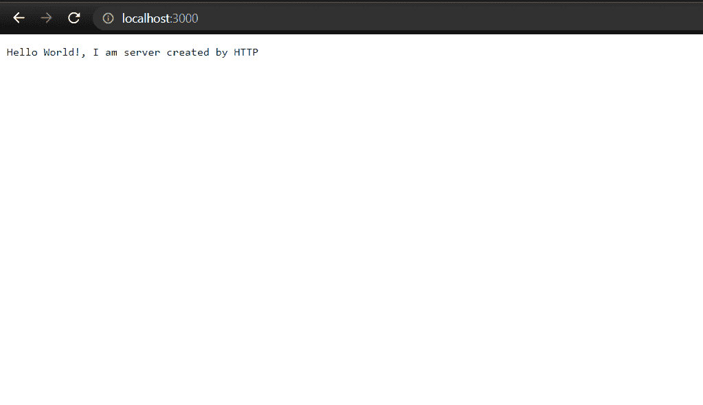
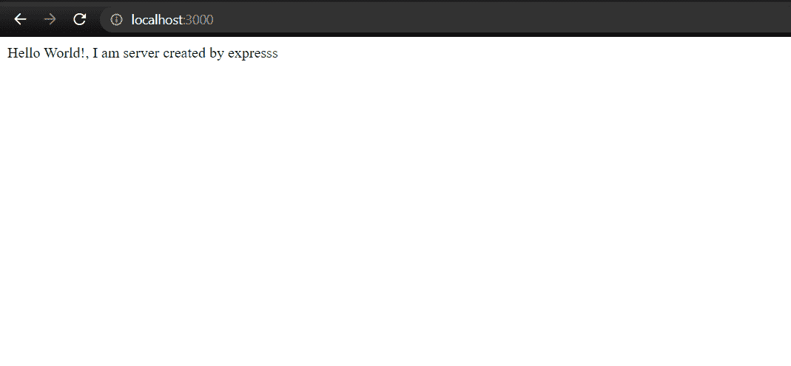

# 【HTTP 模块和 Express.js 模块有什么区别？

> 原文:[https://www . geesforgeks . org/http-module-express-js-module/](https://www.geeksforgeeks.org/what-are-the-differences-between-http-module-and-express-js-module/)有什么区别

HTTP 和 Express 都在 NodeJS 中用于开发。在本文中，我们将分别介绍 HTTP 和 express 模块

**HTTP:** 是内置模块，和 NodeJS 一起预装。它用于创建服务器和建立连接。使用这种连接，只要连接使用超文本传输协议，数据发送和接收就可以完成。

**示例:**使用 NodeJS 中的 HTTP 模块创建服务器。

## index.js

```js
// Importing http module 
var http = require('http');

// Create a server object which listens on port 300
http.createServer(function (req, res) {
    // Write a response to the client
    res.write('Hello World!');

    // End the response
    res.end();
}).listen(3000);
```

使用以下命令运行 **index.js** 文件。

```js
node index.js
```

**输出:**



**Express:** Express 作为一个整体被称为框架，而不仅仅是一个模块。它为您提供了一个应用编程接口、子模块、函数、方法和惯例，用于快速、轻松地将所有必要的组件输入到一起，以构建一个现代化的、功能齐全的网络服务器，并为其提供所有必要的便利(静态资产托管、模板、处理 CSRF、CORS、cookie 解析、POST 数据处理以及更多功能)。

**模块安装:**您可以使用以下命令安装快速模块。

```js
npm i express
```

**示例:**使用 NodeJS 中的 express 模块创建服务器。

## index.js

```js
// Importing express
const express = require('express');

// Creating instance of express
const app = express();

// Handling GET / Request
app.get('/', function (req, res) {
    res.send("Hello World!, I am server created by expresss");
})

// Listening to server at port 3000
app.listen(3000, function () {
    console.log("server started");
})
```

使用以下命令运行 **index.js** 文件。

```js
node index.js
```

**输出:**



**HTTP 模块与 Express.js 模块的区别:**

<figure class="table">

| HTTP | Express |
| HTTP comes with NodeJS, which means that we don't need to install it explicitly. | Express is explicitly installed using the npm command: [T0】 NPM install Express 【T1] |
| HTTP is not a whole framework, rather it is just a module. | Express is an integral framework. |
| HTTP does not provide any support for static asset hosting. | Express provides *express.static* function for static asset custody. Example: *app.use (express.static ('public'));* |
| HTTP is an independent module. | Express delivery is done on the HTTP module. |
| HTTP module provides various tools (functions) to do things for networking, such as making servers and clients. | Express, together with HTTP, does provide more functions to facilitate development. |

</figure>