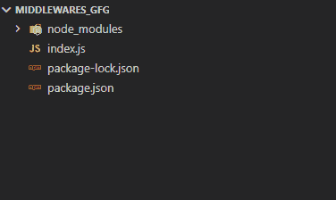
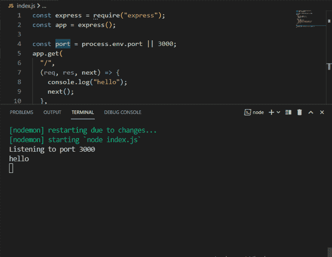

# 什么是 Express.js 中的中间件？

> 原文:[https://www . geesforgeks . org/什么是中间件 in-express-js/](https://www.geeksforgeeks.org/what-is-middleware-in-express-js/)

中间件功能可以访问请求对象和响应对象，也可以访问应用程序请求-响应生命周期中的下一个功能。

中间件用于:

*   更改请求或响应对象。
*   执行任何程序或代码
*   结束请求-响应生命周期
*   调用下一个中间件。

next()函数用于调用下一个中间件，继承当前中间件。需要注意的是，中间件要么停止当前的生命周期，要么将其传递给下一个中间件，否则网页将继续加载。

**中间件语法:**中间件功能的基本语法如下–

```
app.get(path, (req, res, next) => {}, (req, res) => {})
```

中间部分 **(req，res，next)= > {}** 是中间件功能。在这里，我们通常在允许用户查看网页或调用数据和许多其他功能之前执行所需的操作。所以让我们创建自己的中间件，看看它的用途。

让我们创建我们的中间件，看看它是如何执行的。

**步骤 1:** 转到您的项目目录，输入以下命令创建 NodeJs 项目。确保 NodeJs 安装在您的机器上。

```
npm init -y
```

它将创建一个 package.json 文件。

**步骤 2:** 使用以下命令安装两个依赖项。

```
npm install express nodemon
```

**步骤 3:** 在 package.json 文件的 scripts 部分，添加以下代码行。

```
"start": "nodemon index.js", 
```

**步骤 4:** 在目录中创建一个 index.js 文件。确保它不在您正在使用的目录的任何子目录中。

**项目结构:**如下图。



项目结构

现在我们将设置我们的**快递应用程序**，并向我们的**服务器**发送**回复**。

下面是 **index.js** 文件的代码。

## java 描述语言

```
const express = require("express");
const app = express();

const port = process.env.port || 3000;
app.get("/", (req, res) => {
  res.send(`<div>
    <h2>Welcome to GeeksforGeeks</h2>
    <h5>Tutorial on Middleware</h5>
  </div>`);
});
app.listen(port, () => {
  console.log(`Listening to port ${port}`);
});
```

**运行应用程序的步骤:**通过在终端上输入以下命令来运行代码。

```
npm start
```

**输出:**


**创建中间件:**在 **app.get()** 功能中，按照以下代码进行修改。

**index.js**

## java 描述语言

```
app.get(
  "/",
  (req, res, next) => {
    console.log("hello");
    next();
  },
  (req, res) => {
    res.send(`<div>
    <h2>Welcome to GeeksforGeeks</h2>
    <h5>Tutorial on Middleware</h5>
  </div>`);
  }
);
```

**输出:**



中间件