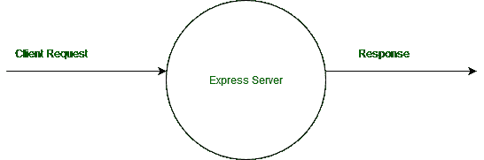
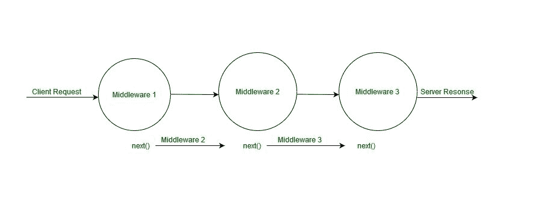
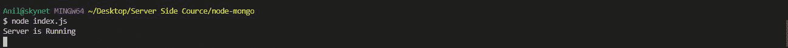
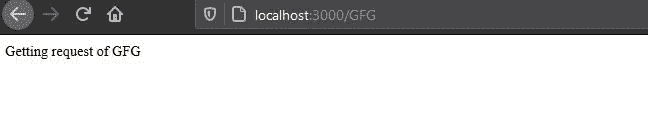
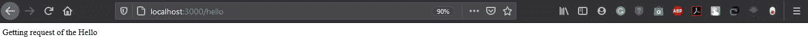
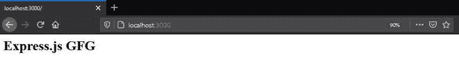
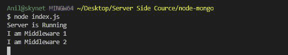
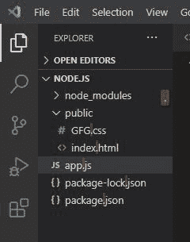
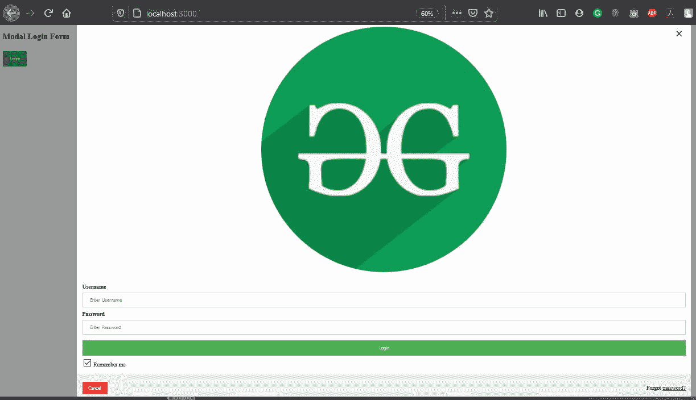

# express . js 中间件的工作及其带来的好处

> 原文:[https://www . geeksforgeeks . org/working-of-express-js-中间件及其优势/](https://www.geeksforgeeks.org/working-of-express-js-middleware-and-its-benefits/)

**框架:**众所周知，它是一个骨架，应用程序通过填充骨架来定义操作的内容。对于网络开发，有 python 和 Django，java 和 spring，对于网络开发，我们有 Node.js 和 Express.js 在 node.js 中有一个 [HTTP 模块](https://www.geeksforgeeks.org/node-js-http-module/)，通过它我们可以创建一个有限的可操作的网站或网络应用程序。一般来说，任何网络应用程序或网站的真正作用是能够处理任何类型的请求。请求可以是发布、获取、删除等等，更像是对图像、视频等的请求，这就是为什么 Express.js 被用作 Node.js 的框架

**Express.js** 是一个路由和中间件框架，用于处理网页的不同路由，它在请求和响应周期之间工作。

#### **中间件框架工作:**



Express.js 中有很多中间件功能，比如[express . js app . use()Function](https://www.geeksforgeeks.org/express-js-app-use-function/)等。

**语法:**

```js
app.use(path,(req,res,next))
```

**参数:**接受上述两个参数，描述如下:

*   **路径**:是调用中间件功能的路径。它可以是表示路径或路径模式的字符串，也可以是匹配路径的正则表达式模式。
*   **回调**:如果当前中间件的响应没有终止，则调用下一个中间件函数的是包含请求对象、响应对象和next()函数的回调函数。在第二个参数中，我们还可以传递中间件的函数名。

#### **多个中间件的工作周期:**



#### **使用 Express.js 中间件的好处:**

1.我们一般使用 [http.createServer()](https://www.geeksforgeeks.org/node-js-http-module/) 来创建一个服务器，并根据信息进行请求和响应，但是我们无法检查客户端发出的是什么类型的请求，以便根据请求进行操作。

2.Express.js 包含多种方法来处理所有类型的请求，而不是处理单一类型的请求，如下所示:

*   [Express.js req.get()](https://www.geeksforgeeks.org/express-js-req-get-function/) 方法:当客户端完成 get 请求时使用该方法，例如:重定向另一个网页请求等
*   [Express.js req.post()](https://www.geeksforgeeks.org/express-js-app-post-function/) 方法:当客户端对上传文档等进行 post 请求时，使用该方法。
*   [Express.js req.delete()](https://www.geeksforgeeks.org/express-js-app-delete-function/) 方法:该方法用于当删除请求由客户端完成时，它主要由管理端完成，例如从服务器删除记录。
*   [Express.js req.put()](https://www.geeksforgeeks.org/express-js-app-put-function/) 方法:当客户端进行更新请求，通过网站更新信息时，使用该方法。

3.易于与 MongoDB、MySQL 等数据库连接。

4.易于提供静态文件和资源我们可以使用 express.js 轻松提供 HTML 文档。

5.使用 Express.js 还有其他几个好处，比如在单个网页上处理多个 get 请求，这意味着允许您基于 HTTP 方法和 URL 定义应用程序的多个[路由](//www.geeksforgeeks.org/routing-in-node-js/)。

**项目结构:**


**安装模块:**

使用以下命令安装快速模块:

```js
npm install express
```

**文件名:Index.js**

## java 描述语言

```js
// Requiring module
const express = require("express");

// Creating express app object
const app = express(); 

// Handling '/' route
app.get("/", (req,res,next) => { 
  res.send("unknown request");
})

// Handling '/GFG' route   
app.get("/GFG", (req,res,next) => { 
  res.send("Getting request of GFG");
})

// Handling '/Hello' route
app.get("/Hello", (req,res,next) => { 
  res.send("Getting request of the Hello");
})

// Server setup
app.listen(3000, () => {
  console.log("Server is Running");
})
```

使用以下命令运行 **index.js** 文件:

```js
node index.js
```



运行项目的命令

**输出:**

现在打开浏览器，转到***http://localhost:3000/GFG***可以看到如下输出:



现在转到***http://localhost:3000/hello***可以看到如下输出:



**注意:**默认情况下，使用 HTTP 模块处理多个请求是一个 get 请求。此方法不能用于多个处理请求。如果我们使用 HTTP 模块来处理多个 get 请求，它需要更多的代码长度和多个 if-else 条件来处理不同的路由。

#### **使用 HTTP 模块处理多个请求:**

**文件名:Index.js**

## java 描述语言

```js
// Requiring module
var http = require('http');

// Create a server object
http.createServer(function (req, res) {

   // The http header
   res.writeHead(200, {'Content-Type': 'text/html'});

   // Getting URL from the request object
   var url = req.url;

   // Checking url
   if(url === '/GFG') {
      res.send("Getting request of GFG");
      res.end();
   }
   else if(url === '/hello') {
       res.send("Getting request of the Hello");
       res.end();
   } else {
       res.send("unknown request");
       res.end();
   }

}).listen(3000, function() {
   // The server object listens on port 3000
   console.log("server start at port 3000");
});
```

#### **从单个中间件调用**多个**中间件:**

**文件名:index.js**

## java 描述语言

```js
// Requiring module
const express = require("express"); 
const app = express();

// Middleware 1
function Middleware1(req,res,next) {  
    console.log("I am Middleware 1");

    // Calling the next middleware present in stack
    next(); 
}

// Middleware 2
function Middleware2(req,res,next) {  

  res.write("<h1>Express.js GFG<h1>")

  // Printing the statement
  console.log("I am Middleware 2"); 

  // Ending the response
  res.end(); 
}

// Request handling
app.get("/", Middleware1, Middleware2);

// Server setup
app.listen(3000, () => {
  console.log("Server is Running");
})
```

**输出:**

现在打开浏览器，您将看到以下输出:



以下是终端屏幕上的输出:



#### **使用 Express.js 发送 HTML 文档:**

**[**express . static()**](https://www.geeksforgeeks.org/express-js-express-static-function/)**中间件是用于服务 HTML 静态文档的 express.js 模块的。使用它的好处是自动获取特定目录中的 HTML 文档的名称。****

******项目结构:******

********

******文件名:index.html******

## ****超文本标记语言****

```js
**<!DOCTYPE html>
<html>

<head>
    <style>

        /* Assign full width inputs */
        input[type=text],
        input[type=password] {
            width: 100%;
            padding: 12px 20px;
            margin: 8px 0;
            display: inline-block;
            border: 1px solid #ccc;
            box-sizing: border-box;
        }

        /* Set a style for the buttons */
        button {
            background-color: #4CAF50;
            color: white;
            padding: 14px 20px;
            margin: 8px 0;
            border: none;
            cursor: pointer;
            width: 100%;
        }

        /* Set a hover effect for the button */
        button:hover {
            opacity: 0.8;
        }

        /* Set extra style for the cancel button */
        .cancelbtn {
            width: auto;
            padding: 10px 18px;
            background-color: #f44336;
        }

        /* Centre the display image inside
          the container */
        .imgcontainer {
            text-align: center;
            margin: 24px 0 12px 0;
            position: relative;
        }

        /* Set image properties */
        img.avatar {
            width: 40%;
            border-radius: 50%;
        }

        /* Set padding to the container */
        .container {
            padding: 16px;
        }

        /* Set the forgot password text */
        span.psw {
            float: right;
            padding-top: 16px;
        }

        /* Set the Modal background */
        .modal {
            display: none;
            position: fixed;
            z-index: 1;
            left: 0;
            top: 0;
            width: 100%;
            height: 100%;
            overflow: auto;
            background-color: rgb(0, 0, 0);
            background-color: rgba(0, 0, 0, 0.4);
            padding-top: 60px;
        }

        /* Style the model content box */
        .modal-content {
            background-color: #fefefe;
            margin: 5% auto 15% auto;
            border: 1px solid #888;
            width: 80%;
        }

        /* Style the close button */
        .close {
            position: absolute;
            right: 25px;
            top: 0;
            color: #000;
            font-size: 35px;
            font-weight: bold;
        }

        .close:hover,
        .close:focus {
            color: red;
            cursor: pointer;
        }

        /* Add zoom animation */
        .animate {
            -webkit-animation: animatezoom 0.6s;
            animation: animatezoom 0.6s
        }

        @-webkit-keyframes animatezoom {
            from {
                -webkit-transform: scale(0)
            }

            to {
                -webkit-transform: scale(1)
            }
        }

        @keyframes animatezoom {
            from {
                transform: scale(0)
            }

            to {
                transform: scale(1)
            }
        }

        @media screen and (max-width: 300px) {
            span.psw {
                display: block;
                float: none;
            }

            .cancelbtn {
                width: 100%;
            }
        }
    </style>
</head>

<body>

    <h2>Modal Login Form</h2>
    <button onclick="document.getElementById('id01')
        .style.display='block'" style="width:auto;">
        Login
    </button>

    <div id="id01" class="modal">

        <form class="modal-content animate"
            action="/action_page.php">

            <div class="imgcontainer">
                <span onclick="document
                    .getElementById('id01').style
                    .display='none'" class="close"
                    title="Close Modal">
                    ×
                </span>

                
            </div>

            <div class="container">
                <label><b>Username</b></label>
                <input type="text" placeholder=
                    "Enter Username" name="uname"
                    required>

                <label><b>Password</b></label>
                <input type="password" placeholder=
                    "Enter Password" name="psw"
                    required>

                <button type="submit">Login</button>
                <input type="checkbox"
                    checked="checked">
                    Remember me
            </div>

            <div class="container" style=
                "background-color:#f1f1f1">
                <button type="button" onclick=
                    "document.getElementById('id01')
                    .style.display='none'"
                    class="cancelbtn">
                    Cancel
                </button>

                <span class="psw">Forgot <a href="#">
                    password?
                </a></span>
            </div>
        </form>
    </div>

    <script>
        var modal = document.getElementById('id01');
        window.onclick = function (event) {
            if (event.target == modal) {
                modal.style.display = "none";
            }
        }
    </script>
</body>

</html>**
```

******文件名:app.js******

## ****java 描述语言****

```js
**// Requiring module
const express = require("express");
const app = express();
const path = require("path");

// Middleware
app.use(express.static(__dirname+"/public"));

// Handling request
app.get("/", (req,res,next) => {
    res.write("GFG");
    res.end();
})

// Server setup
app.listen((3000), () => {
    console.log("Server is Running");
})**
```

****使用以下命令运行 **app.js** 文件:****

```js
**node app.js**
```

******输出:******

********