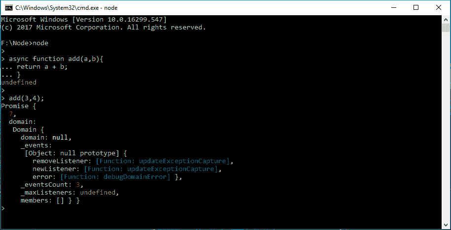

# 异步函数和 Node.js 事件循环

> 原文:[https://www . geesforgeks . org/异步-函数-和-节点-js-事件-循环/](https://www.geeksforgeeks.org/asynchronous-functions-and-the-node-js-event-loop/)

**异步功能**

每个人都知道 JavaScript 本质上是异步的，节点也是。Node 背后的基本原理是，应用程序在一个线程或进程上执行，因此事件是异步处理的。

如果我们考虑像 Apache 这样的典型网络服务器，它需要为每个进程分配单独的线程，直到请求得到满足。使用多线程的缺点是它们不是内存密集型的，不能很好地扩展。此外，我们必须确保每个进程必须是线程安全的，并且不会出现死锁。

但是 Node 做的事情不同。启动节点应用程序时，它只创建一个执行线程。当节点收到请求时，它会将线程分配给该进程，并且在完成当前请求的代码处理之前，不能处理其他请求。因此，Node 通过使用事件循环和回调函数来同时处理多个请求。**事件循环**是一种基本上轮询特定事件并在需要时调用事件处理程序的功能。一个**回调函数**就是节点中的这个事件处理程序。

在节点应用程序中，节点发起请求，但不等待请求获得响应。相反，它将回调函数附加到请求中。当请求完成或请求收到响应时，回调函数会发出一个事件，用请求的操作结果或请求的资源做一些事情。

如果多人同时访问一个 Node 应用程序，而该应用程序需要从一个文件中访问一个资源，Node 会为每个请求附加一个回调函数。一旦资源对该特定请求可用，就会对每个人的请求调用回调函数。同时，节点可以处理其他请求。

节点应用程序中并行请求的服务取决于应用程序有多忙以及它是如何设计的？

**示例:**

```
// Normal Function
function add(a,b){
    return a+b;
}

// Async Function
async function asyncadd(a,b){
    Return a+b;
}
```



**异步打开和写入文件内容**

```
// load http module
var http = require('http');
var fs = require('fs');

// load http module
var http = require('http');
var fs = require('fs');

// create http server
http.createServer(function (req, res) {

        // open and read in helloworld.js
        fs.readFile('helloworld.js', 'utf8', function(err, data) {

        res.writeHead(200, {'Content-Type': 'text/plain'});
        if (err)
            res.write('Could not find or open file for reading\n');
        else

            // if no error, writing JS file to a client
            res.write(data);
            res.end();
            });
}).listen(8124, function() { console.log('bound to port 8124');});

console.log('Server running on 8124/');
```