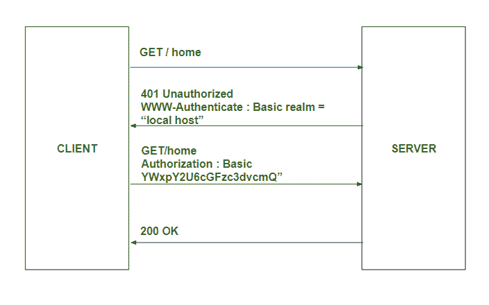
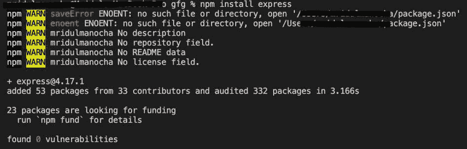
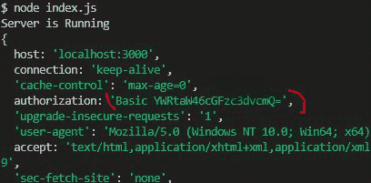

# 使用 HTTP 头在 Node.js 中进行基本认证

> 原文:[https://www . geesforgeks . org/basic-节点内身份验证-js-using-http-header/](https://www.geeksforgeeks.org/basic-authentication-in-node-js-using-http-header/)

客户端身份验证是启动任何应用程序之前的第一步。 [Node.js](https://www.geeksforgeeks.org/nodejs-tutorials/) 应用中的基础认证可以借助 [express.js](https://www.geeksforgeeks.org/working-of-express-js-middleware-and-its-benefits/) 框架完成。Express.js 框架主要用于 Node.js 应用程序，因为它有助于处理和路由客户端使用不同中间件发出的不同类型的请求和响应。

**HTTP WWW-Authenticate 头**是一个响应类型的头，它支持各种身份验证机制，这些机制对于控制对页面和其他资源的访问也很重要。

**认证说明:**



**模块安装:**使用以下命令安装快速模块。

```js
npm install express
```



**项目结构:**


项目结构

**文件名- index.js**

## java 描述语言

```js
// Requiring module
const express = require("express");
const fs = require("fs");
var path = require('path');

const app = express();

function authentication(req, res, next) {
    var authheader = req.headers.authorization;
    console.log(req.headers);

    if (!authheader) {
        var err = new Error('You are not authenticated!');
        res.setHeader('WWW-Authenticate', 'Basic');
        err.status = 401;
        return next(err)
    }

    var auth = new Buffer.from(authheader.split(' ')[1],
    'base64').toString().split(':');
    var user = auth[0];
    var pass = auth[1];

    if (user == 'admin' && pass == 'password') {

        // If Authorized user
        next();
    } else {
        var err = new Error('You are not authenticated!');
        res.setHeader('WWW-Authenticate', 'Basic');
        err.status = 401;
        return next(err);
    }

}

// First step is the authentication of the client
app.use(authentication)
app.use(express.static(path.join(__dirname, 'public')));

// Server setup
app.listen((3000), () => {
    console.log("Server is Running ");
})
```

使用以下命令运行 **index.js** :

```js
node index.js
```

*   在私人窗口中打开任何带有***http://localhost:3000***位置的浏览器(以免保存密码和用户名)。地址栏附近会弹出一个窗口。填写代码中提到的用户名和密码。


*   如果输入的用户名和密码与提到的匹配，那么位置**index.html**将呈现在浏览器上。


**说明:**第一个中间件用于在服务器启动，客户端输入 localhost 地址时，检查客户端的认证情况。最初*req . headers . authorization*未定义，下一个()回调函数返回 401 未授权访问浏览器的状态代码。客户端填写凭据，凭据以 base64 格式加密。之后，它解密包含用户名和密码的 base64 格式数据，然后在检查用户名和密码是否正确后，next()方法调用下一个在认证中间件下面提到的中间件，否则认证表单会一次又一次弹出。

**请求标题详细信息:**

