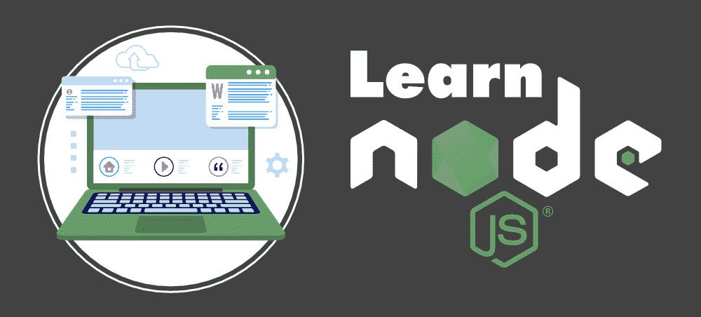

# 学习 Node.js 的最佳方式–完整的路线图

> 原文:[https://www . geesforgeks . org/最佳学习方式-节点-js-a-complete-roadmap/](https://www.geeksforgeeks.org/best-way-to-learn-node-js-a-complete-roadmap/)

大约十年前(2009 年)当**Ryan Dahl**(NodeJS 的原始开发者)发布 NodeJS 的初始版本时，没有人能想到在短时间内 Node 会获得如此大的人气，它将成为小型到大型企业构建其应用后端服务的重中之重。如今，大多数开发人员都意识到了 NodeJS 的炒作和流行，由于其流行度的上升， [Node](https://www.geeksforgeeks.org/introduction-to-nodejs/) 已经成为学习的必备技能之一。

节点是全球最热门的技术，尤其是在**硅谷**。这是为任何软件开发人员打开**惊人的职业机会**的完美技能。您可以构建各种应用程序，如社交媒体应用程序、视频和文本聊天引擎、实时跟踪应用程序、在线游戏和协作工具。许多公司将他们的技术堆栈转移到了 NodeJS，包括**贝宝、领英、优步、雅虎、Medium、GoDaddy、Groupon、沃尔玛**。

以上所有的理由都足以告诉你为什么 NodeJS 在程序员中流行，为什么要学习它。现在的问题是 ***从哪里开始？你应该涵盖哪些主题？NodeJS 框架有哪些，学习哪一个好？*** 你需要从一本书里学习所有的概念还是应该去一些在线教程？放松，深呼吸，我们会一一告诉你一切，给你一个成为 NodeJS 开发者的完整路线图。

### 为什么是 NodeJS？(决定你的最终目标)？

在你开始学习 NodeJS 之前，你应该有一个清晰的目标，那就是你为什么要学习 NodeJS？你到底想用 NodeJS 做什么？你是想做一些网络应用，自己创业，还是想找份新工作？是要建一些聊天应用还是要建一些网络游戏？
大多数初学者都会犯一个常见的错误，他们开始学习一门语言/框架只是为了学习它，而没有一个目标。请记住，学习一项新技术或语言是不同的事情，使用它来构建一些现实世界的应用程序是不同的，作为一名程序员，你的目的应该是能够构建东西，而不仅仅是学习。所以首先探索每个领域，找出你的兴趣所在。
我们已经讨论了可以使用 NodeJS 的各个领域。所以首先，决定你到底想要建立什么，一旦你的目标确定了，坚持下去，进入下一步，即寻找资源。

### 如何学习 node.js

学习 NodeJS 最重要的你要知道的就是 [JavaScript。](https://www.geeksforgeeks.org/javascript-tutorial/)除非你不擅长 JavaScript，否则不要错误地学习 Node。无论您将使用 NodeJS 构建什么，您都将使用大量的 JavaScript 概念。如果你有兴趣知道学习 JavaScript 的途径，那么查看链接[如何成为一名 JavaScript 开发人员？](https://www.geeksforgeeks.org/how-to-become-a-javascript-developer/)一旦你很好的掌握了 JavaScript，那就转移到 NodeJS，为它寻找资源…

#### 学习资源

网上有很多资源和视频，让开发人员困惑的是从哪里开始学习所有的概念。最初，作为一个初学者，如果你被如此多的概念淹没，那么不要害怕，停止学习。要有耐心，去探索，并坚持下去。此外，无论您喜欢什么资源，都可以与该资源一起编写代码。请记住，如果你没有在代码中弄脏你的手，没有任何教程或课程可以教你任何语言或框架。所以，当你学习并自己构建一些应用程序时，就要编码。

查看[官方文档](https://nodejs.org/en/docs/guides/)，详细学习 NodeJS 的各种概念。您也可以访问链接[节点教程极客博客](https://www.geeksforgeeks.org/nodejs-tutorials/)。您也可以参加一些在线视频教程或课程，但是在大多数课程中，不同的讲师可能会介绍不同的 NodeJS 概念。这对你来说可能是压倒性的，也会造成混乱。因此，了解学习 NodeJS 的清晰路径或路线图非常重要。

我们将在下一节讨论完整的路线图。如果你对下一步要学什么感到困惑，路线图会指引你。但是请记住，您的学习曲线取决于之前的编程经验和 JavaScript 知识。此外，NodeJS 中有很多东西需要学习。所以一旦你学完了，就开始在不同的平台上自己探索 NodeJS，用它构建不同种类的应用。

### 学习路线图

#### 1.NodeJS 简介

从 NodeJS 的基础[介绍](https://www.geeksforgeeks.org/introduction-to-nodejs/)部分开始。您应该知道什么是 NodeJS，它在哪里使用，它的一些特性，以及公司为什么使用它。你可以阅读文章 [7 个建立在 NodeJS 上的著名应用程序:原因和好处](https://www.geeksforgeeks.org/7-famous-apps-built-on-nodejs-reasons-and-benefits/)来了解为什么公司转向 NodeJS 来建立他们的应用程序。了解为什么选择 NodeJS 而不是另一个框架来开发服务器端应用程序是很重要的。探索 NodeJS 的不同应用领域、优势、局限性以及 NodeJS 应用部署服务器。

我们将给出一个概述，但更详细地探讨这个主题…

NodeJS 是一个建立在谷歌 Chrome V8 JavaScript 引擎上的服务器端 JavaScript 运行时环境。它将 JavaScript 代码编译成本机机器代码，并提供更高的应用程序效率。这是一个跨平台的运行时环境，提供了一个事件驱动的、非阻塞的输入输出系统。这一特性使其最适合构建快速、高度可靠、可扩展的网络或 web 应用程序以及数据密集型实时应用程序。

NodeJS 提供了良好的吞吐量和更高的一致性，这就是为什么它被公司大量用于构建大型可扩展的单页应用程序、视频流应用程序和 web 应用程序。

#### **历史和发布**

*   2009 年发布，NPM 的第一个版本被创建。是由**瑞恩·达尔介绍的。**
*   2010 年推出了 Express 和 socket.io。
*   2011 年，领英、优步和许多大公司开始使用 NodeJS。
*   2016 年，纱线与 Node.js 6 一起推出
*   NodeJS 的最新 LTS 版本是 12.18.3。

#### 2.了解节点架构

*   基于单线程事件循环模型架构，这意味着客户端请求将由 NodeJS 中的单线程执行。
*   NodeJS 的事件驱动特性允许您同时处理多个客户端请求。

#### **3。节点的安装**

安装 NodeJS 是一个非常简单的过程。可以从 [NodeJS 官方网站下载稳定版的 NodeJs。](https://nodejs.org/en/download/)根据您的操作系统和系统配置，安装 NodeJS，然后您可以立即开始使用它。确保您的内存至少为 4GB，以支持节点。

#### 4. **NPM(节点包管理器)**

节点包管理器是要在 NodeJS 中学习的最重要的核心概念之一。安装后，part 了解了 NPM。NPM 有 800，000+ 图书馆，可以用于不同的目的。这些预构建的库自带代码，可以在 NodeJS 中构建不同的特性。因此，您不需要从头开始构建所有内容。您可以简单地使用 npm 命令安装所需的库，并在应用程序中使用它。因此，这些库在加快应用程序开发过程方面有很大帮助。

#### 5. **JSON 文件**

JSON 文件是 NodeJS 中需要学习的另一个重要概念。您在任何 NodeJS 项目中做的第一件事就是创建 JSON 文件。它是任何项目中的清单文件，您可以在应用程序中找到这个名为 package.json 的文件。它包含项目的元数据。换句话说，它管理和保存关于包和依赖关系的信息以及项目中使用的脚本。如果您想检查应用程序中使用了哪些包或依赖项，只需打开该文件并检查信息。

#### 6.Node.js 基础

从这一步开始，你实际上在 NodeJS 的脚本中变得很脏。像其他编程语言一样，你学习如何打印“你好，世界！”然后开始学习 JavaScript 中的变量、数据类型、运算符、函数等基本概念。在您开始在 NodeJS 中构建实际的应用程序之前，确保您非常好地理解了 JavaScript 中的所有这些概念。

#### 7.文件系统

学习完基础知识后，接下来需要学习的是如何将数据读写到文件中，而不是控制台。要从目录节点访问物理文件系统，JS 使用 fs 模块。

#### 8.事件

NodeJS 自带事件驱动特性，Node 的很多核心功能都是基于事件的概念。事件基本上是一个信号，表明应用程序中发生了一些事情。在 NodeJS 中，开发人员可以使用事件模块来创建和处理自定义事件。基于 NodeJS 构建的应用程序支持并发，因为它们都基于单线程和事件驱动的架构。

#### 9.HTTP 模块

HTTP 模块是 NodeJS 强大的构建模块。HTTP 的模块大量用于构建服务器端网络应用程序。可以使用 HTTP 模块轻松构建带有 NodeJS 的 REST API。

#### 10.结构

像所有其他服务器端语言一样，NodeJS 也提供了许多框架来帮助构建具有更好特性的应用程序。从头开始编写代码以在任何应用程序中构建各种功能都是一个耗时的过程。因此，在您的应用程序中使用框架会使您的工作更容易，并且您可以以更快的速度构建任何类型的功能。下面给出了一些流行的 NodeJS 框架。

*   Express.js
*   Meteor.js
*   AdonisJs
*   雀巢公司
*   帆
*   KoaJS
*   LoopbackJS

#### 11.**数据库**

为了构建一个功能齐全的 NodeJS 应用程序，我们讨论了许多您应该知道的概念。但是您需要存储在应用程序中的信息呢？当然，像其他应用程序一样，您需要将数据存储在数据库中。根据应用程序或需求的类型，您可以选择任何数据库并用 NodeJS 进行配置。下面给出了一些最适合 NodeJS 的数据库…

1.  有关系的
    *   SQL 服务器
    *   一种数据库系统
    *   马里亚 DB
    *   关系型数据库
2.  云数据库
    *   CosmoDB
    *   DynamoDB(动态模式)
3.  搜索引擎
    *   弹性搜索
    *   Solr
    *   狮身人面像
4.  NoSQL
    *   MongoDB
    *   Redis
    *   卡桑德拉
    *   CouchDB

#### 12.测试

任何应用程序在投放市场之前都需要进行适当的测试。节点也是如此。如果您正在学习 Node，您还应该了解 NodeJS 应用程序的测试框架或库。查看下面给出的一些 NodeJS 应用的测试框架和库…

1.  单元、行为、集成测试
    *   茉莉
    *   玩笑
    *   酶
    *   柴
    *   摩卡
2.  E2E 测试
    *   硒
    *   操纵木偶的人

这就是从一开始学习 NodeJS 的路线图。我们希望这是有益的！！！