# 用 Node.js Bootstrap 和 MongoDB 构建一个简单的初学者应用

> 原文:[https://www . geesforgeks . org/build-a-simple-初学者-app-with-node-js-bootstrap-and-MongoDB/](https://www.geeksforgeeks.org/build-a-simple-beginner-app-with-node-js-bootstrap-and-mongodb/)

Node.js 是著名的开源环境之一，它允许您在浏览器之外运行 javascript 脚本。MERN 和 MEAN 栈是两个最受欢迎的组合，可以帮助你创建一个惊人的应用程序。在本文中，我们将使用 Node、Bootstrap 和 MongoDB 创建一个简单的初学者友好的联系人表单应用程序。在开始项目之前，我们必须确保您的系统中安装了 Node.js 和 MongoDB。

**项目结构:**

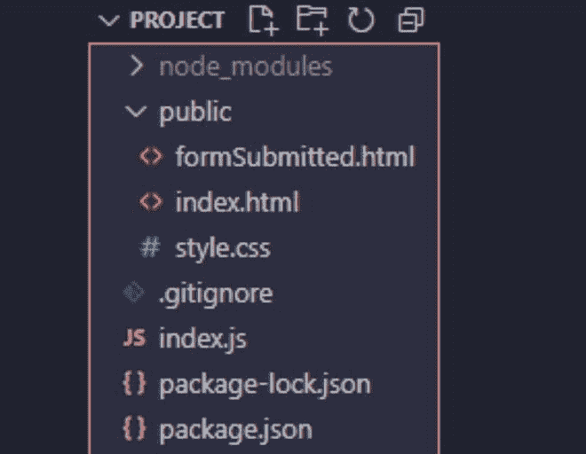

**步骤 1:** 创建一个项目文件夹，并在 IDE 中打开该文件夹。

首先用您提供的值创建一个 **package.json** 文件，使用 IDE 终端中的 **npm init** 命令。

```js
npm init
```

您可以自定义在初始化过程中提出的问题和创建的字段，或者将其保留为默认值。过程结束后，您会在项目文件夹中找到 **package.json** 文件。

**第二步:**接下来在项目文件夹中创建一个 **index.js** 文件，这将是 app 的入口点。

**第 3 步:**现在使用 **npm** 命令安装依赖项[**express**](https://www.geeksforgeeks.org/working-of-express-js-middleware-and-its-benefits/)**[**猫鼬**](https://www.geeksforgeeks.org/mongoose-module-introduction/#:~:text=module%20is%20one%20of%20the,from%20MongoDB%20to%20the%20Node.)**和 [nodemon](https://www.geeksforgeeks.org/node-js-nodemon-module/) 。****

```js
npm install express mongoose nodemon
```

**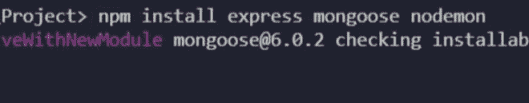

正在安装 express、mongoose 和 nodemon** 

**安装依赖项需要一些时间，完成后，将创建一个名为 **node_modules** 的文件夹，在****package . JSON**文件的依赖项下，您将找到所有已安装依赖项的名称及其版本。****

****

属国**** 

******第四步:**接下来我们打开****index . js**文件，用下面的代码创建一个简单的快递 app。******

## ****java 描述语言****

```js
**// Importing express module
var express = require("express");

// Importing mongoose module
var mongoose = require("mongoose");
const port = 80;
const app = express();

// Handling the get request
app.get("/", (req, res) => {
  res.send("Hello World");
});

// Starting the server on the 80 port
app.listen(port, () => {
  console.log(`The application started
  successfully on port ${port}`);
});**
```

****这段代码创建了一个简单的快速应用程序，启动一个服务器并监听**端口 80** 的连接。该应用以**“你好世界”**回应对**/**的请求。****

******步骤 5:** 要运行代码，请转到终端并键入****

```js
**nodemon index.js**
```

****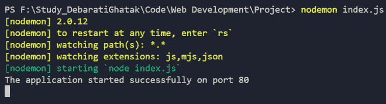

应用程序已成功启动**** 

******第六步:**然后打开浏览器，使用 [http://localhost](http://localhost) ，或者简单的 [localhost](http://localhost) 从自身访问服务器。****

****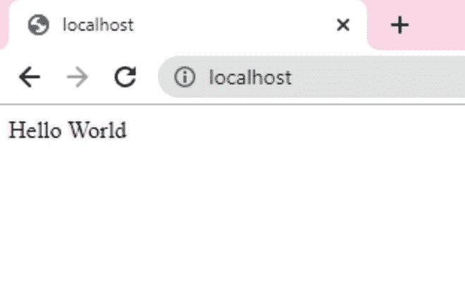

本地主机**** 

****页面显示**“Hello World”**，表示我们的快递 app 工作正常。****

******第 7 步:**我们现在需要添加 2 行代码，因为我们将需要 **express.json()** 和 **express.urlencoded()** 来处理 POST 和 PUT 请求。 **Express** 为我们提供了中间件来处理请求体中传入的数据对象。在 POST 和 PUT 请求中，我们都向服务器发送数据对象，并要求服务器接受或存储该数据对象，该数据对象包含在该请求的 req.body 中。****

```js
**app.use(express.json());
app.use(express.urlencoded({ extended: true }));**
```

******步骤 8:** 在项目文件夹内创建一个名为**公共**的文件夹。我们将在我们项目的**公共**目录中创建所有静态 HTML 文件。****

```js
**// For serving static html files
app.use(express.static('public'));**
```

******第 9 步:**现在我们将使用以下代码连接到猫鼬数据库。本项目数据库名称为**项目组******

```js
**mongoose.connect("mongodb://localhost/projectDG", {
  useNewUrlParser: true,
  useUnifiedTopology: true,
});
var db = mongoose.connection;**
```

******步骤 10:** 接下来，我们要定义一个 post 方法，将联系人表单的数据保存到我们的数据库中。我们定义我们的数据对象，并在此创建名为**用户**的集合。成功插入数据后，我们将重定向至**formSubmitted.html******

****这是 index.js 文件的主要部分，在这里将处理 post 请求，并将数据从客户端请求正确传输到主数据库服务器。****

```js
**app.post("/formFillUp", (req, res) => {
  var name = req.body.name;
  var reason = req.body.reason;
  var email = req.body.email;
  var phone = req.body.phone;
  var city = req.body.city;
  var state = req.body.state;
  var addressline = req.body.addressline;

  var data = {
    name: name,
    reason: reason,
    email: email,
    phone: phone,
    city: city,
    state: state,
    addressline: addressline,
  };

  db.collection("users").insertOne(data, 
  (err, collection) => {
    if (err) {
      throw err;
    }
    console.log("Data inserted successfully!");
  });

  return res.redirect("formSubmitted.html");
});**
```

****最终的 index.js 如下所示:****

******文件名:index.js******

## ****java 描述语言****

```js
**var express = require("express");
var mongoose = require("mongoose");
const port = 80;
const app = express();

mongoose.connect("mongodb://localhost/projectDG", {
  useNewUrlParser: true,
  useUnifiedTopology: true,
});
var db = mongoose.connection;

app.use(express.json());

// For serving static HTML files
app.use(express.static("public"));
app.use(express.urlencoded({ extended: true }));

app.get("/", (req, res) => {
  res.set({
    "Allow-access-Allow-Origin": "*",
  });

  // res.send("Hello World");
  return res.redirect("index.html");
});

app.post("/formFillUp", (req, res) => {
  var name = req.body.name;
  var reason = req.body.reason;
  var email = req.body.email;
  var phone = req.body.phone;
  var city = req.body.city;
  var state = req.body.state;
  var addressline = req.body.addressline;

  var data = {
    name: name,
    reason: reason,
    email: email,
    phone: phone,
    city: city,
    state: state,
    addressline: addressline,
  };

  db.collection("users").insertOne(
  data, (err, collection) => {
    if (err) {
      throw err;
    }
    console.log("Data inserted successfully!");
  });

  return res.redirect("formSubmitted.html");
});

app.listen(port, () => {
  console.log(`The application started 
  successfully on port ${port}`);
});**
```

******第 11 步:**现在我们将在****公共**文件夹中创建**index.html、formSubmittedhtml** 、**T5】和 **style.css** 文件。********

### **index.html:**

## **超文本标记语言**

```js
<!DOCTYPE html>
<html lang="en">

<head>
    <!-- Required meta tags -->
    <meta charset="utf-8" />
    <meta name="viewport" content="width=device-width,
        initial-scale=1, shrink-to-fit=no" />

    <!-- Bootstrap CSS -->
    <link rel="stylesheet" href=
"https://stackpath.bootstrapcdn.com/bootstrap/4.3.1/css/bootstrap.min.css"
        integrity=
"sha384-ggOyR0iXCbMQv3Xipma34MD+dH/1fQ784/j6cY/iJTQUOhcWr7x9JvoRxT2MZw1T"
        crossorigin="anonymous" />
    <link rel="stylesheet" href="./style.css" />
    <link href=
"https://fonts.googleapis.com/css2?family=Poppins&display=swap"
        rel="stylesheet" />
</head>

<body>
    <div class="container mt-3">
        <br />
        <h1>Contact Us</h1>
        <br />
        <form action="/formFillUp" method="POST">
            <div class="form-row">
                <div class="form-group col-md-6">
                    <label for="inputName"
                        style="font-size: 23px">
                        Name
                    </label>
                    <input type="text" class="form-control"
                        id="name" name="name" />
                </div>

                <div class="form-group col-md-6">
                    <label for="inputReason"
                        style="font-size: 23px">
                        Reason for contacting
                    </label>

                    <input type="text" class="form-control"
                        id="reason" name="reason" />
                </div>
            </div>

            <div class="form-row">
                <div class="form-group col-md-6">
                    <label for="inputEmail"
                        style="font-size: 23px">
                        Email
                    </label>
                    <input type="email" class="form-control"
                        id="inputEmail" name="email" />
                </div>
                <div class="form-group col-md-6">
                    <label for="inputPhone"
                        style="font-size: 23px">Phone
                    </label>
                    <input type="text" class="form-control"
                        id="inputPhone" name="phone" />
                </div>
            </div>

            <div class="form-row">
                <div class="form-group col-md-6">
                    <label for="inputCity"
                        style="font-size: 23px">City
                    </label>
                    <input type="text" class="form-control"
                        id="inputCity" name="city" />
                </div>
                <div class="form-group col-md-6">
                    <label for="inputState"
                        style="font-size: 23px">State
                    </label>
                    <input type="text" class="form-control"
                        id="inputState" name="state" />
                </div>
            </div>
            <div class="form-group">
                <label for="inputAddress"
                    style="font-size: 23px">Address</label>
                <input type="text" class="form-control"
                    id="inputAddress" name="addressline" />
            </div>
            <button type="submit" class="btn btn-primary">
                Submit
            </button>
        </form>
    </div>
</body>

</html>
```

****输出:****

**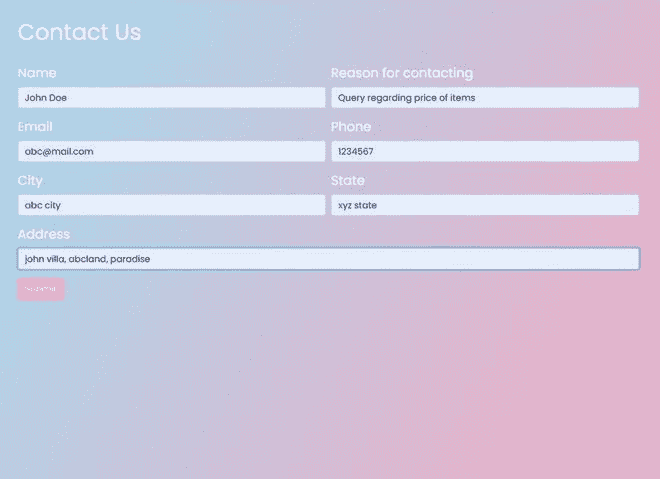

index.html** 

****formSubmitted.html****

## **超文本标记语言**

```js
<!DOCTYPE html>
<html>

<head>
    <title>Form Submitted Successfully</title>
    <link rel="stylesheet" href="./style.css" />
    <link href=
"https://fonts.googleapis.com/css2?family=Poppins&display=swap"
        rel="stylesheet" />
</head>

<body>
    <div class="containerFormSubmittedMessage">
        <h1>Form Submitted Successfully!</h1>

<p>
            Thank you for contacting us! Our
            team will mail you shortly.
        </p>

    </div>
</body>

</html>
```

****输出:****

**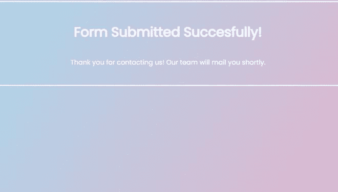

formSubmitted.html** 

****style.css****

## **半铸钢ˌ钢性铸铁(Cast Semi-Steel)**

```js
body {
  background-image: linear-gradient(120deg,
                 #9de7fa 0%, #f89fba 100%);
  color: white;
  font-family: "Poppins", sans-serif;
  min-height: 100vh;
}

.btn-primary {
  color: #fff;
  background-color: #f89fba;
  border-color: #f89fba;
}
.containerFormSubmittedMessage {
  display: flex;
  flex-direction: column;
  margin: auto;
  justify-content: center;
  align-items: center;
  height: 200px;
  border: 3px solid whitesmoke;
}
```

 ****第 12 步:**创建完这三个文件，我们的项目就快完成了。我们现在将启动 MongoDB。打开 Windows Powershell 窗口，然后键入命令 **mongod。****

```js
mongod
```

**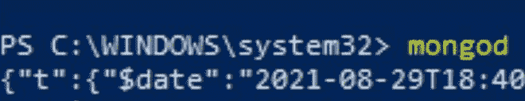

在 powershell 窗口中键入 **mongod** 命令** 

**打开另一个 Windows Powershell 窗口，输入命令 **mongo****

```js
mongo
```

**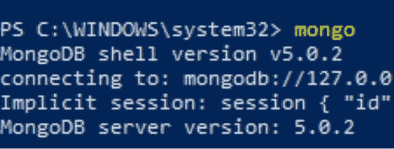

在另一个 powershell 窗口中键入 **mongo** 命令** 

****第十三步:**打开你的 IDE，在终端输入 **nodemon index.js** 启动 app。转到[本地主机](http://localhost/)。**

**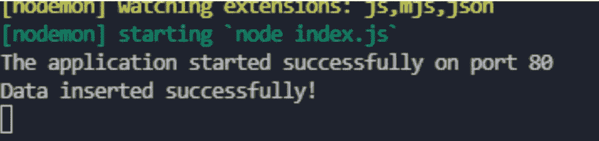**

****注意:**正确处理发文请求后，会打印插入成功的数据。**

*   **填写联系表的详细信息。成功提交表单后，您将从**index.html**重定向至**formSubmitted.html**。**

**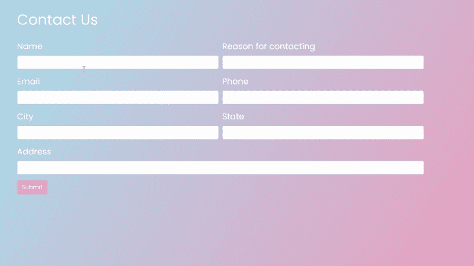

联系方式** 

*   **现在，为了检查我们在联系人表单中输入的数据是否已保存到 **projectDG** 数据库，我们将在第二个 Windows Powershell 窗口中使用以下命令。**

****该命令列出了 mongoDB 中的所有数据库:****

```js
show dbs
```

****这个命令会让我们切换到我们的数据库:****

```js
use projectDG 
```

****这个命令我们将检查集合中的特定数据:****

```js
db.users.find()
```

**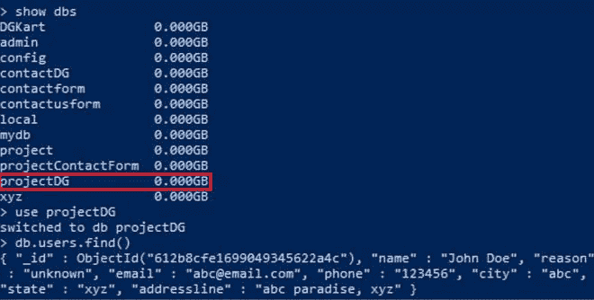

projectDG 数据库中用户集合中的数据** 

**我们可以清楚地看到数据已经被插入到 MongoDB 数据库中。**