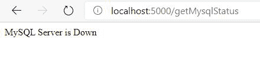

# 检查 Node.js MySQL 服务器是否处于活动状态

> 原文:[https://www . geesforgeks . org/check-if-node-js-MySQL-server-is-active-or-not/](https://www.geeksforgeeks.org/check-if-node-js-mysql-server-is-active-or-not/)

我们将看到如何检查托管 MySQL 数据库的服务器是否处于活动状态。

**语法:**

```js
database_connection.ping(callback);
```

**模块:**

*   NodeJS(节点名称)
*   ExpressJS
*   关系型数据库

**设置环境和执行:**

2.  创建项目

    ```js
    npm init
    ```

    

3.  安装模块

    ```js
    npm install express
    npm install mysql
    ```

    

    **文件结构:**

    

4.  创建服务器

    ## index.js

    ```js
    const express = require("express");
    const database = require('./sqlConnection');

    const app = express();

    app.listen(5000, () => {
      console.log(`Server is up and running on 5000 ...`);
    });
    ```

5.  创建和导出数据库连接对象

    ## sqlConnection.js

    ```js
    const mysql = require("mysql");

    let db_con  = mysql.createConnection({
        host: "localhost",
        user: "root",
        password: ''
    });

    db_con.connect((err) => {
        if (err) {
          console.log("Database Connection Failed !!!", err);
        } else {
          console.log("connected to Database");
        }
    });

    module.exports = db_con;
    ```

6.  创建检查 mysql 服务器活动与否的路由。

    ```js
    app.get("/getMysqlStatus", (req, res) => {

      database.ping((err) => {
        if(err) return res.status(500).send("MySQL Server is Down");

        res.send("MySQL Server is Active");
      })
    });
    ```

    完整索引. js 文件:

    ## java 描述语言

    ```js
    const express = require("express");
    const database = require('./sqlConnection');

    const app = express();

    app.listen(5000, () => {
      console.log(`Server is up and running on 5000 ...`);
    });

    app.get("/getMysqlStatus", (req, res) => {

        database.ping((err) => {
            if(err) return res.status(500).send("MySQL Server is Down");

            res.send("MySQL Server is Active");
        })
    });
    ```

7.  运行服务器

    ```js
    node index.js
    ```

8.  **输出:**将此链接放入浏览器*http://localhost:5000/getMysqlStatus*

    *   如果服务器未激活，您将在浏览器中看到以下输出:

    ```js
    MySQL Server is Down
    ```

    

    *   如果服务器处于活动状态，您将在浏览器中看到以下输出 <u>:</u>

    ```js
    MySQL Server is Active
    ```

    